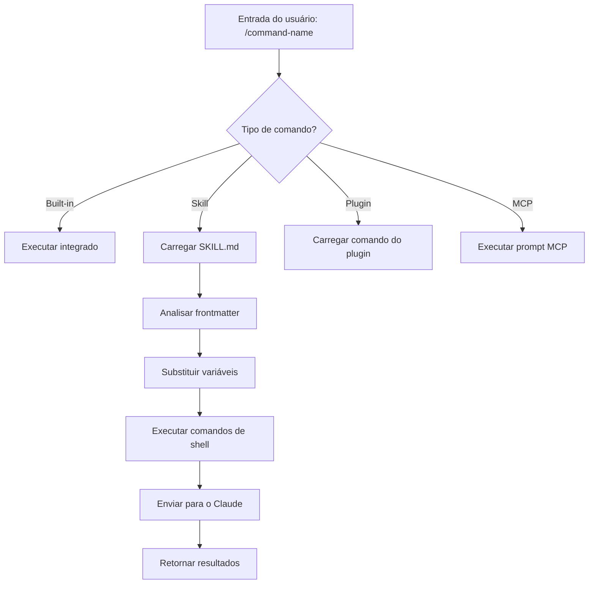
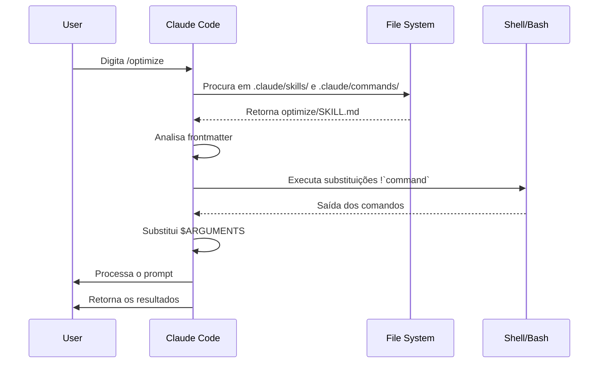

<!-- i18n-source: 01-slash-commands/README.md -->
<!-- i18n-source-sha: 63a1416 -->
<!-- i18n-date: 2026-04-14 -->

<picture>
  <source media="(prefers-color-scheme: dark)" srcset="../../resources/logos/claude-howto-logo-dark.svg">
  
</picture>

# Comandos com barra

## Visão geral

Comandos com barra são atalhos que controlam o comportamento do Claude durante uma sessão interativa. Eles vêm em vários tipos:

- **Comandos integrados**: Fornecidos pelo Claude Code (`/help`, `/clear`, `/model`)
- **Skills**: Comandos definidos pelo usuário criados como arquivos `SKILL.md` (`/optimize`, `/pr`)
- **Comandos de plugin**: Comandos de plugins instalados (`/frontend-design:frontend-design`)
- **Prompts MCP**: Comandos de servidores MCP (`/mcp__github__list_prs`)

> **Nota**: Comandos com barra personalizados foram mesclados em skills. Arquivos em `.claude/commands/` ainda funcionam, mas skills (`.claude/skills/`) agora são o caminho recomendado. Ambos criam atalhos `/command-name`. Veja o [Guia de Skills](../../03-skills/README.md) para a referência completa.

## Referência de comandos integrados

Comandos integrados são atalhos para ações comuns. Há **60+ comandos integrados** e **5 skills incluídas** disponíveis. Digite `/` no Claude Code para ver a lista completa, ou `/` seguido de quaisquer letras para filtrar.

| Comando | Finalidade |
|---------|---------|
| `/add-dir <path>` | Adicionar diretório de trabalho |
| `/agents` | Gerenciar configurações de agentes |
| `/branch [name]` | Ramificar a conversa em uma nova sessão (alias: `/fork`). Observação: `/fork` foi renomeado para `/branch` na v2.1.77 |
| `/btw <question>` | Pergunta lateral sem adicionar ao histórico |
| `/chrome` | Configurar integração com o navegador Chrome |
| `/clear` | Limpar a conversa (aliases: `/reset`, `/new`) |
| `/color [color\|default]` | Definir a cor da barra de prompt |
| `/compact [instructions]` | Compactar a conversa com instruções opcionais de foco |
| `/config` | Abrir Configurações (alias: `/settings`) |
| `/context` | Visualizar o uso do contexto em uma grade colorida |
| `/copy [N]` | Copiar a resposta do assistente para a área de transferência; `w` grava em arquivo |
| `/cost` | Mostrar estatísticas de uso de tokens |
| `/desktop` | Continuar no aplicativo Desktop (alias: `/app`) |
| `/diff` | Visualizador interativo de diff para alterações não commitadas |
| `/doctor` | Diagnosticar a saúde da instalação |
| `/effort [low\|medium\|high\|max\|auto]` | Definir o nível de esforço. `max` requer Opus 4.7 |
| `/exit` | Sair do REPL (alias: `/quit`) |
| `/export [filename]` | Exportar a conversa atual para um arquivo ou para a área de transferência |
| `/extra-usage` | Configurar uso extra para limites de taxa |
| `/fast [on\|off]` | Alternar o modo rápido |
| `/feedback` | Enviar feedback (alias: `/bug`) |
| `/help` | Mostrar ajuda |
| `/hooks` | Ver configurações de hooks |
| `/ide` | Gerenciar integrações com IDE |
| `/init` | Inicializar `CLAUDE.md`. Defina `CLAUDE_CODE_NEW_INIT=1` para o fluxo interativo |
| `/insights` | Gerar relatório de análise da sessão |
| `/install-github-app` | Configurar o app GitHub Actions |
| `/install-slack-app` | Instalar o app Slack |
| `/keybindings` | Abrir a configuração de atalhos |
| `/login` | Alternar contas Anthropic |
| `/logout` | Sair da sua conta Anthropic |
| `/mcp` | Gerenciar servidores MCP e OAuth |
| `/memory` | Editar `CLAUDE.md`, alternar auto-memory |
| `/mobile` | Código QR para o aplicativo móvel (aliases: `/ios`, `/android`) |
| `/model [model]` | Selecionar modelo com setas esquerda/direita para esforço |
| `/passes` | Compartilhar a semana grátis do Claude Code |
| `/permissions` | Ver/atualizar permissões (alias: `/allowed-tools`) |
| `/plan [description]` | Entrar no modo de planejamento |
| `/plugin` | Gerenciar plugins |
| `/powerup` | Descobrir recursos por meio de lições interativas com demos animadas |
| `/privacy-settings` | Configurações de privacidade (somente Pro/Max) |
| `/release-notes` | Ver o changelog |
| `/reload-plugins` | Recarregar plugins ativos |
| `/remote-control` | Controle remoto a partir do claude.ai (alias: `/rc`) |
| `/remote-env` | Configurar o ambiente remoto padrão |
| `/rename [name]` | Renomear a sessão |
| `/resume [session]` | Retomar a conversa (alias: `/continue`) |
| `/review` | **Obsoleto** — instale o plugin `code-review` em vez disso |
| `/rewind` | Reverter a conversa e/ou o código (alias: `/checkpoint`) |
| `/sandbox` | Alternar o modo sandbox |
| `/schedule [description]` | Criar/gerenciar tarefas agendadas na nuvem |
| `/security-review` | Analisar a branch em busca de vulnerabilidades de segurança |
| `/skills` | Listar skills disponíveis |
| `/stats` | Visualizar uso diário, sessões e sequências |
| `/stickers` | Pedir adesivos do Claude Code |
| `/status` | Mostrar versão, modelo e conta |
| `/statusline` | Configurar a linha de status |
| `/tasks` | Listar/gerenciar tarefas em segundo plano |
| `/team-onboarding` | Gerar um guia de integração do colega a partir da configuração local do Claude Code no projeto (novo na v2.1.101) |
| `/terminal-setup` | Configurar atalhos do terminal |
| `/theme` | Alterar o tema de cores |
| `/ultraplan <prompt>` | Criar um rascunho de plano em uma sessão ultraplan e revisar no navegador |
| `/upgrade` | Abrir a página de upgrade para um plano superior |
| `/usage` | Mostrar limites de uso do plano e status de rate limit |
| `/voice` | Alternar ditado por voz push-to-talk |

### Skills incluídas

Essas skills acompanham o Claude Code e são invocadas como comandos com barra:

| Skill | Finalidade |
|-------|---------|
| `/batch <instruction>` | Orquestrar mudanças paralelas em grande escala usando worktrees |
| `/claude-api` | Carregar a referência da API Claude para a linguagem do projeto |
| `/debug [description]` | Ativar logs de depuração |
| `/loop [interval] <prompt>` | Repetir o prompt em um intervalo |
| `/simplify [focus]` | Revisar arquivos alterados para qualidade de código |

### Comandos obsoletos

| Comando | Status |
|---------|--------|
| `/review` | Obsoleto — substituído pelo plugin `code-review` |
| `/output-style` | Obsoleto desde a v2.1.73 |
| `/fork` | Renomeado para `/branch` (o alias ainda funciona, v2.1.77) |
| `/pr-comments` | Removido na v2.1.91 — peça ao Claude diretamente para ver comentários de PR |
| `/vim` | Removido na v2.1.92 — use /config → modo Editor |

### Mudanças recentes

- `/fork` foi renomeado para `/branch`, com `/fork` mantido como alias (v2.1.77)
- `/output-style` foi obsoleto (v2.1.73)
- `/review` foi obsoleto em favor do plugin `code-review`
- O comando `/effort` foi adicionado com o nível `max`, que requer Opus 4.7
- O comando `/voice` foi adicionado para ditado por voz push-to-talk
- O comando `/schedule` foi adicionado para criar/gerenciar tarefas agendadas
- O comando `/color` foi adicionado para personalização da barra de prompt
- `/pr-comments` foi removido na v2.1.91 — peça ao Claude diretamente para ver comentários de PR
- `/vim` foi removido na v2.1.92 — use /config → modo Editor
- `/ultraplan` foi adicionado para revisão e execução de planos no navegador
- `/powerup` foi adicionado para lições interativas de recursos
- `/sandbox` foi adicionado para alternar o modo sandbox
- O seletor `/model` agora mostra rótulos legíveis, como "Sonnet 4.6", em vez de IDs brutos
- `/resume` agora aceita o alias `/continue`
- Prompts MCP estão disponíveis como comandos `/mcp__<server>__<prompt>` (veja [Prompts MCP como Comandos](#prompts-mcp-como-comandos))
- `/team-onboarding` foi adicionado para gerar automaticamente guias de integração de colegas (v2.1.101)

### `/team-onboarding` - Guia de integração de colegas

> **Novo na v2.1.101**

Use `/team-onboarding` para gerar um guia de integração de colegas a partir do uso local do Claude Code no seu projeto. O comando inspeciona seu `CLAUDE.md`, skills instaladas, subagents, hooks e fluxos de trabalho recentes, e então produz um documento de onboarding que ajuda novos desenvolvedores a se tornarem produtivos rapidamente.

É um comando integrado - nada para instalar.

**Uso:**

```bash
claude /team-onboarding
```

O guia gerado resume:

- Propósito do projeto e convenções principais a partir de [`CLAUDE.md`](../../02-memory/README.md)
- [skills](../../03-skills/README.md) disponíveis e quando são invocadas automaticamente
- [subagents](../../04-subagents/README.md) configurados e suas responsabilidades
- [Hooks](../../06-hooks/README.md) que rodam em eventos comuns
- Fluxos de trabalho comuns que novos integrantes devem conhecer

**Disponibilidade:** Incluído no Claude Code v2.1.101 (11 de abril de 2026).

## Comandos personalizados (agora Skills)

Comandos com barra personalizados foram **mesclados em skills**. Ambas as abordagens criam comandos que você pode invocar com `/command-name`:

| Abordagem | Localização | Status |
|----------|----------|--------|
| **Skills (Recomendado)** | `.claude/skills/<name>/SKILL.md` | Padrão atual |
| **Legacy Commands** | `.claude/commands/<name>.md` | Ainda funciona |

Se uma skill e um comando tiverem o mesmo nome, a **skill tem prioridade**. Por exemplo, quando `.claude/commands/review.md` e `.claude/skills/review/SKILL.md` existem ao mesmo tempo, a versão da skill é usada.

### Caminho de migração

Seus arquivos `.claude/commands/` existentes continuam funcionando sem alterações. Para migrar para skills:

**Antes (Comando):**
```
.claude/commands/optimize.md
```

**Depois (Skill):**
```
.claude/skills/optimize/SKILL.md
```

### Por que usar Skills?

Skills oferecem recursos adicionais em relação aos comandos legados:

- **Estrutura de diretórios**: Empacote scripts, templates e arquivos de referência
- **Auto-invocação**: O Claude pode acionar skills automaticamente quando relevante
- **Controle de invocação**: Escolha se usuários, Claude ou ambos podem invocar
- **Execução em subagent**: Rode skills em contextos isolados com `context: fork`
- **Divulgação progressiva**: Carregue arquivos adicionais só quando necessário

### Criando um comando personalizado como skill

Crie um diretório com um arquivo `SKILL.md`:

```bash
mkdir -p .claude/skills/my-command
```

**Arquivo:** `.claude/skills/my-command/SKILL.md`

```yaml
---
name: my-command
description: What this command does and when to use it
---

# My Command

Instructions for Claude to follow when this command is invoked.

1. First step
2. Second step
3. Third step
```

### Referência de frontmatter

| Campo | Finalidade | Padrão |
|-------|---------|---------|
| `name` | Nome do comando (vira `/name`) | Nome do diretório |
| `description` | Descrição curta (ajuda o Claude a saber quando usar) | Primeiro parágrafo |
| `argument-hint` | Argumentos esperados para auto-complete | Nenhum |
| `allowed-tools` | Ferramentas que o comando pode usar sem permissão | Herda |
| `model` | Modelo específico a usar | Herda |
| `disable-model-invocation` | Se `true`, apenas o usuário pode invocar (não o Claude) | `false` |
| `user-invocable` | Se `false`, oculta do menu `/` | `true` |
| `context` | Defina como `fork` para rodar em um subagent isolado | Nenhum |
| `agent` | Tipo de agente ao usar `context: fork` | `general-purpose` |
| `hooks` | Hooks específicos da skill (PreToolUse, PostToolUse, Stop) | Nenhum |

### Argumentos

Os comandos podem receber argumentos:

**Todos os argumentos com `$ARGUMENTS`:**

```yaml
---
name: fix-issue
description: Fix a GitHub issue by number
---

Fix issue #$ARGUMENTS following our coding standards
```

Uso: `/fix-issue 123` → `$ARGUMENTS` vira "123"

**Argumentos individuais com `$0`, `$1`, etc.:**

```yaml
---
name: review-pr
description: Review a PR with priority
---

Review PR #$0 with priority $1
```

Uso: `/review-pr 456 high` → `$0`="456", `$1`="high"

### Contexto dinâmico com comandos de shell

Execute comandos bash antes do prompt usando substituições `!`command``:

```yaml
---
name: commit
description: Create a git commit with context
allowed-tools: Bash(git *)
---

## Context

- Current git status: !`git status`
- Current git diff: !`git diff HEAD`
- Current branch: !`git branch --show-current`
- Recent commits: !`git log --oneline -5`

## Your task

Based on the above changes, create a single git commit.
```

### Referências de arquivo

Inclua conteúdos de arquivos usando `@`:

```markdown
Review the implementation in @src/utils/helpers.js
Compare @src/old-version.js with @src/new-version.js
```

## Comandos de plugin

Plugins podem fornecer comandos personalizados:

```
/plugin-name:command-name
```

Ou simplesmente `/command-name` quando não houver conflitos de nomenclatura.

**Exemplos:**
```bash
/frontend-design:frontend-design
/commit-commands:commit
```

## Prompts MCP como comandos

Servidores MCP podem expor prompts como comandos slash:

```
/mcp__<server-name>__<prompt-name> [arguments]
```

**Exemplos:**
```bash
/mcp__github__list_prs
/mcp__github__pr_review 456
/mcp__jira__create_issue "Bug title" high
```

### Sintaxe de permissões MCP

Controle o acesso ao servidor MCP nas permissões:

- `mcp__github` - Acesso ao servidor GitHub MCP inteiro
- `mcp__github__*` - Acesso curinga a todas as ferramentas
- `mcp__github__get_issue` - Acesso a uma ferramenta específica

## Arquitetura dos comandos



## Ciclo de vida do comando



## Comandos disponíveis nesta pasta

Esses comandos de exemplo podem ser instalados como skills ou comandos legados.

### 1. `/optimize` - Otimização de código

Analisa o código em busca de problemas de desempenho, vazamentos de memória e oportunidades de otimização.

**Uso:**
```
/optimize
[Cole seu código]
```

### 2. `/pr` - Preparação de Pull Request

Guia a preparação do PR com checklist incluindo lint, testes e formatação de commit.

**Uso:**
```
/pr
```

**Screenshot:**


### 3. `/generate-api-docs` - Gerador de documentação de API

Gera documentação de API abrangente a partir do código-fonte.

**Uso:**
```
/generate-api-docs
```

### 4. `/commit` - Commit Git com contexto

Cria um commit git com contexto dinâmico do seu repositório.

**Uso:**
```
/commit [mensagem opcional]
```

### 5. `/push-all` - Preparar, commitar e fazer push

Faz stage de todas as alterações, cria um commit e faz push para o remoto com verificações de segurança.

**Uso:**
```
/push-all
```

**Verificações de segurança:**
- Secrets: `.env*`, `*.key`, `*.pem`, `credentials.json`
- API Keys: detecta chaves reais vs. placeholders
- Large files: `>10MB` sem Git LFS
- Build artifacts: `node_modules/`, `dist/`, `__pycache__/`

### 6. `/doc-refactor` - Reestruturação de documentação

Reestrutura a documentação do projeto para melhorar clareza e acessibilidade.

**Uso:**
```
/doc-refactor
```

### 7. `/setup-ci-cd` - Configuração de pipeline CI/CD

Implementa hooks de pre-commit e GitHub Actions para garantia de qualidade.

**Uso:**
```
/setup-ci-cd
```

### 8. `/unit-test-expand` - Expansão de cobertura de testes

Aumenta a cobertura de testes mirando branches e casos extremos ainda não testados.

**Uso:**
```
/unit-test-expand
```

## Instalação

### Como Skills (Recomendado)

Copie para o diretório de skills:

```bash
# Criar o diretório de skills
mkdir -p .claude/skills

# Para cada arquivo de comando, crie um diretório de skill
for cmd in optimize pr commit; do
  mkdir -p .claude/skills/$cmd
  cp 01-slash-commands/$cmd.md .claude/skills/$cmd/SKILL.md
done
```

### Como comandos legados

Copie para o diretório de comandos:

```bash
# No projeto inteiro (equipe)
mkdir -p .claude/commands
cp 01-slash-commands/*.md .claude/commands/

# Uso pessoal
mkdir -p ~/.claude/commands
cp 01-slash-commands/*.md ~/.claude/commands/
```

## Criando seus próprios comandos

### Template de skill (Recomendado)

Crie `.claude/skills/my-command/SKILL.md`:

```yaml
---
name: my-command
description: What this command does. Use when [trigger conditions].
argument-hint: [optional-args]
allowed-tools: Bash(npm *), Read, Grep
---

# Command Title

## Context

- Current branch: !`git branch --show-current`
- Related files: @package.json

## Instructions

1. First step
2. Second step with argument: $ARGUMENTS
3. Third step

## Output Format

- How to format the response
- What to include
```

### Comando apenas para usuário (sem auto-invocação)

Para comandos com efeitos colaterais que o Claude não deveria acionar automaticamente:

```yaml
---
name: deploy
description: Deploy to production
disable-model-invocation: true
allowed-tools: Bash(npm *), Bash(git *)
---

Deploy the application to production:

1. Run tests
2. Build application
3. Push to deployment target
4. Verify deployment
```

## Boas práticas

| Do | Don't |
|------|---------|
| Use nomes claros e orientados a ação | Crie comandos para tarefas únicas |
| Inclua `description` com condições de disparo | Coloque lógica complexa nos comandos |
| Mantenha os comandos focados em uma única tarefa | Hardcode informações sensíveis |
| Use `disable-model-invocation` para efeitos colaterais | Pule o campo de descrição |
| Use o prefixo `!` para contexto dinâmico | Assuma que o Claude sabe o estado atual |
| Organize arquivos relacionados em diretórios de skill | Coloque tudo em um único arquivo |

## Solução de problemas

### Comando não encontrado

**Soluções:**
- Verifique se o arquivo está em `.claude/skills/<name>/SKILL.md` ou `.claude/commands/<name>.md`
- Confirme se o campo `name` no frontmatter corresponde ao nome esperado do comando
- Reinicie a sessão do Claude Code
- Execute `/help` para ver os comandos disponíveis

### Comando não executa como esperado

**Soluções:**
- Adicione instruções mais específicas
- Inclua exemplos no arquivo da skill
- Verifique `allowed-tools` se estiver usando comandos bash
- Teste primeiro com entradas simples

### Conflito entre skill e comando

Se ambos existirem com o mesmo nome, a **skill tem prioridade**. Remova um deles ou renomeie.

## Guias relacionados

- **[Skills](../03-skills/)** - Referência completa de skills (capacidades invocadas automaticamente)
- **[Memory](../02-memory/)** - Contexto persistente com CLAUDE.md
- **[Subagents](../04-subagents/)** - Agentes delegados de IA
- **[Plugins](../07-plugins/)** - Coleções de comandos incluídas
- **[Hooks](../06-hooks/)** - Automação orientada a eventos

## Recursos adicionais

- [Documentação oficial do modo interativo](https://code.claude.com/docs/en/interactive-mode) - Referência de comandos integrados
- [Documentação oficial de Skills](https://code.claude.com/docs/en/skills) - Referência completa de skills
- [Referência da CLI](https://code.claude.com/docs/en/cli-reference) - Opções de linha de comando

---
**Última atualização**: 16 de abril de 2026
**Versão do Claude Code**: 2.1.112
**Fontes**:
- https://docs.anthropic.com/en/docs/claude-code/slash-commands
- https://www.anthropic.com/news/claude-opus-4-7
- https://support.claude.com/en/articles/12138966-release-notes
**Modelos compatíveis**: Claude Sonnet 4.6, Claude Opus 4.7, Claude Haiku 4.5

*Parte da série de guias [Claude How To](../)*
