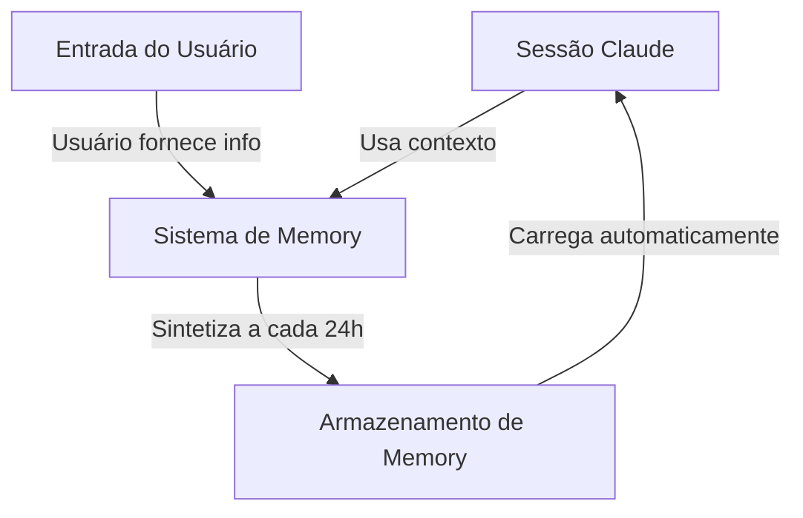
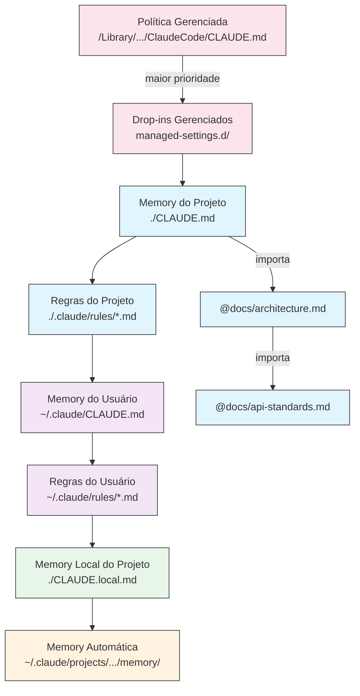
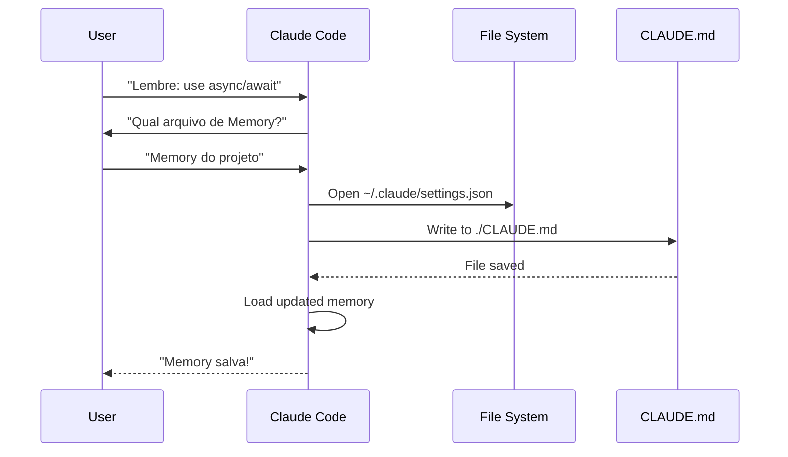
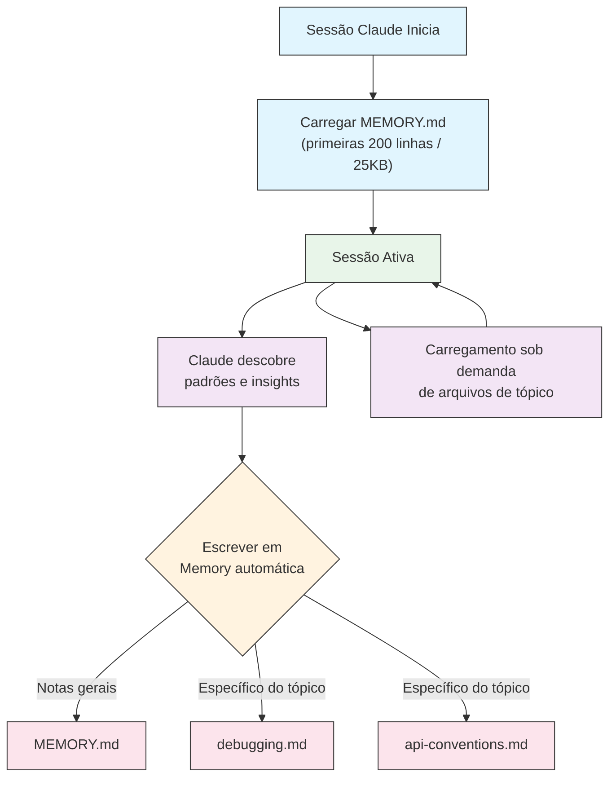
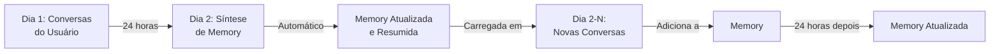

<!-- i18n-source: 02-memory/README.md -->
<!-- i18n-source-sha: d4369ce -->
<!-- i18n-date: 2026-04-16 -->

<picture>
  <source media="(prefers-color-scheme: dark)" srcset="../resources/logos/claude-howto-logo-dark.svg">
  
</picture>

# Guia de Memory

A Memory permite que o Claude retenha contexto entre sessões e conversas. Ela existe em duas formas: síntese automática no claude.ai e CLAUDE.md baseado em sistema de arquivos no Claude Code.

## Visão geral

A Memory no Claude Code fornece contexto persistente que se mantém entre múltiplas sessões e conversas. Ao contrário das janelas de contexto temporárias, os arquivos de Memory permitem:

- Compartilhar padrões de projeto com toda a equipe
- Armazenar preferências pessoais de desenvolvimento
- Manter regras e configurações específicas de diretório
- Importar documentação externa
- Versionar a Memory como parte do seu projeto

O sistema de Memory opera em múltiplos níveis, das preferências pessoais globais até subdiretórios específicos, permitindo controle granular sobre o que o Claude lembra e como aplica esse conhecimento.

## Referência rápida de comandos de Memory

| Comando | Finalidade | Uso | Quando usar |
|---------|-----------|-----|-------------|
| `/init` | Inicializar a Memory do projeto | `/init` | Começar novo projeto, configurar CLAUDE.md pela primeira vez |
| `/memory` | Editar arquivos de Memory no editor | `/memory` | Atualizações extensas, reorganização, revisão de conteúdo |
| Prefixo `#` | ~~Adição rápida de Memory de uma linha~~ **Descontinuado** | — | Use `/memory` ou pergunte conversacionalmente |
| `@caminho/para/arquivo` | Importar conteúdo externo | `@README.md` ou `@docs/api.md` | Referenciar documentação existente no CLAUDE.md |

## Início rápido: inicializando a Memory

### O comando `/init`

O comando `/init` é a forma mais rápida de configurar a Memory do projeto no Claude Code. Ele inicializa um arquivo CLAUDE.md com documentação básica do projeto.

**Uso:**

```bash
/init
```

**O que ele faz:**

- Cria um novo arquivo CLAUDE.md no seu projeto (geralmente em `./CLAUDE.md` ou `./.claude/CLAUDE.md`)
- Estabelece convenções e diretrizes do projeto
- Configura a base para persistência de contexto entre sessões
- Fornece uma estrutura de template para documentar os padrões do seu projeto

**Modo interativo aprimorado:** defina `CLAUDE_CODE_NEW_INIT=1` para ativar um fluxo interativo em múltiplas fases que guia você pela configuração do projeto passo a passo:

```bash
CLAUDE_CODE_NEW_INIT=1 claude
/init
```

**Quando usar `/init`:**

- Ao iniciar um novo projeto com o Claude Code
- Para estabelecer padrões e convenções de codificação da equipe
- Para criar documentação sobre a estrutura do código
- Para configurar hierarquia de Memory para desenvolvimento colaborativo

**Exemplo de fluxo:**

```markdown
# No diretório do seu projeto
/init

# Claude cria CLAUDE.md com estrutura como:
# Configuração do Projeto
## Visão geral do projeto
- Nome: Seu Projeto
- Stack tecnológica: [Suas tecnologias]
- Tamanho da equipe: [Número de desenvolvedores]

## Padrões de desenvolvimento
- Preferências de estilo de código
- Requisitos de testes
- Convenções de fluxo Git
```

### Atualizações rápidas de Memory

> **Nota**: O atalho `#` para Memory inline foi descontinuado. Use `/memory` para editar arquivos de Memory diretamente, ou peça ao Claude conversacionalmente para lembrar algo (ex.: "lembre que sempre usamos o modo estrito do TypeScript").

As formas recomendadas de adicionar informações à Memory são:

**Opção 1: Use o comando `/memory`**

```bash
/memory
```

Abre seus arquivos de Memory no editor do sistema para edição direta.

**Opção 2: Peça conversacionalmente**

```
Lembre que sempre usamos o modo estrito do TypeScript neste projeto.
Adicione à Memory: prefira async/await em vez de cadeias de promises.
```

O Claude atualizará o arquivo CLAUDE.md apropriado com base no seu pedido.

**Referência histórica** (não funciona mais):

O atalho com prefixo `#` permitia anteriormente adicionar regras inline:

```markdown
# Sempre use o modo estrito do TypeScript neste projeto  ← não funciona mais
```

Se você dependia desse padrão, mude para o comando `/memory` ou pedidos conversacionais.

### O comando `/memory`

O comando `/memory` fornece acesso direto para editar seus arquivos de Memory CLAUDE.md dentro das sessões do Claude Code. Ele abre seus arquivos de Memory no editor do sistema para edição abrangente.

**Uso:**

```bash
/memory
```

**O que ele faz:**

- Abre seus arquivos de Memory no editor padrão do sistema
- Permite adições, modificações e reorganizações extensas
- Fornece acesso direto a todos os arquivos de Memory na hierarquia
- Permite gerenciar contexto persistente entre sessões

**Quando usar `/memory`:**

- Para revisar o conteúdo existente da Memory
- Para fazer atualizações extensas nos padrões do projeto
- Para reorganizar a estrutura da Memory
- Para adicionar documentação ou diretrizes detalhadas
- Para manter e atualizar a Memory conforme o projeto evolui

**Comparação: `/memory` vs `/init`**

| Aspecto | `/memory` | `/init` |
|---------|-----------|---------|
| **Finalidade** | Editar arquivos de Memory existentes | Inicializar novo CLAUDE.md |
| **Quando usar** | Atualizar/modificar contexto do projeto | Iniciar novos projetos |
| **Ação** | Abre editor para alterações | Gera template inicial |
| **Fluxo** | Manutenção contínua | Configuração única |

**Exemplo de fluxo:**

```markdown
# Abrir Memory para edição
/memory

# Claude apresenta opções:
# 1. Memory de Política Gerenciada
# 2. Memory do Projeto (./CLAUDE.md)
# 3. Memory do Usuário (~/.claude/CLAUDE.md)
# 4. Memory Local do Projeto

# Escolha a opção 2 (Memory do Projeto)
# Seu editor padrão abre com o conteúdo de ./CLAUDE.md

# Faça alterações, salve e feche o editor
# Claude recarrega automaticamente a Memory atualizada
```

**Usando importações de Memory:**

Os arquivos CLAUDE.md suportam a sintaxe `@caminho/para/arquivo` para incluir conteúdo externo:

```markdown
# Documentação do projeto
Veja @README.md para visão geral do projeto
Veja @package.json para comandos npm disponíveis
Veja @docs/architecture.md para o design do sistema

# Importar do diretório home usando caminho absoluto
@~/.claude/my-project-instructions.md
```

**Recursos de importação:**

- Caminhos relativos e absolutos são suportados (ex.: `@docs/api.md` ou `@~/.claude/my-project-instructions.md`)
- Importações recursivas são suportadas com profundidade máxima de 5
- Importações de locais externos pela primeira vez ativam um diálogo de aprovação por segurança
- Diretivas de importação não são avaliadas dentro de code spans ou blocos de código markdown (portanto é seguro documentá-las em exemplos)
- Ajuda a evitar duplicação referenciando documentação existente
- Inclui automaticamente o conteúdo referenciado no contexto do Claude

## Arquitetura de Memory

A Memory no Claude Code segue um sistema hierárquico onde diferentes escopos servem a finalidades diferentes:



## Hierarquia de Memory no Claude Code

O Claude Code usa um sistema de Memory hierárquico em múltiplos níveis. Os arquivos de Memory são carregados automaticamente quando o Claude Code é iniciado, com os arquivos de nível superior tendo precedência.

**Hierarquia de Memory completa (em ordem de precedência):**

1. **Política Gerenciada** — instruções para toda a organização
   - macOS: `/Library/Application Support/ClaudeCode/CLAUDE.md`
   - Linux/WSL: `/etc/claude-code/CLAUDE.md`
   - Windows: `C:\Program Files\ClaudeCode\CLAUDE.md`

2. **Drop-ins Gerenciados** — arquivos de política mesclados alfabeticamente (v2.1.83+)
   - Diretório `managed-settings.d/` ao lado do CLAUDE.md de política gerenciada
   - Os arquivos são mesclados em ordem alfabética para gerenciamento modular de políticas

3. **Memory do Projeto** — contexto compartilhado com a equipe (com controle de versão)
   - `./.claude/CLAUDE.md` ou `./CLAUDE.md` (na raiz do repositório)

4. **Regras do Projeto** — instruções modulares e específicas por tópico
   - `./.claude/rules/*.md`

5. **Memory do Usuário** — preferências pessoais (todos os projetos)
   - `~/.claude/CLAUDE.md`

6. **Regras de Nível de Usuário** — regras pessoais (todos os projetos)
   - `~/.claude/rules/*.md`

7. **Memory Local do Projeto** — preferências pessoais específicas do projeto
   - `./CLAUDE.local.md`

> **Nota**: `CLAUDE.local.md` é totalmente suportado e documentado na [documentação oficial](https://code.claude.com/docs/en/memory). Fornece preferências pessoais específicas do projeto que não são commitadas no controle de versão. Adicione `CLAUDE.local.md` ao seu `.gitignore`.

8. **Memory Automática** — notas e aprendizados automáticos do Claude
   - `~/.claude/projects/<project>/memory/`

**Comportamento de descoberta de Memory:**

O Claude busca arquivos de Memory nessa ordem, com locais anteriores tendo precedência:



## Excluindo arquivos CLAUDE.md com `claudeMdExcludes`

Em monorrepos grandes, alguns arquivos CLAUDE.md podem ser irrelevantes para o trabalho atual. A configuração `claudeMdExcludes` permite pular arquivos CLAUDE.md específicos para que não sejam carregados no contexto:

```jsonc
// Em ~/.claude/settings.json ou .claude/settings.json
{
  "claudeMdExcludes": [
    "packages/legacy-app/CLAUDE.md",
    "vendors/**/CLAUDE.md"
  ]
}
```

Os padrões são comparados com caminhos relativos à raiz do projeto. Isso é útil para:

- Monorrepos com muitos subprojetos, onde apenas alguns são relevantes
- Repositórios que contêm arquivos CLAUDE.md de terceiros ou vendorizados
- Reduzir o ruído na janela de contexto do Claude excluindo instruções obsoletas ou não relacionadas

## Hierarquia de arquivos de configuração

As configurações do Claude Code (incluindo `autoMemoryDirectory`, `claudeMdExcludes` e outras) são resolvidas a partir de uma hierarquia de cinco níveis, com níveis superiores tendo precedência:

| Nível | Localização | Escopo |
|-------|-------------|--------|
| 1 (Maior) | Política gerenciada (nível de sistema) | Aplicação em toda a organização |
| 2 | `managed-settings.d/` (v2.1.83+) | Drop-ins de política modular, mesclados alfabeticamente |
| 3 | `~/.claude/settings.json` | Preferências do usuário |
| 4 | `.claude/settings.json` | Nível do projeto (commitado no git) |
| 5 (Menor) | `.claude/settings.local.json` | Substituições locais (ignorado pelo git) |

**Configuração específica por plataforma (v2.1.51+):**

As configurações também podem ser definidas via:
- **macOS**: arquivos Property List (plist)
- **Windows**: Registro do Windows

Esses mecanismos nativos de plataforma são lidos junto com os arquivos JSON de configuração e seguem as mesmas regras de precedência.

## Sistema de regras modular

Crie regras organizadas e específicas por caminho usando a estrutura de diretório `.claude/rules/`. As regras podem ser definidas tanto no nível do projeto quanto no nível do usuário:

```
seu-projeto/
├── .claude/
│   ├── CLAUDE.md
│   └── rules/
│       ├── code-style.md
│       ├── testing.md
│       ├── security.md
│       └── api/                  # Subdiretórios suportados
│           ├── conventions.md
│           └── validation.md

~/.claude/
├── CLAUDE.md
└── rules/                        # Regras de nível de usuário (todos os projetos)
    ├── personal-style.md
    └── preferred-patterns.md
```

As regras são descobertas recursivamente dentro do diretório `rules/`, incluindo quaisquer subdiretórios. As regras de nível de usuário em `~/.claude/rules/` são carregadas antes das regras de nível de projeto, permitindo padrões pessoais que os projetos podem substituir.

### Regras específicas por caminho com frontmatter YAML

Defina regras que se aplicam apenas a caminhos de arquivo específicos:

```markdown
---
paths: src/api/**/*.ts
---

# Regras de Desenvolvimento de API

- Todos os endpoints de API devem incluir validação de entrada
- Use Zod para validação de esquema
- Documente todos os parâmetros e tipos de resposta
- Inclua tratamento de erros para todas as operações
```

**Exemplos de padrões glob:**

- `**/*.ts` — todos os arquivos TypeScript
- `src/**/*` — todos os arquivos em src/
- `src/**/*.{ts,tsx}` — múltiplas extensões
- `{src,lib}/**/*.ts, tests/**/*.test.ts` — múltiplos padrões

### Subdiretórios e symlinks

As regras em `.claude/rules/` suportam dois recursos organizacionais:

- **Subdiretórios**: As regras são descobertas recursivamente, então você pode organizá-las em pastas por tópico (ex.: `rules/api/`, `rules/testing/`, `rules/security/`)
- **Symlinks**: Symlinks são suportados para compartilhar regras entre múltiplos projetos. Por exemplo, você pode criar um symlink de um arquivo de regra compartilhado de um local central para o diretório `.claude/rules/` de cada projeto

## Tabela de locais de Memory

| Local | Escopo | Prioridade | Compartilhado | Acesso | Melhor para |
|-------|--------|------------|---------------|--------|-------------|
| `/Library/Application Support/ClaudeCode/CLAUDE.md` (macOS) | Política Gerenciada | 1 (Maior) | Organização | Sistema | Políticas de toda a empresa |
| `/etc/claude-code/CLAUDE.md` (Linux/WSL) | Política Gerenciada | 1 (Maior) | Organização | Sistema | Padrões da organização |
| `C:\Program Files\ClaudeCode\CLAUDE.md` (Windows) | Política Gerenciada | 1 (Maior) | Organização | Sistema | Diretrizes corporativas |
| `managed-settings.d/*.md` (ao lado da política) | Drop-ins Gerenciados | 1.5 | Organização | Sistema | Arquivos de política modular (v2.1.83+) |
| `./CLAUDE.md` ou `./.claude/CLAUDE.md` | Memory do Projeto | 2 | Equipe | Git | Padrões da equipe, arquitetura compartilhada |
| `./.claude/rules/*.md` | Regras do Projeto | 3 | Equipe | Git | Regras modulares específicas por caminho |
| `~/.claude/CLAUDE.md` | Memory do Usuário | 4 | Individual | Sistema de arquivos | Preferências pessoais (todos os projetos) |
| `~/.claude/rules/*.md` | Regras do Usuário | 5 | Individual | Sistema de arquivos | Regras pessoais (todos os projetos) |
| `./CLAUDE.local.md` | Local do Projeto | 6 | Individual | Git (ignorado) | Preferências pessoais específicas do projeto |
| `~/.claude/projects/<project>/memory/` | Memory Automática | 7 (Menor) | Individual | Sistema de arquivos | Notas e aprendizados automáticos do Claude |

## Ciclo de vida de atualização da Memory

Veja como as atualizações de Memory fluem pelas suas sessões do Claude Code:



## Memory automática

A Memory automática é um diretório persistente onde o Claude registra automaticamente aprendizados, padrões e insights enquanto trabalha no seu projeto. Ao contrário dos arquivos CLAUDE.md que você escreve e mantém manualmente, a Memory automática é escrita pelo próprio Claude durante as sessões.

### Como funciona a Memory automática

- **Localização**: `~/.claude/projects/<project>/memory/`
- **Ponto de entrada**: `MEMORY.md` serve como arquivo principal no diretório de Memory automática
- **Arquivos de tópico**: arquivos adicionais opcionais para assuntos específicos (ex.: `debugging.md`, `api-conventions.md`)
- **Comportamento de carregamento**: as primeiras 200 linhas de `MEMORY.md` (ou os primeiros 25KB, o que vier primeiro) são carregadas no contexto no início da sessão. Os arquivos de tópico são carregados sob demanda, não na inicialização.
- **Leitura/escrita**: o Claude lê e escreve arquivos de Memory durante as sessões conforme descobre padrões e conhecimento específico do projeto

### Arquitetura de Memory automática



### Estrutura de diretório da Memory automática

```
~/.claude/projects/<project>/memory/
├── MEMORY.md              # Ponto de entrada (primeiras 200 linhas / 25KB carregados na inicialização)
├── debugging.md           # Arquivo de tópico (carregado sob demanda)
├── api-conventions.md     # Arquivo de tópico (carregado sob demanda)
└── testing-patterns.md    # Arquivo de tópico (carregado sob demanda)
```

### Requisito de versão

A Memory automática requer **Claude Code v2.1.59 ou posterior**. Se você estiver em uma versão mais antiga, atualize primeiro:

```bash
npm install -g @anthropic-ai/claude-code@latest
```

### Diretório de Memory automática personalizado

Por padrão, a Memory automática é armazenada em `~/.claude/projects/<project>/memory/`. Você pode alterar essa localização usando a configuração `autoMemoryDirectory` (disponível desde a **v2.1.74**):

```jsonc
// Em ~/.claude/settings.json ou .claude/settings.local.json (apenas configurações de usuário/local)
{
  "autoMemoryDirectory": "/caminho/para/diretorio/de/memoria/personalizado"
}
```

> **Nota**: `autoMemoryDirectory` só pode ser definido em configurações de nível de usuário (`~/.claude/settings.json`) ou locais (`.claude/settings.local.json`), não em configurações de projeto ou de política gerenciada.

Isso é útil quando você quer:

- Armazenar a Memory automática em um local compartilhado ou sincronizado
- Separar a Memory automática do diretório padrão de configuração do Claude
- Usar um caminho específico do projeto fora da hierarquia padrão

### Compartilhamento de worktree e repositório

Todos os worktrees e subdiretórios dentro do mesmo repositório git compartilham um único diretório de Memory automática. Isso significa que alternar entre worktrees ou trabalhar em subdiretórios diferentes do mesmo repositório lerá e gravará nos mesmos arquivos de Memory.

### Memory de Subagents

Subagents (criados via ferramentas como Task ou execução paralela) podem ter seu próprio contexto de Memory. Use o campo `memory` no frontmatter da definição do Subagent para especificar quais escopos de Memory carregar:

```yaml
memory: user      # Carregar apenas Memory de nível de usuário
memory: project   # Carregar apenas Memory de nível de projeto
memory: local     # Carregar apenas Memory local
```

Isso permite que os Subagents operem com contexto focado em vez de herdar a hierarquia completa de Memory.

> **Nota**: Subagents também podem manter sua própria Memory automática. Consulte a [documentação oficial de Memory de Subagents](https://code.claude.com/docs/en/sub-agents#enable-persistent-memory) para detalhes.

### Controlando a Memory automática

A Memory automática pode ser controlada via a variável de ambiente `CLAUDE_CODE_DISABLE_AUTO_MEMORY`:

| Valor | Comportamento |
|-------|--------------|
| `0` | Forçar Memory automática **ativada** |
| `1` | Forçar Memory automática **desativada** |
| *(não definida)* | Comportamento padrão (Memory automática ativada) |

```bash
# Desativar Memory automática para uma sessão
CLAUDE_CODE_DISABLE_AUTO_MEMORY=1 claude

# Forçar Memory automática ativada explicitamente
CLAUDE_CODE_DISABLE_AUTO_MEMORY=0 claude
```

## Diretórios adicionais com `--add-dir`

A flag `--add-dir` permite que o Claude Code carregue arquivos CLAUDE.md de diretórios adicionais além do diretório de trabalho atual. Isso é útil para monorrepos ou configurações de múltiplos projetos onde o contexto de outros diretórios é relevante.

Para ativar esse recurso, defina a variável de ambiente:

```bash
CLAUDE_CODE_ADDITIONAL_DIRECTORIES_CLAUDE_MD=1
```

Em seguida, inicie o Claude Code com a flag:

```bash
claude --add-dir /caminho/para/outro/projeto
```

O Claude carregará o CLAUDE.md do diretório adicional especificado junto com os arquivos de Memory do seu diretório de trabalho atual.

## Exemplos práticos

### Exemplo 1: Estrutura de Memory do projeto

**Arquivo:** `./CLAUDE.md`

```markdown
# Configuração do Projeto

## Visão geral do projeto
- **Nome**: Plataforma de E-commerce
- **Stack tecnológica**: Node.js, PostgreSQL, React 18, Docker
- **Tamanho da equipe**: 5 desenvolvedores
- **Prazo**: Q4 2025

## Arquitetura
@docs/architecture.md
@docs/api-standards.md
@docs/database-schema.md

## Padrões de desenvolvimento

### Estilo de código
- Use Prettier para formatação
- Use ESLint com config airbnb
- Comprimento máximo de linha: 100 caracteres
- Use indentação de 2 espaços

### Convenções de nomenclatura
- **Arquivos**: kebab-case (user-controller.js)
- **Classes**: PascalCase (UserService)
- **Funções/Variáveis**: camelCase (getUserById)
- **Constantes**: UPPER_SNAKE_CASE (API_BASE_URL)
- **Tabelas do banco de dados**: snake_case (user_accounts)

### Fluxo Git
- Nomes de branch: `feature/descricao` ou `fix/descricao`
- Mensagens de commit: siga conventional commits
- PR obrigatório antes do merge
- Todas as verificações de CI/CD devem passar
- Mínimo de 1 aprovação necessária

### Requisitos de testes
- Cobertura mínima de código de 80%
- Todos os caminhos críticos devem ter testes
- Use Jest para testes unitários
- Use Cypress para testes E2E
- Nomes de arquivos de teste: `*.test.ts` ou `*.spec.ts`

### Padrões de API
- Apenas endpoints RESTful
- Requisição/resposta em JSON
- Use códigos de status HTTP corretamente
- Versione os endpoints: `/api/v1/`
- Documente todos os endpoints com exemplos

### Banco de dados
- Use migrations para alterações de esquema
- Nunca codifique credenciais diretamente
- Use connection pooling
- Ative o log de queries em desenvolvimento
- Backups regulares obrigatórios

### Deploy
- Deploy baseado em Docker
- Orquestração com Kubernetes
- Estratégia de deploy blue-green
- Rollback automático em caso de falha
- Migrations do banco de dados antes do deploy

## Comandos comuns

| Comando | Finalidade |
|---------|-----------|
| `npm run dev` | Iniciar servidor de desenvolvimento |
| `npm test` | Executar suite de testes |
| `npm run lint` | Verificar estilo de código |
| `npm run build` | Build para produção |
| `npm run migrate` | Executar migrations do banco |

## Contatos da equipe
- Tech Lead: Sarah Chen (@sarah.chen)
- Product Manager: Mike Johnson (@mike.j)
- DevOps: Alex Kim (@alex.k)

## Problemas conhecidos e soluções alternativas
- Connection pooling do PostgreSQL limitado a 20 durante horários de pico
- Solução: implementar fila de queries
- Problemas de compatibilidade do Safari 14 com async generators
- Solução: usar transpilador Babel

## Projetos relacionados
- Dashboard de Analytics: `/projects/analytics`
- App Mobile: `/projects/mobile`
- Painel Admin: `/projects/admin`
```

### Exemplo 2: Memory específica de diretório

**Arquivo:** `./src/api/CLAUDE.md`

````markdown
# Padrões do Módulo de API

Este arquivo substitui o CLAUDE.md raiz para tudo em /src/api/

## Padrões específicos de API

### Validação de requisições
- Use Zod para validação de esquema
- Sempre valide a entrada
- Retorne 400 com erros de validação
- Inclua detalhes de erros por campo

### Autenticação
- Todos os endpoints exigem token JWT
- Token no header Authorization
- Token expira após 24 horas
- Implemente mecanismo de refresh token

### Formato de resposta

Todas as respostas devem seguir esta estrutura:

```json
{
  "success": true,
  "data": { /* dados reais */ },
  "timestamp": "2025-11-06T10:30:00Z",
  "version": "1.0"
}
```

Respostas de erro:
```json
{
  "success": false,
  "error": {
    "code": "VALIDATION_ERROR",
    "message": "Mensagem para o usuário",
    "details": { /* erros por campo */ }
  },
  "timestamp": "2025-11-06T10:30:00Z"
}
```

### Paginação
- Use paginação baseada em cursor (não por offset)
- Inclua booleano `hasMore`
- Limite máximo de página a 100
- Tamanho padrão de página: 20

### Rate limiting
- 1000 requisições por hora para usuários autenticados
- 100 requisições por hora para endpoints públicos
- Retorne 429 quando excedido
- Inclua header retry-after

### Cache
- Use Redis para cache de sessão
- Duração de cache: 5 minutos por padrão
- Invalide ao escrever
- Marque chaves de cache com tipo de recurso
````

### Exemplo 3: Memory pessoal

**Arquivo:** `~/.claude/CLAUDE.md`

```markdown
# Minhas preferências de desenvolvimento

## Sobre mim
- **Nível de experiência**: 8 anos de desenvolvimento full-stack
- **Linguagens preferidas**: TypeScript, Python
- **Estilo de comunicação**: Direto, com exemplos
- **Estilo de aprendizado**: Diagramas visuais com código

## Preferências de código

### Tratamento de erros
Prefiro tratamento explícito de erros com blocos try-catch e mensagens de erro significativas.
Evite erros genéricos. Sempre registre erros para depuração.

### Comentários
Use comentários para o POR QUÊ, não o QUÊ. O código deve ser autodocumentado.
Comentários devem explicar lógica de negócio ou decisões não óbvias.

### Testes
Prefiro TDD (desenvolvimento orientado a testes).
Escreva testes primeiro, depois a implementação.
Foque no comportamento, não nos detalhes de implementação.

### Arquitetura
Prefiro design modular e fracamente acoplado.
Use injeção de dependência para testabilidade.
Separe responsabilidades (Controllers, Services, Repositories).

## Preferências de depuração
- Use console.log com prefixo: `[DEBUG]`
- Inclua contexto: nome da função, variáveis relevantes
- Use stack traces quando disponível
- Sempre inclua timestamps nos logs

## Comunicação
- Explique conceitos complexos com diagramas
- Mostre exemplos concretos antes de explicar a teoria
- Inclua trechos de código antes/depois
- Resuma os pontos principais no final

## Organização do projeto
Organizo meus projetos como:

   project/
   ├── src/
   │   ├── api/
   │   ├── services/
   │   ├── models/
   │   └── utils/
   ├── tests/
   ├── docs/
   └── docker/

## Ferramentas
- **IDE**: VS Code com keybindings vim
- **Terminal**: Zsh com Oh-My-Zsh
- **Formatação**: Prettier (100 chars por linha)
- **Linter**: ESLint com config airbnb
- **Framework de testes**: Jest com React Testing Library
```

_Meu teste_
Peça ao Claude para salvar uma nova regra


O Claude não salvou a regra porque eu não tinha nenhum arquivo `Claude.md` em lugar nenhum. Então pedi ao Claude para confirmar a localização.


### Exemplo 4: Atualização de Memory durante a sessão

Você pode adicionar novas regras à Memory durante uma sessão ativa do Claude Code. Há duas formas de fazer isso:

#### Método 1: Pedido direto

```markdown
Usuário: Lembre que prefiro usar React hooks em vez de componentes de classe
         para todos os novos componentes.

Claude: Vou adicionar isso à sua Memory. Em qual arquivo de Memory?
        1. Memory do projeto (./CLAUDE.md)
        2. Memory pessoal (~/.claude/CLAUDE.md)

Usuário: Memory do projeto

Claude: ✅ Memory salva!

Adicionado a ./CLAUDE.md:
---

### Desenvolvimento de componentes
- Use componentes funcionais com React Hooks
- Prefira hooks a componentes de classe
- Hooks personalizados para lógica reutilizável
- Use useCallback para manipuladores de eventos
- Use useMemo para computações custosas
```

#### Método 2: Usando o padrão "# nova regra na Memory"

Você também pode usar o padrão explícito "# nova regra na Memory" para acionar atualizações de Memory:

```markdown
Usuário: # nova regra na Memory
         Sempre valide entrada do usuário com schemas Zod antes de processar.

Claude: Vou salvar essa regra na Memory. Qual arquivo de Memory usar?
        1. Memory do projeto (./CLAUDE.md)
        2. Memory pessoal (~/.claude/CLAUDE.md)

Usuário: Memory do projeto

Claude: ✅ Memory salva!

Adicionado a ./CLAUDE.md:
---

### Validação de entrada
- Sempre valide entrada do usuário com schemas Zod antes de processar
- Defina schemas no topo de cada arquivo de handler de API
- Retorne status 400 com erros de validação
```

#### Dicas para adicionar Memory

- Seja específico e concreto nas suas regras
- Agrupe regras relacionadas sob um cabeçalho de seção
- Atualize seções existentes em vez de duplicar conteúdo
- Escolha o escopo de Memory apropriado (projeto vs. pessoal)

## Comparação de recursos de Memory

| Recurso | Claude Web/Desktop | Claude Code (CLAUDE.md) |
|---------|-------------------|------------------------|
| Síntese automática | ✅ A cada 24h | ✅ Memory automática |
| Cross-project | ✅ Compartilhado | ❌ Específico do projeto |
| Acesso da equipe | ✅ Projetos compartilhados | ✅ Rastreado por git |
| Pesquisável | ✅ Integrado | ✅ Pelo `/memory` |
| Editável | ✅ No chat | ✅ Edição direta do arquivo |
| Import/Export | ✅ Sim | ✅ Copiar/colar |
| Persistente | ✅ 24h+ | ✅ Indefinidamente |

### Memory no Claude Web/Desktop

#### Linha do tempo de síntese de Memory



**Exemplo de resumo de Memory:**

```markdown
## Memory do Claude sobre o Usuário

### Histórico profissional
- Desenvolvedor full-stack sênior com 8 anos de experiência
- Foco em backends TypeScript/Node.js e frontends React
- Contribuidor ativo de código aberto
- Interessado em IA e aprendizado de máquina

### Contexto do projeto
- Atualmente construindo plataforma de e-commerce
- Stack: Node.js, PostgreSQL, React 18, Docker
- Trabalhando com equipe de 5 desenvolvedores
- Usando CI/CD e deploys blue-green

### Preferências de comunicação
- Prefere explicações diretas e concisas
- Gosta de diagramas visuais e exemplos
- Aprecia trechos de código
- Explica lógica de negócio em comentários

### Objetivos atuais
- Melhorar performance da API
- Aumentar cobertura de testes para 90%
- Implementar estratégia de cache
- Documentar arquitetura
```

## Melhores práticas

### O que fazer — o que incluir

- **Seja específico e detalhado**: use instruções claras e detalhadas em vez de orientações vagas
  - ✅ Bom: "Use indentação de 2 espaços para todos os arquivos JavaScript"
  - ❌ Evite: "Siga as melhores práticas"

- **Mantenha organizado**: estruture os arquivos de Memory com seções e cabeçalhos markdown claros

- **Use os níveis hierárquicos apropriados**:
  - **Política gerenciada**: políticas de toda a empresa, padrões de segurança, requisitos de conformidade
  - **Memory do projeto**: padrões da equipe, arquitetura, convenções de codificação (commite no git)
  - **Memory do usuário**: preferências pessoais, estilo de comunicação, escolhas de ferramentas
  - **Memory de diretório**: regras e substituições específicas do módulo

- **Aproveite as importações**: use a sintaxe `@caminho/para/arquivo` para referenciar documentação existente
  - Suporta até 5 níveis de aninhamento recursivo
  - Evita duplicação entre arquivos de Memory
  - Exemplo: `Veja @README.md para visão geral do projeto`

- **Documente comandos frequentes**: inclua comandos usados repetidamente para economizar tempo

- **Versione a Memory do projeto**: commite arquivos CLAUDE.md de nível de projeto no git para benefício da equipe

- **Revise periodicamente**: atualize a Memory regularmente conforme os projetos evoluem e os requisitos mudam

- **Forneça exemplos concretos**: inclua trechos de código e cenários específicos

### O que não fazer — o que evitar

- **Não armazene segredos**: nunca inclua chaves de API, senhas, tokens ou credenciais

- **Não inclua dados sensíveis**: sem PII, informações privadas ou segredos proprietários

- **Não duplique conteúdo**: use importações (`@caminho`) para referenciar documentação existente

- **Não seja vago**: evite declarações genéricas como "siga as melhores práticas" ou "escreva bom código"

- **Não deixe muito longo**: mantenha arquivos de Memory individuais focados e com menos de 500 linhas

- **Não superorganize**: use a hierarquia estrategicamente; não crie substituições de subdiretório excessivas

- **Não esqueça de atualizar**: Memory obsoleta pode causar confusão e práticas desatualizadas

- **Não exceda os limites de aninhamento**: importações de Memory suportam até 5 níveis de aninhamento

### Dicas de gerenciamento de Memory

**Escolha o nível de Memory correto:**

| Caso de uso | Nível de Memory | Justificativa |
|-------------|-----------------|---------------|
| Política de segurança da empresa | Política Gerenciada | Aplica-se a todos os projetos da organização |
| Guia de estilo de código da equipe | Projeto | Compartilhado com a equipe via git |
| Seus atalhos de editor preferidos | Usuário | Preferência pessoal, não compartilhada |
| Padrões do módulo de API | Diretório | Específico apenas para aquele módulo |

**Fluxo de atualização rápida:**

1. Para regras únicas: use o prefixo `#` na conversa
2. Para múltiplas alterações: use `/memory` para abrir o editor
3. Para configuração inicial: use `/init` para criar o template

**Melhores práticas de importação:**

```markdown
# Bom: referencie documentos existentes
@README.md
@docs/architecture.md
@package.json

# Evite: copiar conteúdo que existe em outro lugar
# Em vez de copiar conteúdo do README para o CLAUDE.md, apenas importe
```

## Instruções de instalação

### Configurar Memory do projeto

#### Método 1: Usando o comando `/init` (recomendado)

A forma mais rápida de configurar a Memory do projeto:

1. **Navegue para o diretório do seu projeto:**
   ```bash
   cd /caminho/para/seu/projeto
   ```

2. **Execute o comando init no Claude Code:**
   ```bash
   /init
   ```

3. **O Claude criará e preencherá o CLAUDE.md** com uma estrutura de template

4. **Personalize o arquivo gerado** para atender às necessidades do seu projeto

5. **Commite no git:**
   ```bash
   git add CLAUDE.md
   git commit -m "Initialize project memory with /init"
   ```

#### Método 2: Criação manual

Se preferir configuração manual:

1. **Crie um CLAUDE.md na raiz do projeto:**
   ```bash
   cd /caminho/para/seu/projeto
   touch CLAUDE.md
   ```

2. **Adicione padrões do projeto:**
   ```bash
   cat > CLAUDE.md << 'EOF'
   # Configuração do Projeto

   ## Visão geral do projeto
   - **Nome**: Nome do Seu Projeto
   - **Stack tecnológica**: Liste suas tecnologias
   - **Tamanho da equipe**: Número de desenvolvedores

   ## Padrões de desenvolvimento
   - Seus padrões de codificação
   - Convenções de nomenclatura
   - Requisitos de testes
   EOF
   ```

3. **Commite no git:**
   ```bash
   git add CLAUDE.md
   git commit -m "Add project memory configuration"
   ```

#### Método 3: Atualizações rápidas com `#`

Assim que o CLAUDE.md existir, adicione regras rapidamente durante conversas:

```markdown
# Use versionamento semântico para todos os releases

# Sempre execute testes antes de commitar

# Prefira composição a herança
```

O Claude irá perguntar qual arquivo de Memory atualizar.

### Configurar Memory pessoal

1. **Crie o diretório ~/.claude:**
   ```bash
   mkdir -p ~/.claude
   ```

2. **Crie o CLAUDE.md pessoal:**
   ```bash
   touch ~/.claude/CLAUDE.md
   ```

3. **Adicione suas preferências:**
   ```bash
   cat > ~/.claude/CLAUDE.md << 'EOF'
   # Minhas preferências de desenvolvimento

   ## Sobre mim
   - Nível de experiência: [Seu nível]
   - Linguagens preferidas: [Suas linguagens]
   - Estilo de comunicação: [Seu estilo]

   ## Preferências de código
   - [Suas preferências]
   EOF
   ```

### Configurar Memory específica de diretório

1. **Crie Memory para diretórios específicos:**
   ```bash
   mkdir -p /caminho/para/diretorio/.claude
   touch /caminho/para/diretorio/CLAUDE.md
   ```

2. **Adicione regras específicas do diretório:**
   ```bash
   cat > /caminho/para/diretorio/CLAUDE.md << 'EOF'
   # Padrões de [Nome do Diretório]

   Este arquivo substitui o CLAUDE.md raiz para este diretório.

   ## [Padrões específicos]
   EOF
   ```

3. **Commite no controle de versão:**
   ```bash
   git add /caminho/para/diretorio/CLAUDE.md
   git commit -m "Add [directory] memory configuration"
   ```

### Verificar configuração

1. **Verifique os locais de Memory:**
   ```bash
   # Memory na raiz do projeto
   ls -la ./CLAUDE.md

   # Memory pessoal
   ls -la ~/.claude/CLAUDE.md
   ```

2. **O Claude Code carregará automaticamente** esses arquivos ao iniciar uma sessão

3. **Teste com o Claude Code** iniciando uma nova sessão no seu projeto

## Documentação oficial

Para informações mais atualizadas, consulte a documentação oficial do Claude Code:

- **[Documentação de Memory](https://code.claude.com/docs/en/memory)** — referência completa do sistema de Memory
- **[Referência de Slash Commands](https://code.claude.com/docs/en/interactive-mode)** — todos os comandos integrados incluindo `/init` e `/memory`
- **[Referência CLI](https://code.claude.com/docs/en/cli-reference)** — documentação da interface de linha de comando

### Detalhes técnicos chave da documentação oficial

**Carregamento de Memory:**

- Todos os arquivos de Memory são carregados automaticamente quando o Claude Code inicia
- O Claude sobe pelos diretórios ancestrais a partir do diretório de trabalho atual para descobrir arquivos CLAUDE.md
- Arquivos de subárvore são descobertos e carregados contextualmente ao acessar esses diretórios

**Sintaxe de importação:**

- Use `@caminho/para/arquivo` para incluir conteúdo externo (ex.: `@~/.claude/my-project-instructions.md`)
- Suporta caminhos relativos e absolutos
- Importações recursivas suportadas com profundidade máxima de 5
- Importações externas pela primeira vez ativam um diálogo de aprovação
- Não avaliado dentro de code spans ou blocos de código markdown
- Inclui automaticamente o conteúdo referenciado no contexto do Claude

**Precedência da hierarquia de Memory:**

1. Política Gerenciada (maior precedência)
2. Drop-ins Gerenciados (`managed-settings.d/`, v2.1.83+)
3. Memory do Projeto
4. Regras do Projeto (`.claude/rules/`)
5. Memory do Usuário
6. Regras de Nível de Usuário (`~/.claude/rules/`)
7. Memory Local do Projeto
8. Memory Automática (menor precedência)

## Links para conceitos relacionados

### Pontos de integração
- [Protocolo MCP](../05-mcp/) — acesso a dados ao vivo junto com Memory
- [Slash Commands](../01-slash-commands/) — atalhos específicos da sessão
- [Skills](../03-skills/) — workflows automatizados com contexto de Memory

### Recursos relacionados do Claude
- [Memory do Claude Web](https://claude.ai) — síntese automática
- [Docs oficiais de Memory](https://code.claude.com/docs/en/memory) — documentação da Anthropic

---
**Última atualização**: 16 de abril de 2026
**Versão do Claude Code**: 2.1.112
**Fontes**:
- https://docs.anthropic.com/en/docs/claude-code
- https://www.anthropic.com/news/claude-opus-4-7
- https://support.claude.com/en/articles/12138966-release-notes
- https://docs.anthropic.com/en/docs/claude-code/memory
**Modelos compatíveis**: Claude Sonnet 4.6, Claude Opus 4.7, Claude Haiku 4.5
