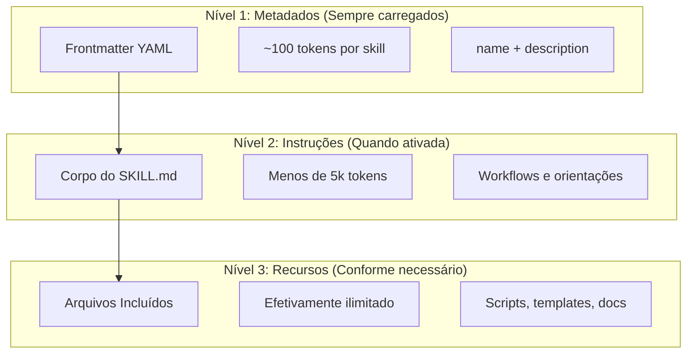
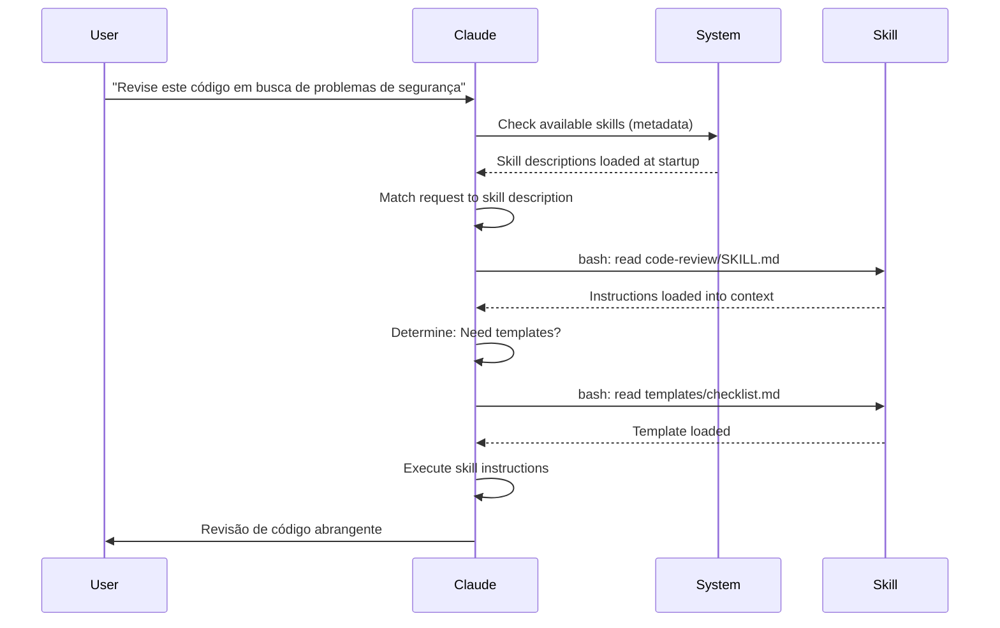

<!-- i18n-source: 03-skills/README.md -->
<!-- i18n-source-sha: d4369ce -->
<!-- i18n-date: 2026-04-16 -->

<picture>
  <source media="(prefers-color-scheme: dark)" srcset="../resources/logos/claude-howto-logo-dark.svg">
  
</picture>

# Guia de Skills de Agente

Skills de Agente são capacidades reutilizáveis baseadas no sistema de arquivos que estendem a funcionalidade do Claude. Elas empacotam expertise de domínio específico, workflows e melhores práticas em componentes descobríveis que o Claude usa automaticamente quando relevante.

## Visão geral

**Skills de Agente** são capacidades modulares que transformam agentes de propósito geral em especialistas. Ao contrário de prompts (instruções no nível da conversa para tarefas únicas), as skills carregam sob demanda e eliminam a necessidade de fornecer as mesmas orientações repetidamente em múltiplas conversas.

### Principais benefícios

- **Especialize o Claude**: adapte capacidades para tarefas específicas de domínio
- **Reduza repetição**: crie uma vez, use automaticamente em todas as conversas
- **Componha capacidades**: combine skills para construir workflows complexos
- **Escale workflows**: reutilize skills em múltiplos projetos e equipes
- **Mantenha qualidade**: incorpore melhores práticas diretamente no seu workflow

As skills seguem o padrão aberto [Agent Skills](https://agentskills.io), que funciona em múltiplas ferramentas de IA. O Claude Code estende o padrão com recursos adicionais como controle de invocação, execução de subagente e injeção dinâmica de contexto.

> **Nota**: Os comandos slash personalizados foram incorporados às skills. Arquivos `.claude/commands/` ainda funcionam e suportam os mesmos campos de frontmatter. Skills são recomendadas para novos desenvolvimentos. Quando ambos existem no mesmo caminho (ex.: `.claude/commands/review.md` e `.claude/skills/review/SKILL.md`), a skill tem precedência.

## Como as skills funcionam: divulgação progressiva

As skills usam uma arquitetura de **divulgação progressiva** — o Claude carrega informações em etapas conforme necessário, em vez de consumir contexto de uma vez. Isso permite gerenciamento eficiente de contexto mantendo escalabilidade ilimitada.

### Três níveis de carregamento



| Nível | Quando carregado | Custo em tokens | Conteúdo |
|-------|-----------------|-----------------|---------|
| **Nível 1: Metadados** | Sempre (na inicialização) | ~100 tokens por Skill | `name` e `description` do frontmatter YAML |
| **Nível 2: Instruções** | Quando a Skill é ativada | Menos de 5k tokens | Corpo do SKILL.md com instruções e orientações |
| **Nível 3+: Recursos** | Conforme necessário | Efetivamente ilimitado | Arquivos incluídos executados via bash sem carregar o conteúdo no contexto |

Isso significa que você pode instalar muitas Skills sem penalidade de contexto — o Claude só sabe que cada Skill existe e quando usá-la até ser realmente ativada.

## Processo de carregamento de skill



## Tipos e locais de skills

| Tipo | Local | Escopo | Compartilhada | Melhor para |
|------|-------|--------|---------------|-------------|
| **Enterprise** | Configurações gerenciadas | Todos os usuários da organização | Sim | Padrões de toda a organização |
| **Pessoal** | `~/.claude/skills/<nome-da-skill>/SKILL.md` | Individual | Não | Workflows pessoais |
| **Projeto** | `.claude/skills/<nome-da-skill>/SKILL.md` | Equipe | Sim (via git) | Padrões da equipe |
| **Plugin** | `<plugin>/skills/<nome-da-skill>/SKILL.md` | Onde habilitado | Depende | Incluído com plugins |

Quando skills compartilham o mesmo nome em diferentes níveis, locais de maior prioridade vencem: **enterprise > pessoal > projeto**. Skills de plugin usam o namespace `nome-do-plugin:nome-da-skill`, portanto não podem conflitar.

### Descoberta automática

**Diretórios aninhados**: quando você trabalha com arquivos em subdiretórios, o Claude Code descobre automaticamente skills de diretórios `.claude/skills/` aninhados. Por exemplo, se você está editando um arquivo em `packages/frontend/`, o Claude Code também procura skills em `packages/frontend/.claude/skills/`. Isso suporta configurações de monorrepositório onde pacotes têm suas próprias skills.

**Diretórios `--add-dir`**: Skills de diretórios adicionados via `--add-dir` são carregadas automaticamente com detecção de alterações ao vivo. Qualquer edição nos arquivos de skill nesses diretórios tem efeito imediato sem reiniciar o Claude Code.

**Orçamento de descrição**: As descrições de skills (metadados de Nível 1) são limitadas a **1% da janela de contexto** (fallback: **8.000 caracteres**). Se você tem muitas skills instaladas, as descrições podem ser abreviadas. Todos os nomes de skill são sempre incluídos, mas as descrições são cortadas para caber. Coloque o caso de uso principal no início das descrições. Substitua o orçamento com a variável de ambiente `SLASH_COMMAND_TOOL_CHAR_BUDGET`.

## Criando skills personalizadas

### Estrutura básica de diretório

```
minha-skill/
├── SKILL.md           # Instruções principais (obrigatório)
├── template.md        # Template para o Claude preencher
├── examples/
│   └── sample.md      # Exemplo de saída mostrando o formato esperado
└── scripts/
    └── validate.sh    # Script que o Claude pode executar
```

### Formato do SKILL.md

```yaml
---
name: nome-da-sua-skill
description: Descrição breve do que esta Skill faz e quando usá-la
---

# Nome da Sua Skill

## Instruções
Forneça orientações claras e passo a passo para o Claude.

## Exemplos
Mostre exemplos concretos de uso desta Skill.
```

### Campos obrigatórios

- **name**: apenas letras minúsculas, números e hífens (máx. 64 caracteres). Não pode conter "anthropic" ou "claude".
- **description**: o que a Skill faz E quando usá-la (máx. 1024 caracteres). Isso é crítico para o Claude saber quando ativar a skill.

### Campos opcionais do frontmatter

```yaml
---
name: minha-skill
description: O que esta skill faz e quando usá-la
argument-hint: "[arquivo] [formato]"        # Dica para autocompletar
disable-model-invocation: true              # Apenas o usuário pode invocar
user-invocable: false                       # Ocultar do menu slash
allowed-tools: Read, Grep, Glob             # Restringir acesso a ferramentas
model: opus                                 # Modelo específico a usar
effort: high                                # Nível de esforço (low, medium, high, max)
context: fork                               # Executar em subagente isolado
agent: Explore                              # Qual tipo de agente (com context: fork)
shell: bash                                 # Shell para comandos: bash (padrão) ou powershell
hooks:                                      # Hooks com escopo da skill
  PreToolUse:
    - matcher: "Bash"
      hooks:
        - type: command
          command: "./scripts/validate.sh"
paths: "src/api/**/*.ts"               # Padrões glob limitando quando a skill é ativada
---
```

| Campo | Descrição |
|-------|-----------|
| `name` | Apenas letras minúsculas, números e hífens (máx. 64 chars). Não pode conter "anthropic" ou "claude". |
| `description` | O que a Skill faz E quando usá-la (máx. 1024 chars). Crítico para correspondência de invocação automática. |
| `argument-hint` | Dica exibida no menu de autocompletar `/` (ex.: `"[arquivo] [formato]"`). |
| `disable-model-invocation` | `true` = apenas o usuário pode invocar via `/nome`. O Claude nunca invocará automaticamente. |
| `user-invocable` | `false` = oculto do menu `/`. Apenas o Claude pode invocá-la automaticamente. |
| `allowed-tools` | Lista separada por vírgulas das ferramentas que a skill pode usar sem prompts de permissão. |
| `model` | Substituição de modelo enquanto a skill está ativa (ex.: `opus`, `sonnet`). |
| `effort` | Nível de esforço enquanto a skill está ativa: `low`, `medium`, `high` ou `max`. |
| `context` | `fork` para executar a skill em um contexto de subagente bifurcado com sua própria janela de contexto. |
| `agent` | Tipo de subagente quando `context: fork` (ex.: `Explore`, `Plan`, `general-purpose`). |
| `shell` | Shell usado para substituições de `` !`comando` `` e scripts: `bash` (padrão) ou `powershell`. |
| `hooks` | Hooks com escopo do ciclo de vida desta skill (mesmo formato que hooks globais). |
| `paths` | Padrões glob que limitam quando a skill é ativada automaticamente. String separada por vírgulas ou lista YAML. Mesmo formato que regras específicas de caminho. |

## Tipos de conteúdo de skills

As skills podem conter dois tipos de conteúdo, cada um adequado para diferentes finalidades:

### Conteúdo de referência

Adiciona conhecimento que o Claude aplica ao seu trabalho atual — convenções, padrões, guias de estilo, conhecimento de domínio. Executa inline com o contexto da sua conversa.

```yaml
---
name: api-conventions
description: Padrões de design de API para este código
---

Ao escrever endpoints de API:
- Use convenções de nomenclatura RESTful
- Retorne formatos de erro consistentes
- Inclua validação de requisição
```

### Conteúdo de tarefa

Instruções passo a passo para ações específicas. Frequentemente invocadas diretamente com `/nome-da-skill`.

```yaml
---
name: deploy
description: Fazer deploy da aplicação para produção
context: fork
disable-model-invocation: true
---

Faça o deploy da aplicação:
1. Execute a suite de testes
2. Build da aplicação
3. Push para o destino de deploy
```

## Controlando a invocação de skills

Por padrão, tanto você quanto o Claude podem invocar qualquer skill. Dois campos do frontmatter controlam os três modos de invocação:

| Frontmatter | Você pode invocar | Claude pode invocar |
|---|---|---|
| (padrão) | Sim | Sim |
| `disable-model-invocation: true` | Sim | Não |
| `user-invocable: false` | Não | Sim |

**Use `disable-model-invocation: true`** para workflows com efeitos colaterais: `/commit`, `/deploy`, `/send-slack-message`. Você não quer que o Claude decida fazer deploy porque seu código parece pronto.

**Use `user-invocable: false`** para conhecimento de fundo que não é acionável como comando. Uma skill `legacy-system-context` explica como um sistema antigo funciona — útil para o Claude, mas não uma ação significativa para usuários.

## Substituições de string

As skills suportam valores dinâmicos que são resolvidos antes que o conteúdo da skill chegue ao Claude:

| Variável | Descrição |
|----------|-----------|
| `$ARGUMENTS` | Todos os argumentos passados ao invocar a skill |
| `$ARGUMENTS[N]` ou `$N` | Acessa argumento específico por índice (base 0) |
| `${CLAUDE_SESSION_ID}` | ID da sessão atual |
| `${CLAUDE_SKILL_DIR}` | Diretório contendo o arquivo SKILL.md da skill |
| `` !`comando` `` | Injeção dinâmica de contexto — executa um comando shell e inclui a saída inline |

**Exemplo:**

```yaml
---
name: fix-issue
description: Corrigir uma issue do GitHub
---

Corrija a issue $ARGUMENTS do GitHub seguindo nossos padrões de codificação.
1. Leia a descrição da issue
2. Implemente a correção
3. Escreva testes
4. Crie um commit
```

Executar `/fix-issue 123` substitui `$ARGUMENTS` por `123`.

## Injetando contexto dinâmico

A sintaxe `` !`comando` `` executa comandos shell antes que o conteúdo da skill seja enviado ao Claude:

```yaml
---
name: pr-summary
description: Resumir alterações em um pull request
context: fork
agent: Explore
---

## Contexto do pull request
- Diff do PR: !`gh pr diff`
- Comentários do PR: !`gh pr view --comments`
- Arquivos alterados: !`gh pr diff --name-only`

## Sua tarefa
Resuma este pull request...
```

Os comandos são executados imediatamente; o Claude vê apenas a saída final. Por padrão, os comandos rodam em `bash`. Defina `shell: powershell` no frontmatter para usar PowerShell em vez disso.

## Executando skills em subagentes

Adicione `context: fork` para executar uma skill em um contexto de subagente isolado. O conteúdo da skill se torna a tarefa para um subagente dedicado com sua própria janela de contexto, mantendo a conversa principal limpa.

O campo `agent` especifica qual tipo de agente usar:

| Tipo de agente | Melhor para |
|---|---|
| `Explore` | Pesquisa somente leitura, análise de código |
| `Plan` | Criar planos de implementação |
| `general-purpose` | Tarefas amplas que requerem todas as ferramentas |
| Agentes personalizados | Agentes especializados definidos na sua configuração |

**Exemplo de frontmatter:**

```yaml
---
context: fork
agent: Explore
---
```

**Exemplo completo de skill:**

```yaml
---
name: deep-research
description: Pesquisar um tópico profundamente
context: fork
agent: Explore
---

Pesquise $ARGUMENTS profundamente:
1. Encontre arquivos relevantes usando Glob e Grep
2. Leia e analise o código
3. Resuma as descobertas com referências específicas de arquivo
```

## Exemplos práticos

### Exemplo 1: Skill de revisão de código

**Estrutura de diretório:**

```
~/.claude/skills/code-review/
├── SKILL.md
├── templates/
│   ├── review-checklist.md
│   └── finding-template.md
└── scripts/
    ├── analyze-metrics.py
    └── compare-complexity.py
```

**Arquivo:** `~/.claude/skills/code-review/SKILL.md`

```yaml
---
name: code-review-specialist
description: Revisão de código abrangente com análise de segurança, performance e qualidade. Use quando usuários pedem para revisar código, analisar qualidade de código, avaliar pull requests, ou mencionam revisão de código, análise de segurança ou otimização de performance.
---

# Skill de Revisão de Código

Esta skill fornece capacidades abrangentes de revisão de código com foco em:

1. **Análise de Segurança**
   - Problemas de autenticação/autorização
   - Riscos de exposição de dados
   - Vulnerabilidades de injeção
   - Fraquezas criptográficas

2. **Revisão de Performance**
   - Eficiência de algoritmos (análise Big O)
   - Otimização de memória
   - Otimização de queries de banco de dados
   - Oportunidades de cache

3. **Qualidade de Código**
   - Princípios SOLID
   - Padrões de design
   - Convenções de nomenclatura
   - Cobertura de testes

4. **Manutenibilidade**
   - Legibilidade do código
   - Tamanho das funções (deve ser < 50 linhas)
   - Complexidade ciclomática
   - Segurança de tipos

## Template de revisão

Para cada trecho de código revisado, forneça:

### Resumo
- Avaliação geral de qualidade (1-5)
- Contagem de descobertas principais
- Áreas prioritárias recomendadas

### Problemas críticos (se houver)
- **Problema**: Descrição clara
- **Local**: Arquivo e número de linha
- **Impacto**: Por que isso importa
- **Gravidade**: Crítico/Alto/Médio
- **Correção**: Exemplo de código

Para checklists detalhadas, veja [templates/review-checklist.md](templates/review-checklist.md).
```

### Exemplo 2: Skill de visualizador de código

Uma skill que gera visualizações HTML interativas:

**Estrutura de diretório:**

```
~/.claude/skills/codebase-visualizer/
├── SKILL.md
└── scripts/
    └── visualize.py
```

**Arquivo:** `~/.claude/skills/codebase-visualizer/SKILL.md`

````yaml
---
name: codebase-visualizer
description: Gera uma visualização de árvore HTML interativa e recolhível do seu código. Use ao explorar um novo repo, entender a estrutura do projeto ou identificar arquivos grandes.
allowed-tools: Bash(python *)
---

# Visualizador de Código

Gera uma visualização HTML em árvore mostrando a estrutura de arquivos do seu projeto.

## Uso

Execute o script de visualização a partir da raiz do projeto:

```bash
python ~/.claude/skills/codebase-visualizer/scripts/visualize.py .
```

Isso cria `codebase-map.html` e o abre no seu navegador padrão.

## O que a visualização mostra

- **Diretórios recolhíveis**: clique nas pastas para expandir/recolher
- **Tamanhos de arquivo**: exibidos ao lado de cada arquivo
- **Cores**: cores diferentes para diferentes tipos de arquivo
- **Totais de diretório**: mostra o tamanho agregado de cada pasta
````

O script Python incluído faz o trabalho pesado enquanto o Claude cuida da orquestração.

### Exemplo 3: Skill de deploy (apenas invocação do usuário)

```yaml
---
name: deploy
description: Fazer deploy da aplicação para produção
disable-model-invocation: true
allowed-tools: Bash(npm *), Bash(git *)
---

Faça deploy de $ARGUMENTS para produção:

1. Execute a suite de testes: `npm test`
2. Build da aplicação: `npm run build`
3. Push para o destino de deploy
4. Verifique se o deploy foi bem-sucedido
5. Reporte o status do deploy
```

### Exemplo 4: Skill de voz da marca (conhecimento de fundo)

```yaml
---
name: brand-voice
description: Garantir que toda comunicação corresponda às diretrizes de voz e tom da marca. Use ao criar textos de marketing, comunicações com clientes ou conteúdo público.
user-invocable: false
---

## Tom de voz
- **Amigável mas profissional** — acessível sem ser informal
- **Claro e conciso** — evite jargão
- **Confiante** — sabemos o que estamos fazendo
- **Empático** — entenda as necessidades do usuário

## Diretrizes de escrita
- Use "você" ao se dirigir aos leitores
- Use voz ativa
- Mantenha frases com menos de 20 palavras
- Comece com proposta de valor

Para templates, veja [templates/](templates/).
```

### Exemplo 5: Skill geradora de CLAUDE.md

```yaml
---
name: claude-md
description: Criar ou atualizar arquivos CLAUDE.md seguindo melhores práticas para onboarding ideal de agentes de IA. Use quando usuários mencionam CLAUDE.md, documentação de projeto ou onboarding de IA.
---

## Princípios básicos

**LLMs são stateless**: CLAUDE.md é o único arquivo incluído automaticamente em cada conversa.

### As regras de ouro

1. **Menos é mais**: mantenha abaixo de 300 linhas (idealmente menos de 100)
2. **Aplicabilidade universal**: inclua apenas informações relevantes para CADA sessão
3. **Não use Claude como linter**: use ferramentas determinísticas em vez disso
4. **Nunca gere automaticamente**: crie manualmente com consideração cuidadosa

## Seções essenciais

- **Nome do projeto**: descrição breve de uma linha
- **Stack tecnológica**: linguagem principal, frameworks, banco de dados
- **Comandos de desenvolvimento**: comandos de instalação, teste e build
- **Convenções críticas**: apenas convenções não óbvias e de alto impacto
- **Problemas conhecidos / armadilhas**: coisas que pegam os desenvolvedores de surpresa
```

### Exemplo 6: Skill de refatoração com scripts

**Estrutura de diretório:**

```
refactor/
├── SKILL.md
├── references/
│   ├── code-smells.md
│   └── refactoring-catalog.md
├── templates/
│   └── refactoring-plan.md
└── scripts/
    ├── analyze-complexity.py
    └── detect-smells.py
```

**Arquivo:** `refactor/SKILL.md`

```yaml
---
name: code-refactor
description: Refatoração sistemática de código baseada na metodologia de Martin Fowler. Use quando usuários pedem para refatorar código, melhorar estrutura de código, reduzir dívida técnica ou eliminar code smells.
---

# Skill de Refatoração de Código

Uma abordagem faseada enfatizando mudanças seguras e incrementais apoiadas por testes.

## Workflow

Fase 1: Pesquisa e Análise → Fase 2: Avaliação de Cobertura de Testes →
Fase 3: Identificação de Code Smells → Fase 4: Criação de Plano de Refatoração →
Fase 5: Implementação Incremental → Fase 6: Revisão e Iteração

## Princípios básicos

1. **Preservação de comportamento**: o comportamento externo deve permanecer inalterado
2. **Pequenos passos**: faça mudanças minúsculas e testáveis
3. **Orientado a testes**: os testes são a rede de segurança
4. **Contínuo**: a refatoração é contínua, não um evento único

Para catálogo de code smells, veja [references/code-smells.md](references/code-smells.md).
Para técnicas de refatoração, veja [references/refactoring-catalog.md](references/refactoring-catalog.md).
```

## Arquivos de suporte

As skills podem incluir múltiplos arquivos em seu diretório além do `SKILL.md`. Esses arquivos de suporte (templates, exemplos, scripts, documentos de referência) permitem que o arquivo principal da skill permaneça focado enquanto fornece ao Claude recursos adicionais que ele pode carregar conforme necessário.

```
minha-skill/
├── SKILL.md              # Instruções principais (obrigatório, mantenha abaixo de 500 linhas)
├── templates/            # Templates para o Claude preencher
│   └── output-format.md
├── examples/             # Exemplos de saída mostrando o formato esperado
│   └── sample-output.md
├── references/           # Conhecimento de domínio e especificações
│   └── api-spec.md
└── scripts/              # Scripts que o Claude pode executar
    └── validate.sh
```

Diretrizes para arquivos de suporte:

- Mantenha o `SKILL.md` com menos de **500 linhas**. Mova material de referência detalhado, exemplos grandes e especificações para arquivos separados.
- Referencie arquivos adicionais do `SKILL.md` usando **caminhos relativos** (ex.: `[Referência da API](references/api-spec.md)`).
- Arquivos de suporte são carregados no Nível 3 (conforme necessário), portanto não consomem contexto até que o Claude realmente os leia.

## Gerenciando skills

### Visualizando skills disponíveis

Pergunte ao Claude diretamente:
```
Quais Skills estão disponíveis?
```

Ou verifique no sistema de arquivos:
```bash
# Listar skills pessoais
ls ~/.claude/skills/

# Listar skills do projeto
ls .claude/skills/
```

### Testando uma skill

Duas formas de testar:

**Deixe o Claude invocá-la automaticamente** pedindo algo que corresponda à descrição:
```
Você pode me ajudar a revisar este código em busca de problemas de segurança?
```

**Ou invoque diretamente** com o nome da skill:
```
/code-review src/auth/login.ts
```

### Atualizando uma skill

Edite o arquivo `SKILL.md` diretamente. As alterações têm efeito na próxima inicialização do Claude Code.

```bash
# Skill pessoal
code ~/.claude/skills/minha-skill/SKILL.md

# Skill do projeto
code .claude/skills/minha-skill/SKILL.md
```

### Restringindo o acesso a skills do Claude

Três formas de controlar quais skills o Claude pode invocar:

**Desative todas as skills** em `/permissions`:
```
# Adicione às regras de negação:
Skill
```

**Permita ou negue skills específicas**:
```
# Permita apenas skills específicas
Skill(commit)
Skill(review-pr *)

# Negue skills específicas
Skill(deploy *)
```

**Oculte skills individuais** adicionando `disable-model-invocation: true` ao frontmatter delas.

## Melhores práticas

### 1. Torne as descrições específicas

- **Ruim (vago)**: "Ajuda com documentos"
- **Bom (específico)**: "Extrai texto e tabelas de arquivos PDF, preenche formulários, mescla documentos. Use ao trabalhar com arquivos PDF ou quando o usuário mencionar PDFs, formulários ou extração de documentos."

### 2. Mantenha skills focadas

- Uma Skill = uma capacidade
- ✅ "Preenchimento de formulários PDF"
- ❌ "Processamento de documentos" (muito amplo)

### 3. Inclua termos-gatilho

Adicione palavras-chave nas descrições que correspondam às solicitações dos usuários:
```yaml
description: Analisa planilhas Excel, gera tabelas dinâmicas, cria gráficos. Use ao trabalhar com arquivos Excel, planilhas ou arquivos .xlsx.
```

### 4. Mantenha o SKILL.md abaixo de 500 linhas

Mova material de referência detalhado para arquivos separados que o Claude carrega conforme necessário.

### 5. Referencie arquivos de suporte

```markdown
## Recursos adicionais

- Para detalhes completos da API, veja [reference.md](reference.md)
- Para exemplos de uso, veja [examples.md](examples.md)
```

### O que fazer

- Use nomes claros e descritivos
- Inclua instruções abrangentes
- Adicione exemplos concretos
- Empacote scripts e templates relacionados
- Teste com cenários reais
- Documente dependências

### O que não fazer

- Não crie skills para tarefas únicas
- Não duplique funcionalidade existente
- Não faça skills muito amplas
- Não pule o campo de descrição
- Não instale skills de fontes não confiáveis sem auditar

## Solução de problemas

### Referência rápida

| Problema | Solução |
|---------|---------|
| Claude não usa a Skill | Torne a descrição mais específica com termos-gatilho |
| Arquivo de skill não encontrado | Verifique o caminho: `~/.claude/skills/nome/SKILL.md` |
| Erros YAML | Verifique marcadores `---`, indentação, sem tabs |
| Skills conflitam | Use termos-gatilho distintos nas descrições |
| Scripts não executam | Verifique permissões: `chmod +x scripts/*.py` |
| Claude não vê todas as skills | Skills demais; verifique `/context` por avisos |

### Skill não ativando

Se o Claude não usa sua skill quando esperado:

1. Verifique se a descrição inclui palavras-chave que os usuários diriam naturalmente
2. Verifique se a skill aparece ao perguntar "Quais skills estão disponíveis?"
3. Tente reformular sua solicitação para corresponder à descrição
4. Invoque diretamente com `/nome-da-skill` para testar

### Skill ativando demais

Se o Claude usa sua skill quando você não quer:

1. Torne a descrição mais específica
2. Adicione `disable-model-invocation: true` para invocação apenas manual

### Claude não vê todas as skills

As descrições de skills são carregadas em **1% da janela de contexto** (fallback: **8.000 caracteres**). Cada entrada é limitada a 250 caracteres independentemente do orçamento. Execute `/context` para verificar avisos sobre skills excluídas. Substitua o orçamento com a variável de ambiente `SLASH_COMMAND_TOOL_CHAR_BUDGET`.

## Considerações de segurança

**Use apenas Skills de fontes confiáveis.** As skills fornecem ao Claude capacidades através de instruções e código — uma Skill maliciosa pode direcionar o Claude a invocar ferramentas ou executar código de forma prejudicial.

**Principais considerações de segurança:**

- **Audite completamente**: revise todos os arquivos no diretório da Skill
- **Fontes externas são arriscadas**: skills que buscam de URLs externas podem ser comprometidas
- **Uso indevido de ferramentas**: Skills maliciosas podem invocar ferramentas de formas prejudiciais
- **Trate como instalação de software**: use apenas Skills de fontes confiáveis

## Skills vs outros recursos

| Recurso | Invocação | Melhor para |
|---------|-----------|-------------|
| **Skills** | Auto ou `/nome` | Expertise reutilizável, workflows |
| **Comandos Slash** | `/nome` iniciado pelo usuário | Atalhos rápidos (incorporados às skills) |
| **Subagentes** | Auto-delegado | Execução de tarefa isolada |
| **Memória (CLAUDE.md)** | Sempre carregado | Contexto persistente do projeto |
| **MCP** | Tempo real | Acesso a dados/serviços externos |
| **Hooks** | Orientado a eventos | Efeitos colaterais automatizados |

## Skills integradas

O Claude Code vem com várias skills integradas que estão sempre disponíveis sem instalação:

| Skill | Descrição |
|-------|-----------|
| `/simplify` | Revisa arquivos alterados em busca de reuso, qualidade e eficiência; cria 3 agentes de revisão paralelos |
| `/batch <instrução>` | Orquestra mudanças paralelas em larga escala no código usando git worktrees |
| `/debug [descrição]` | Soluciona problemas da sessão atual lendo o log de depuração |
| `/loop [intervalo] <prompt>` | Executa prompt repetidamente em intervalo (ex.: `/loop 5m check the deploy`) |
| `/claude-api` | Carrega referência da API/SDK Claude; ativa automaticamente em imports `anthropic`/`@anthropic-ai/sdk` |

Essas skills estão disponíveis pronto para uso e não precisam ser instaladas ou configuradas. Elas seguem o mesmo formato SKILL.md que as skills personalizadas.

## Compartilhando skills

### Skills de projeto (compartilhamento em equipe)

1. Crie a Skill em `.claude/skills/`
2. Commite no git
3. Membros da equipe puxam as alterações — Skills disponíveis imediatamente

### Skills pessoais

```bash
# Copie para o diretório pessoal
cp -r minha-skill ~/.claude/skills/

# Torne os scripts executáveis
chmod +x ~/.claude/skills/minha-skill/scripts/*.py
```

### Distribuição via plugin

Empacote skills no diretório `skills/` de um plugin para distribuição mais ampla.

## Indo além: uma coleção de skills e um gerenciador

Assim que você começar a construir skills a sério, duas coisas se tornam essenciais: uma biblioteca de skills comprovadas e uma ferramenta para gerenciá-las.

**[luongnv89/skills](https://github.com/luongnv89/skills)** — uma coleção de skills usadas diariamente em quase todos os projetos. Destaques incluem `logo-designer` (gera logos de projeto on-the-fly) e `ollama-optimizer` (ajusta performance de LLM local para seu hardware). Ótimo ponto de partida para skills prontas para uso.

**[luongnv89/asm](https://github.com/luongnv89/asm)** — Agent Skill Manager. Cuida do desenvolvimento de skills, detecção de duplicatas e testes. O comando `asm link` permite testar uma skill em qualquer projeto sem copiar arquivos — essencial quando você tem mais de um punhado de skills.

## Recursos adicionais

- [Documentação oficial de Skills](https://code.claude.com/docs/en/skills)
- [Blog de Arquitetura de Agent Skills](https://claude.com/blog/equipping-agents-for-the-real-world-with-agent-skills)
- [Repositório de Skills](https://github.com/luongnv89/skills) — coleção de skills prontas para uso
- [Guia de Comandos Slash](../01-slash-commands/) — atalhos iniciados pelo usuário
- [Guia de Subagentes](../04-subagents/) — agentes de IA delegados
- [Guia de Memória](../02-memory/) — contexto persistente
- [MCP (Model Context Protocol)](../05-mcp/) — dados externos em tempo real
- [Guia de Hooks](../06-hooks/) — automação orientada a eventos

---
**Última atualização**: 11 de abril de 2026
**Versão do Claude Code**: 2.1.101
**Fontes**:
- https://code.claude.com/docs/en/skills
**Modelos compatíveis**: Claude Sonnet 4.6, Claude Opus 4.6, Claude Haiku 4.5
