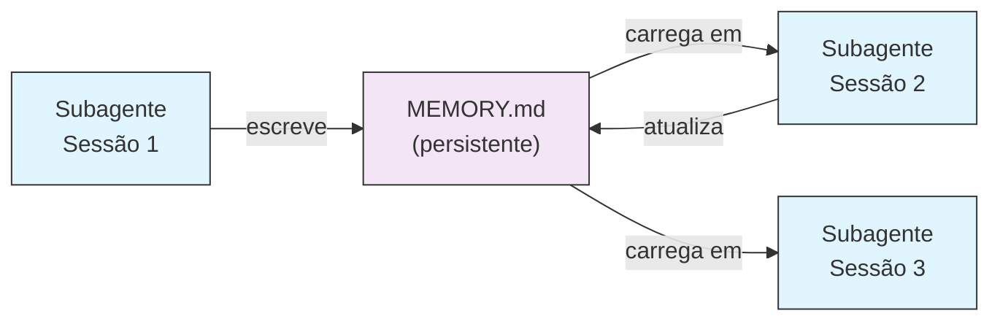
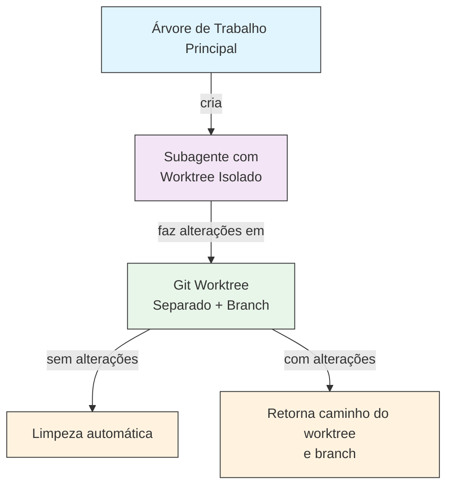
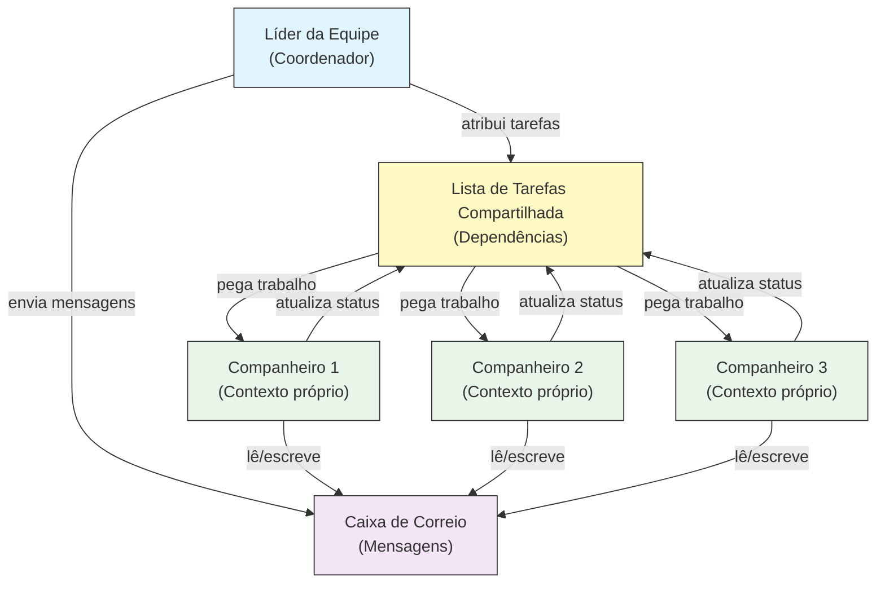
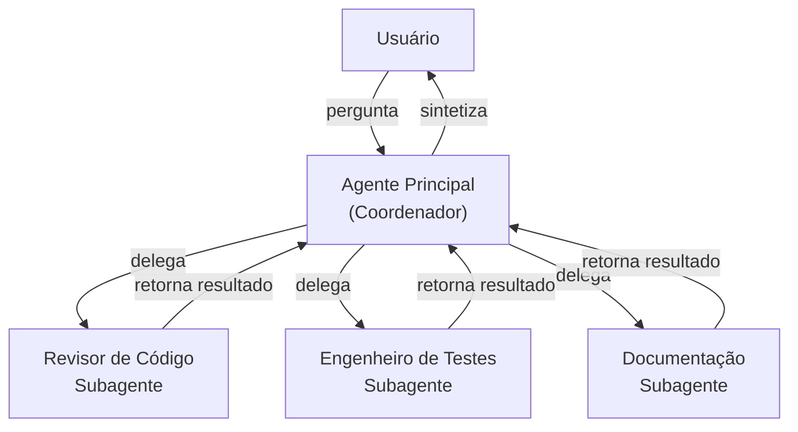
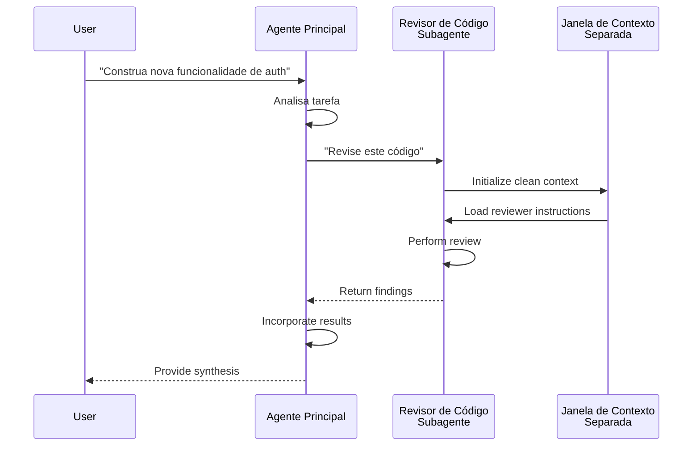
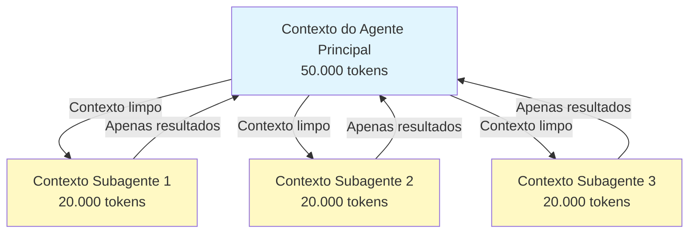
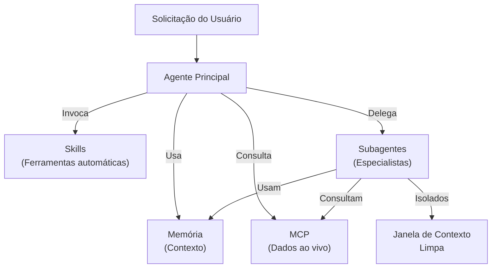

<!-- i18n-source: 04-subagents/README.md -->
<!-- i18n-source-sha: d4369ce -->
<!-- i18n-date: 2026-04-16 -->

<picture>
  <source media="(prefers-color-scheme: dark)" srcset="../resources/logos/claude-howto-logo-dark.svg">
  
</picture>

# Subagentes — Guia de Referência Completo

Subagentes são assistentes de IA especializados para os quais o Claude Code pode delegar tarefas. Cada subagente tem uma finalidade específica, usa sua própria janela de contexto separada da conversa principal e pode ser configurado com ferramentas específicas e um prompt de sistema personalizado.

## Sumário

1. [Visão geral](#visão-geral)
2. [Principais benefícios](#principais-benefícios)
3. [Locais de arquivo](#locais-de-arquivo)
4. [Configuração](#configuração)
5. [Subagentes integrados](#subagentes-integrados)
6. [Gerenciando subagentes](#gerenciando-subagentes)
7. [Usando subagentes](#usando-subagentes)
8. [Agentes retomáveis](#agentes-retomáveis)
9. [Encadeando subagentes](#encadeando-subagentes)
10. [Memória persistente para subagentes](#memória-persistente-para-subagentes)
11. [Subagentes em segundo plano](#subagentes-em-segundo-plano)
12. [Isolamento por worktree](#isolamento-por-worktree)
13. [Restringindo subagentes que podem ser criados](#restringindo-subagentes-que-podem-ser-criados)
14. [Comando CLI `claude agents`](#comando-cli-claude-agents)
15. [Equipes de agentes (experimental)](#equipes-de-agentes-experimental)
16. [Segurança de subagentes de plugin](#segurança-de-subagentes-de-plugin)
17. [Arquitetura](#arquitetura)
18. [Gerenciamento de contexto](#gerenciamento-de-contexto)
19. [Quando usar subagentes](#quando-usar-subagentes)
20. [Melhores práticas](#melhores-práticas)
21. [Exemplos de subagentes nesta pasta](#exemplos-de-subagentes-nesta-pasta)
22. [Instruções de instalação](#instruções-de-instalação)
23. [Conceitos relacionados](#conceitos-relacionados)

---

## Visão geral

Subagentes habilitam execução delegada de tarefas no Claude Code ao:

- Criar **assistentes de IA isolados** com janelas de contexto separadas
- Fornecer **prompts de sistema personalizados** para expertise especializada
- Aplicar **controle de acesso a ferramentas** para limitar capacidades
- Prevenir **poluição de contexto** de tarefas complexas
- Habilitar **execução paralela** de múltiplas tarefas especializadas

Cada subagente opera independentemente com um contexto limpo, recebendo apenas o contexto específico necessário para sua tarefa e retornando resultados ao agente principal para síntese.

**Início rápido**: use o comando `/agents` para criar, visualizar, editar e gerenciar seus subagentes interativamente.

---

## Principais benefícios

| Benefício | Descrição |
|-----------|-----------|
| **Preservação de contexto** | Opera em contexto separado, prevenindo poluição da conversa principal |
| **Expertise especializada** | Ajustado para domínios específicos com taxas de sucesso mais altas |
| **Reutilizabilidade** | Use em diferentes projetos e compartilhe com equipes |
| **Permissões flexíveis** | Diferentes níveis de acesso a ferramentas para diferentes tipos de subagente |
| **Escalabilidade** | Múltiplos agentes trabalham em diferentes aspectos simultaneamente |

---

## Locais de arquivo

Arquivos de subagente podem ser armazenados em múltiplos locais com diferentes escopos:

| Prioridade | Tipo | Local | Escopo |
|------------|------|-------|--------|
| 1 (maior) | **Definido via CLI** | Via flag `--agents` (JSON) | Apenas a sessão |
| 2 | **Subagentes do projeto** | `.claude/agents/` | Projeto atual |
| 3 | **Subagentes do usuário** | `~/.claude/agents/` | Todos os projetos |
| 4 (menor) | **Agentes de plugin** | Diretório `agents/` do plugin | Via plugins |

Quando nomes duplicados existem, fontes de maior prioridade têm precedência.

---

## Configuração

### Formato do arquivo

Subagentes são definidos em frontmatter YAML seguido do prompt de sistema em markdown:

```yaml
---
name: nome-do-seu-subagente
description: Descrição de quando este subagente deve ser invocado
tools: tool1, tool2, tool3  # Opcional — herda todas as ferramentas se omitido
disallowedTools: tool4  # Opcional — ferramentas explicitamente proibidas
model: sonnet  # Opcional — sonnet, opus, haiku, ou inherit
permissionMode: default  # Opcional — modo de permissão
maxTurns: 20  # Opcional — limite de turnos agênticos
skills: skill1, skill2  # Opcional — skills a pré-carregar no contexto
mcpServers: server1  # Opcional — servidores MCP disponíveis
memory: user  # Opcional — escopo de memória persistente (user, project, local)
background: false  # Opcional — executar como tarefa em segundo plano
effort: high  # Opcional — nível de raciocínio (low, medium, high, max)
isolation: worktree  # Opcional — isolamento por git worktree
initialPrompt: "Comece analisando o código"  # Opcional — primeiro turno enviado automaticamente
hooks:  # Opcional — hooks com escopo do componente
  PreToolUse:
    - matcher: "Bash"
      hooks:
        - type: command
          command: "./scripts/security-check.sh"
---

O prompt de sistema do seu subagente vai aqui. Pode ter múltiplos parágrafos
e deve definir claramente o papel, capacidades e abordagem do subagente
para resolver problemas.
```

### Campos de configuração

| Campo | Obrigatório | Descrição |
|-------|-------------|-----------|
| `name` | Sim | Identificador único (letras minúsculas e hífens) |
| `description` | Sim | Descrição em linguagem natural da finalidade. Inclua "use PROACTIVELY" para encorajar invocação automática |
| `tools` | Não | Lista separada por vírgulas de ferramentas específicas. Omita para herdar todas. Suporta sintaxe `Agent(nome_agente)` para restringir subagentes que podem ser criados |
| `disallowedTools` | Não | Lista separada por vírgulas de ferramentas que o subagente não deve usar |
| `model` | Não | Modelo a usar: `sonnet`, `opus`, `haiku`, ID completo do modelo, ou `inherit`. Padrão é o modelo de subagente configurado |
| `permissionMode` | Não | `default`, `acceptEdits`, `dontAsk`, `bypassPermissions`, `plan` |
| `maxTurns` | Não | Número máximo de turnos agênticos que o subagente pode fazer |
| `skills` | Não | Lista separada por vírgulas de skills a pré-carregar. Injeta o conteúdo completo da skill no contexto do subagente na inicialização |
| `mcpServers` | Não | Servidores MCP disponíveis para o subagente |
| `hooks` | Não | Hooks com escopo do componente (PreToolUse, PostToolUse, Stop) |
| `memory` | Não | Escopo do diretório de memória persistente: `user`, `project` ou `local` |
| `background` | Não | Defina como `true` para sempre executar este subagente como tarefa em segundo plano |
| `effort` | Não | Nível de esforço de raciocínio: `low`, `medium`, `high` ou `max` |
| `isolation` | Não | Defina como `worktree` para dar ao subagente seu próprio git worktree |
| `initialPrompt` | Não | Primeiro turno enviado automaticamente quando o subagente roda como agente principal |

### Opções de configuração de ferramentas

**Opção 1: Herdar todas as ferramentas (omita o campo)**
```yaml
---
name: full-access-agent
description: Agente com todas as ferramentas disponíveis
---
```

**Opção 2: Especificar ferramentas individuais**
```yaml
---
name: limited-agent
description: Agente com ferramentas específicas apenas
tools: Read, Grep, Glob, Bash
---
```

**Opção 3: Acesso condicional a ferramentas**
```yaml
---
name: conditional-agent
description: Agente com acesso filtrado a ferramentas
tools: Read, Bash(npm:*), Bash(test:*)
---
```

### Configuração via CLI

Defina subagentes para uma única sessão usando a flag `--agents` com formato JSON:

```bash
claude --agents '{
  "code-reviewer": {
    "description": "Revisor de código especialista. Use proativamente após alterações de código.",
    "prompt": "Você é um revisor de código sênior. Foque em qualidade, segurança e melhores práticas.",
    "tools": ["Read", "Grep", "Glob", "Bash"],
    "model": "sonnet"
  }
}'
```

**Formato JSON para a flag `--agents`:**

```json
{
  "nome-do-agente": {
    "description": "Obrigatório: quando invocar este agente",
    "prompt": "Obrigatório: prompt de sistema para o agente",
    "tools": ["Opcional", "array", "de", "ferramentas"],
    "model": "opcional: sonnet|opus|haiku"
  }
}
```

**Prioridade das definições de agente:**

As definições de agente são carregadas com esta ordem de prioridade (primeira correspondência vence):
1. **Definido via CLI** — flag `--agents` (apenas sessão, JSON)
2. **Nível de projeto** — `.claude/agents/` (projeto atual)
3. **Nível de usuário** — `~/.claude/agents/` (todos os projetos)
4. **Nível de plugin** — diretório `agents/` do plugin

Isso permite que definições via CLI substituam todas as outras fontes para uma única sessão.

---

## Subagentes integrados

O Claude Code inclui vários subagentes integrados que estão sempre disponíveis:

| Agente | Modelo | Finalidade |
|--------|--------|-----------|
| **general-purpose** | Herda | Tarefas complexas e de múltiplas etapas |
| **Plan** | Herda | Pesquisa para o modo de planejamento |
| **Explore** | Haiku | Exploração de código somente leitura (quick/medium/very thorough) |
| **Bash** | Herda | Comandos de terminal em contexto separado |
| **statusline-setup** | Sonnet | Configurar a linha de status |
| **Claude Code Guide** | Haiku | Responder perguntas sobre recursos do Claude Code |

### Subagente General-Purpose

| Propriedade | Valor |
|-------------|-------|
| **Modelo** | Herda do pai |
| **Ferramentas** | Todas as ferramentas |
| **Finalidade** | Tarefas complexas de pesquisa, operações de múltiplas etapas, modificações de código |

**Quando usado**: tarefas que requerem tanto exploração quanto modificação com raciocínio complexo.

### Subagente Plan

| Propriedade | Valor |
|-------------|-------|
| **Modelo** | Herda do pai |
| **Ferramentas** | Read, Glob, Grep, Bash |
| **Finalidade** | Usado automaticamente no modo de planejamento para pesquisar o código |

**Quando usado**: quando o Claude precisa entender o código antes de apresentar um plano.

### Subagente Explore

| Propriedade | Valor |
|-------------|-------|
| **Modelo** | Haiku (rápido, baixa latência) |
| **Modo** | Estritamente somente leitura |
| **Ferramentas** | Glob, Grep, Read, Bash (apenas comandos somente leitura) |
| **Finalidade** | Busca e análise rápida de código |

**Quando usado**: ao pesquisar/entender código sem fazer alterações.

**Níveis de profundidade** — especifique a profundidade da exploração:
- **"quick"** — buscas rápidas com exploração mínima, bom para encontrar padrões específicos
- **"medium"** — exploração moderada, equilíbrio entre velocidade e profundidade, abordagem padrão
- **"very thorough"** — análise abrangente em múltiplos locais e convenções de nomenclatura, pode demorar mais

### Subagente Bash

| Propriedade | Valor |
|-------------|-------|
| **Modelo** | Herda do pai |
| **Ferramentas** | Bash |
| **Finalidade** | Executar comandos de terminal em uma janela de contexto separada |

**Quando usado**: ao executar comandos shell que se beneficiam de contexto isolado.

### Subagente Statusline Setup

| Propriedade | Valor |
|-------------|-------|
| **Modelo** | Sonnet |
| **Ferramentas** | Read, Write, Bash |
| **Finalidade** | Configurar o display da linha de status do Claude Code |

**Quando usado**: ao configurar ou personalizar a linha de status.

### Subagente Claude Code Guide

| Propriedade | Valor |
|-------------|-------|
| **Modelo** | Haiku (rápido, baixa latência) |
| **Ferramentas** | Somente leitura |
| **Finalidade** | Responder perguntas sobre recursos e uso do Claude Code |

**Quando usado**: quando usuários fazem perguntas sobre como o Claude Code funciona ou como usar recursos específicos.

---

## Gerenciando subagentes

### Usando o comando `/agents` (recomendado)

```bash
/agents
```

Fornece um menu interativo para:
- Visualizar todos os subagentes disponíveis (integrados, de usuário e de projeto)
- Criar novos subagentes com configuração guiada
- Editar subagentes personalizados existentes e acesso a ferramentas
- Deletar subagentes personalizados
- Ver quais subagentes estão ativos quando há duplicatas

### Gerenciamento direto de arquivos

```bash
# Criar um subagente de projeto
mkdir -p .claude/agents
cat > .claude/agents/test-runner.md << 'EOF'
---
name: test-runner
description: Use proativamente para executar testes e corrigir falhas
---

Você é um especialista em automação de testes. Quando ver alterações de código,
execute proativamente os testes apropriados. Se os testes falharem, analise as
falhas e as corrija preservando a intenção original dos testes.
EOF

# Criar um subagente de usuário (disponível em todos os projetos)
mkdir -p ~/.claude/agents
```

---

## Usando subagentes

### Delegação automática

O Claude delega tarefas proativamente com base em:
- Descrição da tarefa na sua solicitação
- O campo `description` nas configurações de subagente
- Contexto atual e ferramentas disponíveis

Para encorajar uso proativo, inclua "use PROACTIVELY" ou "MUST BE USED" no seu campo `description`:

```yaml
---
name: code-reviewer
description: Especialista em revisão de código. Use PROACTIVELY após escrever ou modificar código.
---
```

### Invocação explícita

Você pode solicitar explicitamente um subagente específico:

```
> Use o subagente test-runner para corrigir testes com falha
> Peça ao subagente code-reviewer para verificar minhas alterações recentes
> Peça ao subagente debugger para investigar este erro
```

### Invocação por @-menção

Use o prefixo `@` para garantir que um subagente específico seja invocado (ignora heurísticas de delegação automática):

```
> @"code-reviewer (agent)" revise o módulo de autenticação
```

### Agente para toda a sessão

Execute uma sessão inteira usando um agente específico como agente principal:

```bash
# Via flag CLI
claude --agent code-reviewer

# Via settings.json
{
  "agent": "code-reviewer"
}
```

### Listando agentes disponíveis

Use o comando `claude agents` para listar todos os agentes configurados de todas as fontes:

```bash
claude agents
```

---

## Agentes retomáveis

Subagentes podem continuar conversas anteriores com contexto completo preservado:

```bash
# Invocação inicial
> Use o agente code-analyzer para começar a revisar o módulo de autenticação
# Retorna agentId: "abc123"

# Retome o agente mais tarde
> Retome o agente abc123 e agora analise também a lógica de autorização
```

**Casos de uso**:
- Pesquisa de longa duração em múltiplas sessões
- Refinamento iterativo sem perder contexto
- Workflows de múltiplas etapas mantendo contexto

---

## Encadeando subagentes

Execute múltiplos subagentes em sequência:

```bash
> Primeiro use o subagente code-analyzer para encontrar problemas de performance,
  depois use o subagente optimizer para corrigi-los
```

Isso habilita workflows complexos onde a saída de um subagente alimenta outro.

---

## Memória persistente para subagentes

O campo `memory` dá aos subagentes um diretório persistente que sobrevive entre conversas. Isso permite que subagentes acumulem conhecimento ao longo do tempo, armazenando notas, descobertas e contexto que persistem entre sessões.

### Escopos de memória

| Escopo | Diretório | Caso de uso |
|--------|-----------|-------------|
| `user` | `~/.claude/agent-memory/<name>/` | Notas pessoais e preferências em todos os projetos |
| `project` | `.claude/agent-memory/<name>/` | Conhecimento específico do projeto compartilhado com a equipe |
| `local` | `.claude/agent-memory-local/<name>/` | Conhecimento local do projeto não commitado no controle de versão |

### Como funciona

- As primeiras 200 linhas de `MEMORY.md` no diretório de memória são carregadas automaticamente no prompt de sistema do subagente
- As ferramentas `Read`, `Write` e `Edit` são habilitadas automaticamente para o subagente gerenciar seus arquivos de memória
- O subagente pode criar arquivos adicionais em seu diretório de memória conforme necessário

### Exemplo de configuração

```yaml
---
name: researcher
memory: user
---

Você é um assistente de pesquisa. Use seu diretório de memória para armazenar
descobertas, acompanhar progresso entre sessões e acumular conhecimento ao longo do tempo.

Verifique seu arquivo MEMORY.md no início de cada sessão para lembrar o contexto anterior.
```



---

## Subagentes em segundo plano

Subagentes podem ser executados em segundo plano, liberando a conversa principal para outras tarefas.

### Configuração

Defina `background: true` no frontmatter para sempre executar o subagente como tarefa em segundo plano:

```yaml
---
name: long-runner
background: true
description: Realiza tarefas de análise de longa duração em segundo plano
---
```

### Atalhos de teclado

| Atalho | Ação |
|--------|------|
| `Ctrl+B` | Mover para segundo plano uma tarefa de subagente em execução |
| `Ctrl+F` | Encerrar todos os agentes em segundo plano (pressione duas vezes para confirmar) |

### Desabilitando tarefas em segundo plano

Defina a variável de ambiente para desabilitar o suporte a tarefas em segundo plano completamente:

```bash
export CLAUDE_CODE_DISABLE_BACKGROUND_TASKS=1
```

---

## Isolamento por worktree

A configuração `isolation: worktree` dá a um subagente seu próprio git worktree, permitindo que ele faça alterações independentemente sem afetar a árvore de trabalho principal.

### Configuração

```yaml
---
name: feature-builder
isolation: worktree
description: Implementa funcionalidades em um git worktree isolado
tools: Read, Write, Edit, Bash, Grep, Glob
---
```

### Como funciona



- O subagente opera em seu próprio git worktree em um branch separado
- Se o subagente não fizer alterações, o worktree é limpo automaticamente
- Se houver alterações, o caminho do worktree e o nome do branch são retornados ao agente principal para revisão ou merge

---

## Restringindo subagentes que podem ser criados

Você pode controlar quais subagentes um dado subagente pode criar usando a sintaxe `Agent(tipo_agente)` no campo `tools`. Isso fornece uma forma de listar em allowlist subagentes específicos para delegação.

> **Nota**: Na v2.1.63, a ferramenta `Task` foi renomeada para `Agent`. Referências existentes a `Task(...)` ainda funcionam como aliases.

### Exemplo

```yaml
---
name: coordinator
description: Coordena trabalho entre agentes especializados
tools: Agent(worker, researcher), Read, Bash
---

Você é um agente coordenador. Pode delegar trabalho apenas aos subagentes
"worker" e "researcher". Use Read e Bash para sua própria exploração.
```

Neste exemplo, o subagente `coordinator` só pode criar os subagentes `worker` e `researcher`. Não pode criar outros subagentes, mesmo que estejam definidos em outro lugar.

---

## Comando CLI `claude agents`

O comando `claude agents` lista todos os agentes configurados agrupados por fonte (integrado, nível de usuário, nível de projeto):

```bash
claude agents
```

Este comando:
- Mostra todos os agentes disponíveis de todas as fontes
- Agrupa agentes por sua localização de origem
- Indica **substituições** quando um agente de maior prioridade sobrepõe um de menor prioridade (ex.: um agente de nível de projeto com o mesmo nome que um de nível de usuário)

---

## Equipes de agentes (experimental)

Equipes de agentes coordenam múltiplas instâncias do Claude Code trabalhando juntas em tarefas complexas. Ao contrário de subagentes (que são subtarefas delegadas que retornam resultados), companheiros de equipe trabalham independentemente com suas próprias janelas de contexto e podem se enviar mensagens diretamente por meio de um sistema de caixa de correio compartilhada.

> **Documentação oficial**: [code.claude.com/docs/en/agent-teams](https://code.claude.com/docs/en/agent-teams)

> **Nota**: Equipes de agentes é experimental e desabilitado por padrão. Requer Claude Code v2.1.32+. Habilite antes de usar.

### Subagentes vs Equipes de agentes

| Aspecto | Subagentes | Equipes de agentes |
|---------|-----------|-------------------|
| **Modelo de delegação** | Pai delega subtarefa, aguarda resultado | Líder coordena trabalho, companheiros executam independentemente |
| **Contexto** | Contexto novo por subtarefa, resultados destilados de volta | Cada companheiro mantém sua própria janela de contexto persistente |
| **Coordenação** | Sequencial ou paralelo, gerenciado pelo pai | Lista de tarefas compartilhada com gerenciamento automático de dependências |
| **Comunicação** | Resultados retornam apenas ao pai (sem mensagens entre agentes) | Companheiros podem se enviar mensagens diretamente via caixa de correio |
| **Retomada de sessão** | Suportado | Não suportado com companheiros in-process |
| **Melhor para** | Subtarefas focadas e bem definidas | Trabalho complexo que requer comunicação entre agentes e execução paralela |

### Habilitando equipes de agentes

Defina a variável de ambiente ou adicione ao seu `settings.json`:

```bash
export CLAUDE_CODE_EXPERIMENTAL_AGENT_TEAMS=1
```

Ou em `settings.json`:

```json
{
  "env": {
    "CLAUDE_CODE_EXPERIMENTAL_AGENT_TEAMS": "1"
  }
}
```

### Iniciando uma equipe

Uma vez habilitado, peça ao Claude para trabalhar com companheiros no seu prompt:

```
Usuário: Construa o módulo de autenticação. Use uma equipe — um companheiro
         para os endpoints de API, um para o esquema do banco de dados
         e um para a suite de testes.
```

O Claude criará a equipe, atribuirá tarefas e coordenará o trabalho automaticamente.

### Modos de display

Controle como a atividade dos companheiros é exibida:

| Modo | Flag | Descrição |
|------|------|-----------|
| **Auto** | `--teammate-mode auto` | Escolhe automaticamente o melhor modo para seu terminal |
| **In-process** (padrão) | `--teammate-mode in-process` | Exibe saída dos companheiros inline no terminal atual |
| **Split-panes** | `--teammate-mode tmux` | Abre cada companheiro em um painel tmux ou iTerm2 separado |

```bash
claude --teammate-mode tmux
```

Você também pode definir o modo de display em `settings.json`:

```json
{
  "teammateMode": "tmux"
}
```

> **Nota**: O modo de painéis divididos requer tmux ou iTerm2. Não está disponível no terminal VS Code, Windows Terminal ou Ghostty.

### Navegação

Use `Shift+Down` para navegar entre companheiros no modo de painéis divididos.

### Configuração de equipe

As configurações de equipe são armazenadas em `~/.claude/teams/{team-name}/config.json`.

### Arquitetura



**Componentes principais**:

- **Líder da equipe**: a sessão principal do Claude Code que cria a equipe, atribui tarefas e coordena
- **Lista de tarefas compartilhada**: uma lista sincronizada de tarefas com rastreamento automático de dependências
- **Caixa de correio**: um sistema de mensagens entre agentes para coordenação
- **Companheiros**: instâncias independentes do Claude Code, cada uma com sua própria janela de contexto

### Atribuição de tarefas e mensagens

O líder da equipe divide o trabalho em tarefas e as atribui aos companheiros. A lista de tarefas compartilhada gerencia:

- **Gerenciamento automático de dependências** — tarefas aguardam suas dependências serem concluídas
- **Rastreamento de status** — companheiros atualizam o status da tarefa conforme trabalham
- **Mensagens entre agentes** — companheiros enviam mensagens via caixa de correio para coordenação (ex.: "Esquema do banco de dados pronto, pode começar a escrever as queries")

### Fluxo de aprovação de plano

Para tarefas complexas, o líder da equipe cria um plano de execução antes que os companheiros comecem. O usuário revisa e aprova o plano, garantindo que a abordagem da equipe esteja alinhada com as expectativas antes de qualquer alteração de código.

### Eventos de hook para equipes

Equipes de agentes introduzem dois [eventos de hook](../06-hooks/) adicionais:

| Evento | Dispara quando | Caso de uso |
|--------|---------------|-------------|
| `TeammateIdle` | Um companheiro termina sua tarefa atual e não tem trabalho pendente | Acionar notificações, atribuir tarefas de acompanhamento |
| `TaskCompleted` | Uma tarefa na lista compartilhada é marcada como concluída | Executar validação, atualizar dashboards, encadear trabalho dependente |

### Melhores práticas

- **Tamanho da equipe**: mantenha equipes com 3-5 companheiros para coordenação ideal
- **Tamanho das tarefas**: divida o trabalho em tarefas que levem 5-15 minutos cada — pequenas o suficiente para paralelizar, grandes o suficiente para ser significativo
- **Evite conflitos de arquivo**: atribua arquivos ou diretórios diferentes a companheiros diferentes para evitar conflitos de merge
- **Comece simples**: use o modo in-process para sua primeira equipe; mude para painéis divididos depois de se familiarizar
- **Descrições claras de tarefas**: forneça descrições específicas e acionáveis para que os companheiros possam trabalhar independentemente

### Limitações

- **Experimental**: o comportamento do recurso pode mudar em versões futuras
- **Sem retomada de sessão**: companheiros in-process não podem ser retomados após o fim de uma sessão
- **Uma equipe por sessão**: não é possível criar equipes aninhadas ou múltiplas equipes em uma única sessão
- **Liderança fixa**: o papel de líder da equipe não pode ser transferido para um companheiro
- **Restrições de painéis divididos**: requer tmux/iTerm2; não disponível no terminal VS Code, Windows Terminal ou Ghostty
- **Sem equipes entre sessões**: companheiros existem apenas dentro da sessão atual

> **Aviso**: Equipes de agentes é experimental. Teste com trabalho não crítico primeiro e monitore a coordenação dos companheiros para comportamento inesperado.

---

## Segurança de subagentes de plugin

Subagentes fornecidos por plugins têm capacidades de frontmatter restritas por segurança. Os seguintes campos **não são permitidos** em definições de subagentes de plugin:

- `hooks` — não pode definir hooks de ciclo de vida
- `mcpServers` — não pode configurar servidores MCP
- `permissionMode` — não pode substituir configurações de permissão

Isso impede que plugins escalem privilégios ou executem comandos arbitrários por meio de hooks de subagente.

---

## Arquitetura

### Arquitetura de alto nível



### Ciclo de vida do subagente



---

## Gerenciamento de contexto



### Pontos-chave

- Cada subagente recebe uma **janela de contexto nova** sem o histórico da conversa principal
- Apenas o **contexto relevante** é passado ao subagente para sua tarefa específica
- Os resultados são **destilados** de volta ao agente principal
- Isso previne **esgotamento de tokens de contexto** em projetos longos

### Considerações de performance

- **Eficiência de contexto** — agentes preservam o contexto principal, habilitando sessões mais longas
- **Latência** — subagentes começam com contexto limpo e podem adicionar latência ao reunir contexto inicial

### Comportamentos-chave

- **Sem criação aninhada** — subagentes não podem criar outros subagentes
- **Permissões em segundo plano** — subagentes em segundo plano negam automaticamente permissões que não estejam pré-aprovadas
- **Em segundo plano** — pressione `Ctrl+B` para mover uma tarefa em execução para segundo plano
- **Transcrições** — transcrições de subagentes são armazenadas em `~/.claude/projects/{project}/{sessionId}/subagents/agent-{agentId}.jsonl`
- **Compactação automática** — o contexto do subagente é compactado automaticamente em ~95% da capacidade (substitua com a variável de ambiente `CLAUDE_AUTOCOMPACT_PCT_OVERRIDE`)

---

## Quando usar subagentes

| Cenário | Use subagente | Por quê |
|---------|--------------|---------|
| Funcionalidade complexa com muitas etapas | Sim | Separa responsabilidades, previne poluição de contexto |
| Revisão rápida de código | Não | Overhead desnecessário |
| Execução paralela de tarefas | Sim | Cada subagente tem seu próprio contexto |
| Expertise especializada necessária | Sim | Prompts de sistema personalizados |
| Análise de longa duração | Sim | Previne esgotamento do contexto principal |
| Tarefa única | Não | Adiciona latência desnecessariamente |

---

## Melhores práticas

### Princípios de design

**Faça:**
- Comece com agentes gerados pelo Claude — gere o subagente inicial com o Claude, depois itere para personalizar
- Projete subagentes focados — responsabilidades únicas e claras em vez de um fazendo tudo
- Escreva prompts detalhados — inclua instruções específicas, exemplos e restrições
- Limite o acesso a ferramentas — conceda apenas ferramentas necessárias para a finalidade do subagente
- Controle de versão — commite subagentes de projeto no controle de versão para colaboração em equipe

**Não faça:**
- Criar subagentes sobrepostos com os mesmos papéis
- Dar aos subagentes acesso desnecessário a ferramentas
- Usar subagentes para tarefas simples de uma etapa
- Misturar responsabilidades no prompt de um subagente
- Esquecer de passar o contexto necessário

### Melhores práticas de prompt de sistema

1. **Seja específico sobre o papel**
   ```
   Você é um revisor de código especialista em [áreas específicas]
   ```

2. **Defina prioridades claramente**
   ```
   Prioridades de revisão (em ordem):
   1. Problemas de segurança
   2. Problemas de performance
   3. Qualidade de código
   ```

3. **Especifique o formato de saída**
   ```
   Para cada problema forneça: Severidade, Categoria, Local, Descrição, Correção, Impacto
   ```

4. **Inclua etapas de ação**
   ```
   Quando invocado:
   1. Execute git diff para ver alterações recentes
   2. Foque nos arquivos modificados
   3. Comece a revisão imediatamente
   ```

### Estratégia de acesso a ferramentas

1. **Comece restritivo**: inicie com apenas ferramentas essenciais
2. **Expanda apenas quando necessário**: adicione ferramentas conforme os requisitos demandam
3. **Somente leitura quando possível**: use Read/Grep para agentes de análise
4. **Execução em sandbox**: limite comandos Bash a padrões específicos

---

## Exemplos de subagentes nesta pasta

Esta pasta contém subagentes de exemplo prontos para uso:

### 1. Revisor de código (`code-reviewer.md`)

**Finalidade**: análise abrangente de qualidade e manutenibilidade de código

**Ferramentas**: Read, Grep, Glob, Bash

**Especialização**:
- Detecção de vulnerabilidades de segurança
- Identificação de otimização de performance
- Avaliação de manutenibilidade do código
- Análise de cobertura de testes

**Use quando**: precisa de revisões de código automatizadas com foco em qualidade e segurança

---

### 2. Engenheiro de testes (`test-engineer.md`)

**Finalidade**: estratégia de testes, análise de cobertura e testes automatizados

**Ferramentas**: Read, Write, Bash, Grep

**Especialização**:
- Criação de testes unitários
- Design de testes de integração
- Identificação de casos extremos
- Análise de cobertura (meta >80%)

**Use quando**: precisa de criação abrangente de suite de testes ou análise de cobertura

---

### 3. Escritor de documentação (`documentation-writer.md`)

**Finalidade**: documentação técnica, docs de API e guias do usuário

**Ferramentas**: Read, Write, Grep

**Especialização**:
- Documentação de endpoints de API
- Criação de guias do usuário
- Documentação de arquitetura
- Melhoria de comentários de código

**Use quando**: precisa criar ou atualizar documentação do projeto

---

### 4. Revisor seguro (`secure-reviewer.md`)

**Finalidade**: revisão de código focada em segurança com permissões mínimas

**Ferramentas**: Read, Grep

**Especialização**:
- Detecção de vulnerabilidades de segurança
- Problemas de autenticação/autorização
- Riscos de exposição de dados
- Identificação de ataques de injeção

**Use quando**: precisa de auditorias de segurança sem capacidades de modificação

---

### 5. Agente de implementação (`implementation-agent.md`)

**Finalidade**: capacidades completas de implementação para desenvolvimento de funcionalidades

**Ferramentas**: Read, Write, Edit, Bash, Grep, Glob

**Especialização**:
- Implementação de funcionalidades
- Geração de código
- Execução de build e testes
- Modificação do código

**Use quando**: precisa que um subagente implemente funcionalidades de ponta a ponta

---

### 6. Depurador (`debugger.md`)

**Finalidade**: especialista em depuração para erros, falhas de testes e comportamento inesperado

**Ferramentas**: Read, Edit, Bash, Grep, Glob

**Especialização**:
- Análise de causa raiz
- Investigação de erros
- Resolução de falhas de testes
- Implementação de correção mínima

**Use quando**: encontra bugs, erros ou comportamento inesperado

---

### 7. Cientista de dados (`data-scientist.md`)

**Finalidade**: especialista em análise de dados para queries SQL e insights de dados

**Ferramentas**: Bash, Read, Write

**Especialização**:
- Otimização de queries SQL
- Operações BigQuery
- Análise e visualização de dados
- Insights estatísticos

**Use quando**: precisa de análise de dados, queries SQL ou operações BigQuery

---

## Instruções de instalação

### Método 1: Usando o comando /agents (recomendado)

```bash
/agents
```

Em seguida:
1. Selecione 'Create New Agent'
2. Escolha nível de projeto ou de usuário
3. Descreva seu subagente em detalhes
4. Selecione ferramentas para conceder acesso (ou deixe em branco para herdar todas)
5. Salve e use

### Método 2: Copiar para o projeto

Copie os arquivos de agente para o diretório `.claude/agents/` do seu projeto:

```bash
# Navegue para o seu projeto
cd /caminho/para/seu/projeto

# Crie o diretório de agentes se não existir
mkdir -p .claude/agents

# Copie todos os arquivos de agente desta pasta
cp /caminho/para/04-subagents/*.md .claude/agents/

# Remova o README (não necessário em .claude/agents)
rm .claude/agents/README.md
```

### Método 3: Copiar para o diretório do usuário

Para agentes disponíveis em todos os seus projetos:

```bash
# Crie o diretório de agentes do usuário
mkdir -p ~/.claude/agents

# Copie os agentes
cp /caminho/para/04-subagents/code-reviewer.md ~/.claude/agents/
cp /caminho/para/04-subagents/debugger.md ~/.claude/agents/
# ... copie outros conforme necessário
```

### Verificação

Após a instalação, verifique se os agentes são reconhecidos:

```bash
/agents
```

Você deve ver seus agentes instalados listados junto com os integrados.

---

## Estrutura de arquivos

```
project/
├── .claude/
│   └── agents/
│       ├── code-reviewer.md
│       ├── test-engineer.md
│       ├── documentation-writer.md
│       ├── secure-reviewer.md
│       ├── implementation-agent.md
│       ├── debugger.md
│       └── data-scientist.md
└── ...
```

---

## Conceitos relacionados

### Recursos relacionados

- **[Comandos Slash](../01-slash-commands/)** — atalhos rápidos iniciados pelo usuário
- **[Memória](../02-memory/)** — contexto persistente entre sessões
- **[Skills](../03-skills/)** — capacidades autônomas reutilizáveis
- **[Protocolo MCP](../05-mcp/)** — acesso a dados externos em tempo real
- **[Hooks](../06-hooks/)** — automação de comandos shell orientada a eventos
- **[Plugins](../07-plugins/)** — pacotes de extensão incluídos

### Comparação com outros recursos

| Recurso | Invocado pelo usuário | Invocado automaticamente | Persistente | Acesso externo | Contexto isolado |
|---------|----------------------|--------------------------|------------|-----------------|-----------------|
| **Comandos Slash** | Sim | Não | Não | Não | Não |
| **Subagentes** | Sim | Sim | Não | Não | Sim |
| **Memória** | Auto | Auto | Sim | Não | Não |
| **MCP** | Auto | Sim | Não | Sim | Não |
| **Skills** | Sim | Sim | Não | Não | Não |

### Padrão de integração



---

## Recursos adicionais

- [Documentação oficial de Subagentes](https://code.claude.com/docs/en/sub-agents)
- [Referência CLI](https://code.claude.com/docs/en/cli-reference) — flag `--agents` e outras opções CLI
- [Guia de Plugins](../07-plugins/) — para incluir agentes com outros recursos
- [Guia de Skills](../03-skills/) — para capacidades invocadas automaticamente
- [Guia de Memória](../02-memory/) — para contexto persistente
- [Guia de Hooks](../06-hooks/) — para automação orientada a eventos

---
**Última atualização**: 11 de abril de 2026
**Versão do Claude Code**: 2.1.101
**Fontes**:
- https://code.claude.com/docs/en/sub-agents
- https://code.claude.com/docs/en/agent-teams
**Modelos compatíveis**: Claude Sonnet 4.6, Claude Opus 4.6, Claude Haiku 4.5
