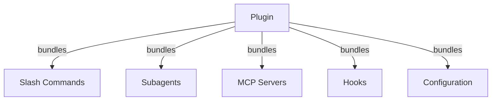
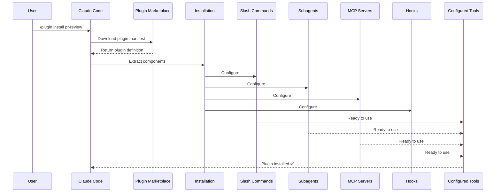
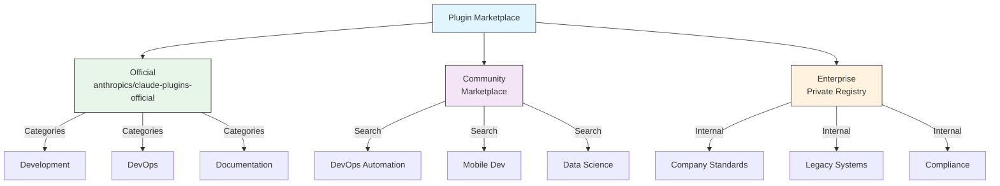
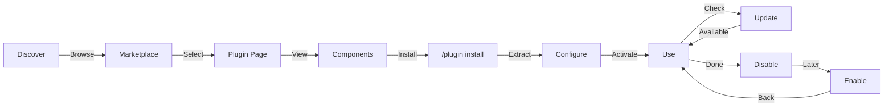
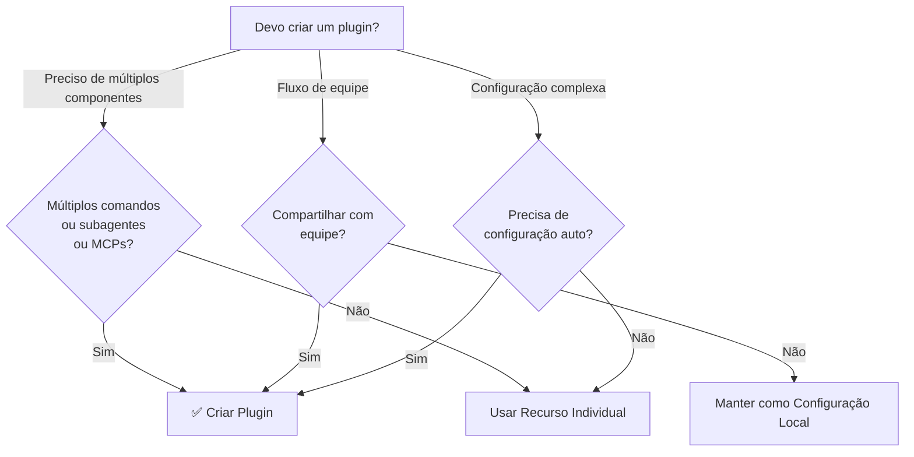

<!-- i18n-source: 07-plugins/README.md -->
<!-- i18n-source-sha: d4369ce -->
<!-- i18n-date: 2026-04-16 -->
<picture>
  <source media="(prefers-color-scheme: dark)" srcset="../resources/logos/claude-howto-logo-dark.svg">
  
</picture>

# Plugins do Claude Code

Esta pasta contém exemplos completos de plugins que agrupam múltiplos recursos do Claude Code em pacotes instaláveis e coesos.

## Visão Geral

Plugins do Claude Code são coleções agrupadas de customizações (comandos de barra, subagentes, servidores MCP e hooks) que se instalam com um único comando. Eles representam o mecanismo de extensão de mais alto nível — combinando múltiplos recursos em pacotes coesos e compartilháveis.

## Arquitetura do Plugin



## Processo de Carregamento do Plugin



## Tipos e Distribuição de Plugins

| Tipo | Escopo | Compartilhado | Autoridade | Exemplos |
|------|--------|---------------|------------|---------|
| Oficial | Global | Todos os usuários | Anthropic | PR Review, Security Guidance |
| Comunidade | Público | Todos os usuários | Comunidade | DevOps, Data Science |
| Organização | Interno | Membros da equipe | Empresa | Padrões internos, ferramentas |
| Pessoal | Individual | Único usuário | Desenvolvedor | Fluxos de trabalho personalizados |

## Estrutura de Definição do Plugin

O manifesto do plugin usa formato JSON em `.claude-plugin/plugin.json`:

```json
{
  "name": "my-first-plugin",
  "description": "A greeting plugin",
  "version": "1.0.0",
  "author": {
    "name": "Your Name"
  },
  "homepage": "https://example.com",
  "repository": "https://github.com/user/repo",
  "license": "MIT"
}
```

## Exemplo de Estrutura de Plugin

```
my-plugin/
├── .claude-plugin/
│   └── plugin.json       # Manifesto (nome, descrição, versão, autor)
├── commands/             # Skills como arquivos Markdown
│   ├── task-1.md
│   ├── task-2.md
│   └── workflows/
├── agents/               # Definições de agentes personalizados
│   ├── specialist-1.md
│   ├── specialist-2.md
│   └── configs/
├── skills/               # Agent Skills com arquivos SKILL.md
│   ├── skill-1.md
│   └── skill-2.md
├── hooks/                # Handlers de eventos em hooks.json
│   └── hooks.json
├── .mcp.json             # Configurações de servidores MCP
├── .lsp.json             # Configurações de servidores LSP para inteligência de código
├── bin/                  # Executáveis adicionados ao PATH da ferramenta Bash enquanto o plugin está ativado
├── settings.json         # Configurações padrão aplicadas quando o plugin está ativado (atualmente apenas a chave `agent` é suportada)
├── templates/
│   └── issue-template.md
├── scripts/
│   ├── helper-1.sh
│   └── helper-2.py
├── docs/
│   ├── README.md
│   └── USAGE.md
└── tests/
    └── plugin.test.js
```

### Configuração de servidor LSP

Plugins podem incluir suporte ao Language Server Protocol (LSP) para inteligência de código em tempo real. Servidores LSP fornecem diagnósticos, navegação de código e informações de símbolos enquanto você trabalha.

**Locais de configuração**:
- Arquivo `.lsp.json` no diretório raiz do plugin
- Chave `lsp` inline em `plugin.json`

#### Referência de campos

| Campo | Obrigatório | Descrição |
|-------|-------------|-----------|
| `command` | Sim | Binário do servidor LSP (deve estar no PATH) |
| `extensionToLanguage` | Sim | Mapeia extensões de arquivo para IDs de linguagem |
| `args` | Não | Argumentos de linha de comando para o servidor |
| `transport` | Não | Método de comunicação: `stdio` (padrão) ou `socket` |
| `env` | Não | Variáveis de ambiente para o processo do servidor |
| `initializationOptions` | Não | Opções enviadas durante a inicialização do LSP |
| `settings` | Não | Configuração do workspace passada ao servidor |
| `workspaceFolder` | Não | Substituir o caminho da pasta do workspace |
| `startupTimeout` | Não | Tempo máximo (ms) para aguardar a inicialização do servidor |
| `shutdownTimeout` | Não | Tempo máximo (ms) para desligamento gracioso |
| `restartOnCrash` | Não | Reiniciar automaticamente se o servidor travar |
| `maxRestarts` | Não | Número máximo de tentativas de reinicialização antes de desistir |

#### Exemplos de configuração

**Go (gopls)**:

```json
{
  "go": {
    "command": "gopls",
    "args": ["serve"],
    "extensionToLanguage": {
      ".go": "go"
    }
  }
}
```

**Python (pyright)**:

```json
{
  "python": {
    "command": "pyright-langserver",
    "args": ["--stdio"],
    "extensionToLanguage": {
      ".py": "python",
      ".pyi": "python"
    }
  }
}
```

**TypeScript**:

```json
{
  "typescript": {
    "command": "typescript-language-server",
    "args": ["--stdio"],
    "extensionToLanguage": {
      ".ts": "typescript",
      ".tsx": "typescriptreact",
      ".js": "javascript",
      ".jsx": "javascriptreact"
    }
  }
}
```

#### Plugins LSP disponíveis

O marketplace oficial inclui plugins LSP pré-configurados:

| Plugin | Linguagem | Binário do Servidor | Comando de Instalação |
|--------|-----------|---------------------|-----------------------|
| `pyright-lsp` | Python | `pyright-langserver` | `pip install pyright` |
| `typescript-lsp` | TypeScript/JavaScript | `typescript-language-server` | `npm install -g typescript-language-server typescript` |
| `rust-lsp` | Rust | `rust-analyzer` | Instalar via `rustup component add rust-analyzer` |

#### Capacidades do LSP

Uma vez configurados, os servidores LSP fornecem:

- **Diagnósticos instantâneos** — erros e avisos aparecem imediatamente após edições
- **Navegação de código** — ir para definição, encontrar referências, implementações
- **Informações ao passar o mouse** — assinaturas de tipos e documentação ao passar o mouse
- **Listagem de símbolos** — navegar por símbolos no arquivo atual ou workspace

## Opções do Plugin (v2.1.83+)

Plugins podem declarar opções configuráveis pelo usuário no manifesto via `userConfig`. Valores marcados com `sensitive: true` são armazenados no keychain do sistema em vez de arquivos de configurações em texto simples:

```json
{
  "name": "my-plugin",
  "version": "1.0.0",
  "userConfig": {
    "apiKey": {
      "description": "Chave de API para o serviço",
      "sensitive": true
    },
    "region": {
      "description": "Região de implantação",
      "default": "us-east-1"
    }
  }
}
```

## Dados Persistentes do Plugin (`${CLAUDE_PLUGIN_DATA}`) (v2.1.78+)

Plugins têm acesso a um diretório de estado persistente via a variável de ambiente `${CLAUDE_PLUGIN_DATA}`. Este diretório é único por plugin e sobrevive entre sessões, tornando-o adequado para caches, bancos de dados e outros estados persistentes:

```json
{
  "hooks": {
    "PostToolUse": [
      {
        "command": "node ${CLAUDE_PLUGIN_DATA}/track-usage.js"
      }
    ]
  }
}
```

O diretório é criado automaticamente quando o plugin é instalado. Arquivos armazenados aqui persistem até que o plugin seja desinstalado.

## Plugin Inline via Configurações (`source: 'settings'`) (v2.1.80+)

Plugins podem ser definidos inline em arquivos de configurações como entradas de marketplace usando o campo `source: 'settings'`. Isso permite incorporar uma definição de plugin diretamente sem exigir um repositório ou marketplace separado:

```json
{
  "pluginMarketplaces": [
    {
      "name": "inline-tools",
      "source": "settings",
      "plugins": [
        {
          "name": "quick-lint",
          "source": "./local-plugins/quick-lint"
        }
      ]
    }
  ]
}
```

## Configurações do Plugin

Plugins podem incluir um arquivo `settings.json` para fornecer configuração padrão. Atualmente suporta a chave `agent`, que define o agente da thread principal para o plugin:

```json
{
  "agent": "agents/specialist-1.md"
}
```

Quando um plugin inclui `settings.json`, seus padrões são aplicados na instalação. Os usuários podem substituir essas configurações em sua própria configuração de projeto ou usuário.

## Abordagem Standalone vs Plugin

| Abordagem | Nomes de Comandos | Configuração | Melhor Para |
|-----------|-------------------|-------------|------------|
| **Standalone** | `/hello` | Configuração manual no CLAUDE.md | Pessoal, específico do projeto |
| **Plugins** | `/plugin-name:hello` | Automatizada via plugin.json | Compartilhamento, distribuição, uso em equipe |

Use **comandos de barra standalone** para fluxos de trabalho pessoais rápidos. Use **plugins** quando quiser agrupar múltiplos recursos, compartilhar com uma equipe ou publicar para distribuição.

## Exemplos Práticos

### Exemplo 1: Plugin de Revisão de PR

**Arquivo:** `.claude-plugin/plugin.json`

```json
{
  "name": "pr-review",
  "version": "1.0.0",
  "description": "Complete PR review workflow with security, testing, and docs",
  "author": {
    "name": "Anthropic"
  },
  "repository": "https://github.com/your-org/pr-review",
  "license": "MIT"
}
```

**Arquivo:** `commands/review-pr.md`

```markdown
---
name: Review PR
description: Start comprehensive PR review with security and testing checks
---

# PR Review

This command initiates a complete pull request review including:

1. Security analysis
2. Test coverage verification
3. Documentation updates
4. Code quality checks
5. Performance impact assessment
```

**Arquivo:** `agents/security-reviewer.md`

```yaml
---
name: security-reviewer
description: Security-focused code review
tools: read, grep, diff
---

# Security Reviewer

Specializes in finding security vulnerabilities:
- Authentication/authorization issues
- Data exposure
- Injection attacks
- Secure configuration
```

**Instalação:**

```bash
/plugin install pr-review

# Resultado:
# ✅ 3 slash commands installed
# ✅ 3 subagents configured
# ✅ 2 MCP servers connected
# ✅ 4 hooks registered
# ✅ Ready to use!
```

### Exemplo 2: Plugin DevOps

**Componentes:**

```
devops-automation/
├── commands/
│   ├── deploy.md
│   ├── rollback.md
│   ├── status.md
│   └── incident.md
├── agents/
│   ├── deployment-specialist.md
│   ├── incident-commander.md
│   └── alert-analyzer.md
├── mcp/
│   ├── github-config.json
│   ├── kubernetes-config.json
│   └── prometheus-config.json
├── hooks/
│   ├── pre-deploy.js
│   ├── post-deploy.js
│   └── on-error.js
└── scripts/
    ├── deploy.sh
    ├── rollback.sh
    └── health-check.sh
```

### Exemplo 3: Plugin de Documentação

**Componentes Agrupados:**

```
documentation/
├── commands/
│   ├── generate-api-docs.md
│   ├── generate-readme.md
│   ├── sync-docs.md
│   └── validate-docs.md
├── agents/
│   ├── api-documenter.md
│   ├── code-commentator.md
│   └── example-generator.md
├── mcp/
│   ├── github-docs-config.json
│   └── slack-announce-config.json
└── templates/
    ├── api-endpoint.md
    ├── function-docs.md
    └── adr-template.md
```

## Marketplace de Plugins

O diretório oficial de plugins gerenciado pela Anthropic é `anthropics/claude-plugins-official`. Administradores Enterprise também podem criar marketplaces de plugins privados para distribuição interna.



### Configuração do Marketplace

Usuários enterprise e avançados podem controlar o comportamento do marketplace através das configurações:

| Configuração | Descrição |
|-------------|-----------|
| `extraKnownMarketplaces` | Adicionar fontes de marketplace adicionais além dos padrões |
| `strictKnownMarketplaces` | Controlar quais marketplaces os usuários têm permissão de adicionar |
| `deniedPlugins` | Lista de bloqueio gerenciada pelo administrador para impedir a instalação de plugins específicos |

### Recursos Adicionais do Marketplace

- **Timeout padrão do git**: Aumentado de 30s para 120s para repositórios de plugin grandes
- **Registros npm personalizados**: Plugins podem especificar URLs de registro npm personalizados para resolução de dependências
- **Fixação de versão**: Bloqueie plugins em versões específicas para ambientes reproduzíveis

### Schema de definição de marketplace

Marketplaces de plugins são definidos em `.claude-plugin/marketplace.json`:

```json
{
  "name": "my-team-plugins",
  "owner": "my-org",
  "plugins": [
    {
      "name": "code-standards",
      "source": "./plugins/code-standards",
      "description": "Enforce team coding standards",
      "version": "1.2.0",
      "author": "platform-team"
    },
    {
      "name": "deploy-helper",
      "source": {
        "source": "github",
        "repo": "my-org/deploy-helper",
        "ref": "v2.0.0"
      },
      "description": "Deployment automation workflows"
    }
  ]
}
```

| Campo | Obrigatório | Descrição |
|-------|-------------|-----------|
| `name` | Sim | Nome do marketplace em kebab-case |
| `owner` | Sim | Organização ou usuário que mantém o marketplace |
| `plugins` | Sim | Array de entradas de plugin |
| `plugins[].name` | Sim | Nome do plugin (kebab-case) |
| `plugins[].source` | Sim | Fonte do plugin (string de caminho ou objeto de fonte) |
| `plugins[].description` | Não | Breve descrição do plugin |
| `plugins[].version` | Não | String de versão semântica |
| `plugins[].author` | Não | Nome do autor do plugin |

### Tipos de fonte de plugin

Plugins podem ser originados de múltiplos locais:

| Fonte | Sintaxe | Exemplo |
|-------|---------|---------|
| **Caminho relativo** | String de caminho | `"./plugins/my-plugin"` |
| **GitHub** | `{ "source": "github", "repo": "owner/repo" }` | `{ "source": "github", "repo": "acme/lint-plugin", "ref": "v1.0" }` |
| **URL Git** | `{ "source": "url", "url": "..." }` | `{ "source": "url", "url": "https://git.internal/plugin.git" }` |
| **Subdiretório Git** | `{ "source": "git-subdir", "url": "...", "path": "..." }` | `{ "source": "git-subdir", "url": "https://github.com/org/monorepo.git", "path": "packages/plugin" }` |
| **npm** | `{ "source": "npm", "package": "..." }` | `{ "source": "npm", "package": "@acme/claude-plugin", "version": "^2.0" }` |
| **pip** | `{ "source": "pip", "package": "..." }` | `{ "source": "pip", "package": "claude-data-plugin", "version": ">=1.0" }` |

Fontes GitHub e git suportam campos opcionais `ref` (branch/tag) e `sha` (hash de commit) para fixação de versão.

### Métodos de distribuição

**GitHub (recomendado)**:
```bash
# Usuários adicionam seu marketplace
/plugin marketplace add owner/repo-name
```

**Outros serviços git** (URL completa necessária):
```bash
/plugin marketplace add https://gitlab.com/org/marketplace-repo.git
```

**Repositórios privados**: Suportados via helpers de credencial git ou tokens de ambiente. Os usuários devem ter acesso de leitura ao repositório.

**Submissão ao marketplace oficial**: Submeta plugins ao marketplace curado pela Anthropic para distribuição mais ampla via [claude.ai/settings/plugins/submit](https://claude.ai/settings/plugins/submit) ou [platform.claude.com/plugins/submit](https://platform.claude.com/plugins/submit).

### Modo estrito

Controle como as definições do marketplace interagem com arquivos `plugin.json` locais:

| Configuração | Comportamento |
|-------------|---------------|
| `strict: true` (padrão) | `plugin.json` local é autoritativo; entrada do marketplace o complementa |
| `strict: false` | A entrada do marketplace é toda a definição do plugin |

**Restrições de organização** com `strictKnownMarketplaces`:

| Valor | Efeito |
|-------|--------|
| Não definido | Sem restrições — usuários podem adicionar qualquer marketplace |
| Array vazio `[]` | Bloqueio total — nenhum marketplace permitido |
| Array de padrões | Lista de permissões — apenas marketplaces correspondentes podem ser adicionados |

```json
{
  "strictKnownMarketplaces": [
    "my-org/*",
    "github.com/trusted-vendor/*"
  ]
}
```

> **Aviso**: No modo estrito com `strictKnownMarketplaces`, os usuários só podem instalar plugins de marketplaces na lista de permissões. Útil para ambientes enterprise que requerem distribuição controlada de plugins.

## Ciclo de Vida e Instalação do Plugin



## Comparação de Recursos do Plugin

| Recurso | Slash Command | Skill | Subagente | Plugin |
|---------|---------------|-------|-----------|--------|
| **Instalação** | Cópia manual | Cópia manual | Config manual | Um comando |
| **Tempo de Configuração** | 5 minutos | 10 minutos | 15 minutos | 2 minutos |
| **Agrupamento** | Arquivo único | Arquivo único | Arquivo único | Múltiplos |
| **Versionamento** | Manual | Manual | Manual | Automático |
| **Compartilhamento em Equipe** | Copiar arquivo | Copiar arquivo | Copiar arquivo | ID de instalação |
| **Atualizações** | Manual | Manual | Manual | Auto-disponível |
| **Dependências** | Nenhuma | Nenhuma | Nenhuma | Pode incluir |
| **Marketplace** | Não | Não | Não | Sim |
| **Distribuição** | Repositório | Repositório | Repositório | Marketplace |

## Comandos CLI do Plugin

Todas as operações de plugin estão disponíveis como comandos CLI:

```bash
claude plugin install <name>@<marketplace>   # Instalar de um marketplace
claude plugin uninstall <name>               # Remover um plugin
claude plugin list                           # Listar plugins instalados
claude plugin enable <name>                  # Ativar um plugin desativado
claude plugin disable <name>                 # Desativar um plugin
claude plugin validate                       # Validar estrutura do plugin
```

## Métodos de Instalação

### Do Marketplace
```bash
/plugin install plugin-name
# ou via CLI:
claude plugin install plugin-name@marketplace-name
```

### Ativar / Desativar (com detecção automática de escopo)
```bash
/plugin enable plugin-name
/plugin disable plugin-name
```

### Plugin Local (para desenvolvimento)
```bash
# Flag CLI para teste local (repetível para múltiplos plugins)
claude --plugin-dir ./path/to/plugin
claude --plugin-dir ./plugin-a --plugin-dir ./plugin-b
```

### De Repositório Git
```bash
/plugin install github:username/repo
```

## Quando Criar um Plugin



### Casos de Uso para Plugins

| Caso de Uso | Recomendação | Motivo |
|-------------|--------------|--------|
| **Onboarding de Equipe** | ✅ Usar Plugin | Configuração instantânea, todas as configurações |
| **Configuração de Framework** | ✅ Usar Plugin | Agrupa comandos específicos do framework |
| **Padrões Enterprise** | ✅ Usar Plugin | Distribuição central, controle de versão |
| **Automação de Tarefa Rápida** | ❌ Usar Command | Complexidade excessiva |
| **Expertise de Domínio Único** | ❌ Usar Skill | Muito pesado, use skill |
| **Análise Especializada** | ❌ Usar Subagente | Criar manualmente ou usar skill |
| **Acesso a Dados Ao Vivo** | ❌ Usar MCP | Standalone, não agrupar |

## Testando um Plugin

Antes de publicar, teste seu plugin localmente usando o flag CLI `--plugin-dir` (repetível para múltiplos plugins):

```bash
claude --plugin-dir ./my-plugin
claude --plugin-dir ./my-plugin --plugin-dir ./another-plugin
```

Isso lança o Claude Code com seu plugin carregado, permitindo:
- Verificar se todos os comandos de barra estão disponíveis
- Testar se subagentes e agentes funcionam corretamente
- Confirmar se servidores MCP conectam adequadamente
- Validar a execução de hooks
- Verificar configurações de servidor LSP
- Verificar erros de configuração

## Hot-Reload

Plugins suportam hot-reload durante o desenvolvimento. Quando você modifica arquivos do plugin, o Claude Code pode detectar as alterações automaticamente. Você também pode forçar um recarregamento com:

```bash
/reload-plugins
```

Isso re-lê todos os manifestos de plugin, comandos, agentes, skills, hooks e configurações MCP/LSP sem reiniciar a sessão.

## Configurações Gerenciadas para Plugins

Administradores podem controlar o comportamento de plugins em toda a organização usando configurações gerenciadas:

| Configuração | Descrição |
|-------------|-----------|
| `enabledPlugins` | Lista de permissões de plugins ativados por padrão |
| `deniedPlugins` | Lista de bloqueio de plugins que não podem ser instalados |
| `extraKnownMarketplaces` | Adicionar fontes de marketplace adicionais além dos padrões |
| `strictKnownMarketplaces` | Restringir quais marketplaces os usuários têm permissão de adicionar |
| `allowedChannelPlugins` | Controlar quais plugins são permitidos por canal de lançamento |

Essas configurações podem ser aplicadas em nível de organização via arquivos de configuração gerenciados e têm precedência sobre as configurações do usuário.

## Segurança do Plugin

Subagentes de plugin executam em um sandbox restrito. As seguintes chaves de frontmatter **não são permitidas** em definições de subagente de plugin:

- `hooks` -- Subagentes não podem registrar handlers de eventos
- `mcpServers` -- Subagentes não podem configurar servidores MCP
- `permissionMode` -- Subagentes não podem substituir o modelo de permissão

Isso garante que plugins não possam escalar privilégios ou modificar o ambiente host além de seu escopo declarado.

## Publicando um Plugin

**Passos para publicar:**

1. Criar estrutura do plugin com todos os componentes
2. Escrever manifesto `.claude-plugin/plugin.json`
3. Criar `README.md` com documentação
4. Testar localmente com `claude --plugin-dir ./my-plugin`
5. Submeter ao marketplace de plugins
6. Ser revisado e aprovado
7. Publicado no marketplace
8. Usuários podem instalar com um comando

**Exemplo de submissão:**

```markdown
# PR Review Plugin

## Description
Complete PR review workflow with security, testing, and documentation checks.

## What's Included
- 3 slash commands for different review types
- 3 specialized subagents
- GitHub and CodeQL MCP integration
- Automated security scanning hooks

## Installation
```bash
/plugin install pr-review
```

## Features
✅ Security analysis
✅ Test coverage checking
✅ Documentation verification
✅ Code quality assessment
✅ Performance impact analysis

## Usage
```bash
/review-pr
/check-security
/check-tests
```

## Requirements
- Claude Code 1.0+
- GitHub access
- CodeQL (optional)
```

## Plugin vs Configuração Manual

**Configuração Manual (2+ horas):**
- Instalar comandos de barra um por um
- Criar subagentes individualmente
- Configurar MCPs separadamente
- Configurar hooks manualmente
- Documentar tudo
- Compartilhar com a equipe (torcer para que configurem corretamente)

**Com Plugin (2 minutos):**
```bash
/plugin install pr-review
# ✅ Tudo instalado e configurado
# ✅ Pronto para usar imediatamente
# ✅ A equipe pode reproduzir a configuração exata
```

## Boas Práticas

### Faça ✅
- Use nomes de plugin claros e descritivos
- Inclua README abrangente
- Versione seu plugin adequadamente (semver)
- Teste todos os componentes juntos
- Documente os requisitos claramente
- Forneça exemplos de uso
- Inclua tratamento de erros
- Marque adequadamente para descoberta
- Mantenha compatibilidade retroativa
- Mantenha plugins focados e coesos
- Inclua testes abrangentes
- Documente todas as dependências

### Não Faça ❌
- Não agrupe recursos não relacionados
- Não hardcode credenciais
- Não pule os testes
- Não esqueça a documentação
- Não crie plugins redundantes
- Não ignore o versionamento
- Não complique demais as dependências de componentes
- Não esqueça de tratar erros graciosamente

## Instruções de Instalação

### Instalando do Marketplace

1. **Navegar pelos plugins disponíveis:**
   ```bash
   /plugin list
   ```

2. **Ver detalhes do plugin:**
   ```bash
   /plugin info plugin-name
   ```

3. **Instalar um plugin:**
   ```bash
   /plugin install plugin-name
   ```

### Instalando de Caminho Local

```bash
/plugin install ./path/to/plugin-directory
```

### Instalando do GitHub

```bash
/plugin install github:username/repo
```

### Listar Plugins Instalados

```bash
/plugin list --installed
```

### Atualizar um Plugin

```bash
/plugin update plugin-name
```

### Desativar/Ativar um Plugin

```bash
# Desativar temporariamente
/plugin disable plugin-name

# Reativar
/plugin enable plugin-name
```

### Desinstalar um Plugin

```bash
/plugin uninstall plugin-name
```

## Conceitos Relacionados

Os seguintes recursos do Claude Code funcionam em conjunto com plugins:

- **[Comandos de Barra](../01-slash-commands/)** - Comandos individuais agrupados em plugins
- **[Memória](../02-memory/)** - Contexto persistente para plugins
- **[Skills](../03-skills/)** - Expertise de domínio que pode ser encapsulada em plugins
- **[Subagentes](../04-subagents/)** - Agentes especializados incluídos como componentes de plugin
- **[Servidores MCP](../05-mcp/)** - Integrações do Model Context Protocol agrupadas em plugins
- **[Hooks](../06-hooks/)** - Handlers de eventos que disparam fluxos de trabalho de plugin

## Exemplo de Fluxo de Trabalho Completo

### Fluxo de Trabalho Completo do Plugin de Revisão de PR

```
1. Usuário: /review-pr

2. Plugin executa:
   ├── hook pre-review.js valida repositório git
   ├── GitHub MCP busca dados do PR
   ├── subagente security-reviewer analisa segurança
   ├── subagente test-checker verifica cobertura
   └── subagente performance-analyzer verifica performance

3. Resultados sintetizados e apresentados:
   ✅ Segurança: Sem problemas críticos
   ⚠️  Testes: Cobertura 65% (recomenda 80%+)
   ✅ Performance: Sem impacto significativo
   📝 12 recomendações fornecidas
```

## Resolução de Problemas

### Plugin Não Instala
- Verifique a compatibilidade de versão do Claude Code: `/version`
- Verifique a sintaxe do `plugin.json` com um validador JSON
- Verifique a conexão com a internet (para plugins remotos)
- Revise as permissões: `ls -la plugin/`

### Componentes Não Carregam
- Verifique se os caminhos no `plugin.json` correspondem à estrutura real do diretório
- Verifique as permissões de arquivo: `chmod +x scripts/`
- Revise a sintaxe do arquivo de componente
- Verifique os logs: `/plugin debug plugin-name`

### Falha na Conexão MCP
- Verifique se as variáveis de ambiente estão configuradas corretamente
- Verifique a instalação e saúde do servidor MCP
- Teste a conexão MCP independentemente com `/mcp test`
- Revise a configuração MCP no diretório `mcp/`

### Comandos Não Disponíveis Após Instalação
- Certifique-se de que o plugin foi instalado com sucesso: `/plugin list --installed`
- Verifique se o plugin está ativado: `/plugin status plugin-name`
- Reinicie o Claude Code: `exit` e reabra
- Verifique conflitos de nomes com comandos existentes

### Problemas de Execução de Hooks
- Verifique se os arquivos de hook têm permissões corretas
- Verifique a sintaxe do hook e os nomes de eventos
- Revise os logs de hook para detalhes de erros
- Teste hooks manualmente se possível

## Recursos Adicionais

- [Documentação Oficial de Plugins](https://code.claude.com/docs/en/plugins)
- [Descobrir Plugins](https://code.claude.com/docs/en/discover-plugins)
- [Marketplaces de Plugins](https://code.claude.com/docs/en/plugin-marketplaces)
- [Referência de Plugins](https://code.claude.com/docs/en/plugins-reference)
- [Referência de Servidor MCP](https://modelcontextprotocol.io/)
- [Guia de Configuração de Subagentes](../04-subagents/README.md)
- [Referência do Sistema de Hooks](../06-hooks/README.md)

---
**Última Atualização**: 16 de abril de 2026
**Versão do Claude Code**: 2.1.112
**Fontes**:
- https://docs.anthropic.com/en/docs/claude-code/plugins
- https://www.anthropic.com/news/claude-opus-4-7
- https://support.claude.com/en/articles/12138966-release-notes
**Modelos Compatíveis**: Claude Sonnet 4.6, Claude Opus 4.7, Claude Haiku 4.5
