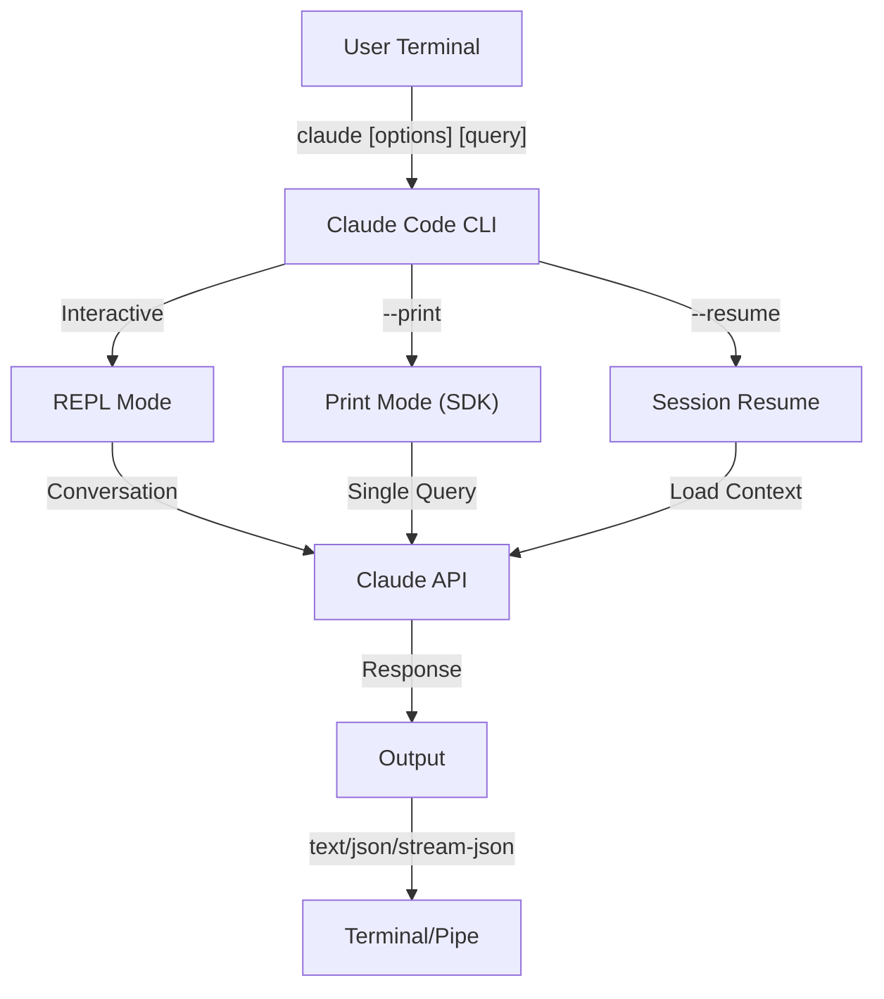
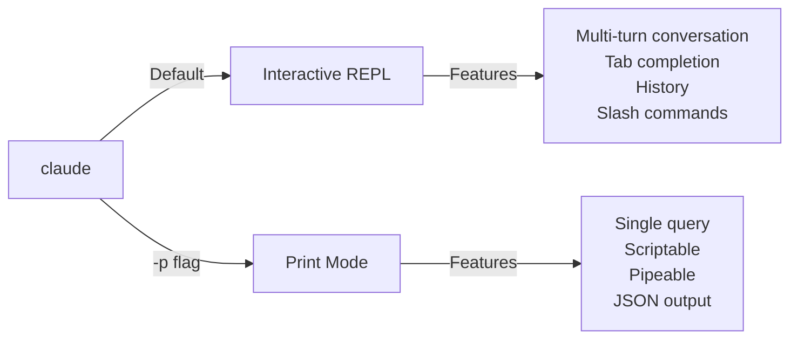

<!-- i18n-source: 10-cli/README.md -->
<!-- i18n-source-sha: d4369ce -->
<!-- i18n-date: 2026-04-16 -->
<picture>
  <source media="(prefers-color-scheme: dark)" srcset="../resources/logos/claude-howto-logo-dark.svg">
  
</picture>

# Referência CLI

## Visão Geral

O CLI (Interface de Linha de Comando) do Claude Code é a principal forma de interagir com o Claude Code. Ele fornece opções poderosas para executar consultas, gerenciar sessões, configurar modelos e integrar o Claude em seus fluxos de trabalho de desenvolvimento.

## Arquitetura



## Comandos CLI

| Comando | Descrição | Exemplo |
|---------|-----------|---------|
| `claude` | Iniciar REPL interativo | `claude` |
| `claude "query"` | Iniciar REPL com prompt inicial | `claude "explain this project"` |
| `claude -p "query"` | Modo de impressão - consulta e sai | `claude -p "explain this function"` |
| `cat file \| claude -p "query"` | Processar conteúdo via pipe | `cat logs.txt \| claude -p "explain"` |
| `claude -c` | Continuar conversa mais recente | `claude -c` |
| `claude -c -p "query"` | Continuar no modo de impressão | `claude -c -p "check for type errors"` |
| `claude -r "<session>" "query"` | Retomar sessão por ID ou nome | `claude -r "auth-refactor" "finish this PR"` |
| `claude update` | Atualizar para a versão mais recente | `claude update` |
| `claude mcp` | Configurar servidores MCP | Veja [documentação MCP](../05-mcp/) |
| `claude mcp serve` | Executar o Claude Code como servidor MCP | `claude mcp serve` |
| `claude agents` | Listar todos os subagentes configurados | `claude agents` |
| `claude auto-mode defaults` | Imprimir regras padrão do modo auto como JSON | `claude auto-mode defaults` |
| `claude remote-control` | Iniciar servidor de Controle Remoto | `claude remote-control` |
| `claude plugin` | Gerenciar plugins (instalar, ativar, desativar) | `claude plugin install my-plugin` |
| `claude auth login` | Fazer login (suporta `--email`, `--sso`) | `claude auth login --email user@example.com` |
| `claude auth logout` | Sair da conta atual | `claude auth logout` |
| `claude auth status` | Verificar status de autenticação (saída 0 se logado, 1 se não) | `claude auth status` |

## Flags Principais

| Flag | Descrição | Exemplo |
|------|-----------|---------|
| `-p, --print` | Imprimir resposta sem modo interativo | `claude -p "query"` |
| `-c, --continue` | Carregar conversa mais recente | `claude --continue` |
| `-r, --resume` | Retomar sessão específica por ID ou nome | `claude --resume auth-refactor` |
| `-v, --version` | Exibir número de versão | `claude -v` |
| `-w, --worktree` | Iniciar em worktree git isolado | `claude -w` |
| `-n, --name` | Nome de exibição da sessão | `claude -n "auth-refactor"` |
| `--from-pr <number>` | Retomar sessões vinculadas ao PR do GitHub | `claude --from-pr 42` |
| `--remote "task"` | Criar sessão web no claude.ai | `claude --remote "implement API"` |
| `--remote-control, --rc` | Sessão interativa com Controle Remoto | `claude --rc` |
| `--teleport` | Retomar sessão web localmente | `claude --teleport` |
| `--teammate-mode` | Modo de exibição da equipe de agentes | `claude --teammate-mode tmux` |
| `--bare` | Modo mínimo (pular hooks, skills, plugins, MCP, auto memory, CLAUDE.md) | `claude --bare` |
| `--enable-auto-mode` | Desbloquear modo de permissão auto | `claude --enable-auto-mode` |
| `--channels` | Inscrever-se em plugins de canal MCP | `claude --channels discord,telegram` |
| `--chrome` / `--no-chrome` | Ativar/desativar integração com navegador Chrome | `claude --chrome` |
| `--effort` | Definir nível de esforço de raciocínio | `claude --effort high` |
| `--init` / `--init-only` | Executar hooks de inicialização | `claude --init` |
| `--maintenance` | Executar hooks de manutenção e sair | `claude --maintenance` |
| `--disable-slash-commands` | Desativar todos os skills e comandos de barra | `claude --disable-slash-commands` |
| `--no-session-persistence` | Desativar salvamento de sessão (modo de impressão) | `claude -p --no-session-persistence "query"` |

### Modo Interativo vs Modo de Impressão



**Modo Interativo** (padrão):
```bash
# Iniciar sessão interativa
claude

# Iniciar com prompt inicial
claude "explain the authentication flow"
```

**Modo de Impressão** (não-interativo):
```bash
# Consulta única, depois sai
claude -p "what does this function do?"

# Processar conteúdo do arquivo
cat error.log | claude -p "explain this error"

# Encadear com outras ferramentas
claude -p "list todos" | grep "URGENT"
```

## Modelo e Configuração

| Flag | Descrição | Exemplo |
|------|-----------|---------|
| `--model` | Definir modelo (sonnet, opus, haiku, ou nome completo) | `claude --model opus` |
| `--fallback-model` | Fallback automático de modelo quando sobrecarregado | `claude -p --fallback-model sonnet "query"` |
| `--agent` | Especificar agente para a sessão | `claude --agent my-custom-agent` |
| `--agents` | Definir subagentes personalizados via JSON | Veja [Configuração de Agentes](#configuração-de-agentes) |
| `--effort` | Definir nível de esforço (low, medium, high, max) | `claude --effort high` |

### Exemplos de Seleção de Modelo

```bash
# Usar Opus 4.7 para tarefas complexas
claude --model opus "design a caching strategy"

# Usar Haiku 4.5 para tarefas rápidas
claude --model haiku -p "format this JSON"

# Nome completo do modelo
claude --model claude-sonnet-4-6-20250929 "review this code"

# Com fallback para confiabilidade
claude -p --model opus --fallback-model sonnet "analyze architecture"

# Usar opusplan (Opus planeja, Sonnet executa)
claude --model opusplan "design and implement the caching layer"
```

## Personalização do Prompt de Sistema

| Flag | Descrição | Exemplo |
|------|-----------|---------|
| `--system-prompt` | Substituir o prompt padrão completo | `claude --system-prompt "You are a Python expert"` |
| `--system-prompt-file` | Carregar prompt de arquivo (modo de impressão) | `claude -p --system-prompt-file ./prompt.txt "query"` |
| `--append-system-prompt` | Anexar ao prompt padrão | `claude --append-system-prompt "Always use TypeScript"` |

### Exemplos de Prompt de Sistema

```bash
# Persona personalizada completa
claude --system-prompt "You are a senior security engineer. Focus on vulnerabilities."

# Anexar instruções específicas
claude --append-system-prompt "Always include unit tests with code examples"

# Carregar prompt complexo de arquivo
claude -p --system-prompt-file ./prompts/code-reviewer.txt "review main.py"
```

### Comparação de Flags de Prompt de Sistema

| Flag | Comportamento | Interativo | Impressão |
|------|--------------|------------|-----------|
| `--system-prompt` | Substitui todo o prompt de sistema padrão | ✅ | ✅ |
| `--system-prompt-file` | Substitui com prompt do arquivo | ❌ | ✅ |
| `--append-system-prompt` | Anexa ao prompt de sistema padrão | ✅ | ✅ |

**Use `--system-prompt-file` apenas no modo de impressão. Para o modo interativo, use `--system-prompt` ou `--append-system-prompt`.**

## Gerenciamento de Ferramentas e Permissões

| Flag | Descrição | Exemplo |
|------|-----------|---------|
| `--tools` | Restringir ferramentas nativas disponíveis | `claude -p --tools "Bash,Edit,Read" "query"` |
| `--allowedTools` | Ferramentas que executam sem solicitar | `"Bash(git log:*)" "Read"` |
| `--disallowedTools` | Ferramentas removidas do contexto | `"Bash(rm:*)" "Edit"` |
| `--dangerously-skip-permissions` | Pular todos os prompts de permissão | `claude --dangerously-skip-permissions` |
| `--permission-mode` | Iniciar no modo de permissão especificado | `claude --permission-mode auto` |
| `--permission-prompt-tool` | Ferramenta MCP para tratamento de permissão | `claude -p --permission-prompt-tool mcp_auth "query"` |
| `--enable-auto-mode` | Desbloquear modo de permissão auto | `claude --enable-auto-mode` |

### Exemplos de Permissão

```bash
# Modo somente leitura para revisão de código
claude --permission-mode plan "review this codebase"

# Restringir para ferramentas seguras apenas
claude --tools "Read,Grep,Glob" -p "find all TODO comments"

# Permitir comandos git específicos sem prompts
claude --allowedTools "Bash(git status:*)" "Bash(git log:*)"

# Bloquear operações perigosas
claude --disallowedTools "Bash(rm -rf:*)" "Bash(git push --force:*)"
```

## Saída e Formato

| Flag | Descrição | Opções | Exemplo |
|------|-----------|--------|---------|
| `--output-format` | Especificar formato de saída (modo de impressão) | `text`, `json`, `stream-json` | `claude -p --output-format json "query"` |
| `--input-format` | Especificar formato de entrada (modo de impressão) | `text`, `stream-json` | `claude -p --input-format stream-json` |
| `--verbose` | Ativar log detalhado | | `claude --verbose` |
| `--include-partial-messages` | Incluir eventos de streaming | Requer `stream-json` | `claude -p --output-format stream-json --include-partial-messages "query"` |
| `--json-schema` | Obter JSON validado correspondendo ao schema | | `claude -p --json-schema '{"type":"object"}' "query"` |
| `--max-budget-usd` | Gasto máximo para o modo de impressão | | `claude -p --max-budget-usd 5.00 "query"` |

### Exemplos de Formato de Saída

```bash
# Texto simples (padrão)
claude -p "explain this code"

# JSON para uso programático
claude -p --output-format json "list all functions in main.py"

# JSON de streaming para processamento em tempo real
claude -p --output-format stream-json "generate a long report"

# Saída estruturada com validação de schema
claude -p --json-schema '{"type":"object","properties":{"bugs":{"type":"array"}}}' \
  "find bugs in this code and return as JSON"
```

## Workspace e Diretório

| Flag | Descrição | Exemplo |
|------|-----------|---------|
| `--add-dir` | Adicionar diretórios de trabalho adicionais | `claude --add-dir ../apps ../lib` |
| `--setting-sources` | Fontes de configuração separadas por vírgula | `claude --setting-sources user,project` |
| `--settings` | Carregar configurações de arquivo ou JSON | `claude --settings ./settings.json` |
| `--plugin-dir` | Carregar plugins do diretório (repetível) | `claude --plugin-dir ./my-plugin` |

### Exemplo de Múltiplos Diretórios

```bash
# Trabalhar em múltiplos diretórios de projeto
claude --add-dir ../frontend ../backend ../shared "find all API endpoints"

# Carregar configurações personalizadas
claude --settings '{"model":"opus","verbose":true}' "complex task"
```

## Configuração MCP

| Flag | Descrição | Exemplo |
|------|-----------|---------|
| `--mcp-config` | Carregar servidores MCP do JSON | `claude --mcp-config ./mcp.json` |
| `--strict-mcp-config` | Usar apenas a config MCP especificada | `claude --strict-mcp-config --mcp-config ./mcp.json` |
| `--channels` | Inscrever-se em plugins de canal MCP | `claude --channels discord,telegram` |

### Exemplos MCP

```bash
# Carregar servidor GitHub MCP
claude --mcp-config ./github-mcp.json "list open PRs"

# Modo estrito - apenas servidores especificados
claude --strict-mcp-config --mcp-config ./production-mcp.json "deploy to staging"
```

## Gerenciamento de Sessão

| Flag | Descrição | Exemplo |
|------|-----------|---------|
| `--session-id` | Usar ID de sessão específico (UUID) | `claude --session-id "550e8400-..."` |
| `--fork-session` | Criar nova sessão ao retomar | `claude --resume abc123 --fork-session` |

### Exemplos de Sessão

```bash
# Continuar última conversa
claude -c

# Retomar sessão nomeada
claude -r "feature-auth" "continue implementing login"

# Fork de sessão para experimentação
claude --resume feature-auth --fork-session "try alternative approach"

# Usar ID de sessão específico
claude --session-id "550e8400-e29b-41d4-a716-446655440000" "continue"
```

### Fork de Sessão

Criar um branch de uma sessão existente para experimentação:

```bash
# Fork de uma sessão para tentar uma abordagem diferente
claude --resume abc123 --fork-session "try alternative implementation"

# Fork com uma mensagem personalizada
claude -r "feature-auth" --fork-session "test with different architecture"
```

**Casos de Uso:**
- Tentar implementações alternativas sem perder a sessão original
- Experimentar com diferentes abordagens em paralelo
- Criar branches de trabalho bem-sucedido para variações
- Testar mudanças disruptivas sem afetar a sessão principal

A sessão original permanece inalterada, e o fork se torna uma nova sessão independente.

## Recursos Avançados

| Flag | Descrição | Exemplo |
|------|-----------|---------|
| `--chrome` | Ativar integração com navegador Chrome | `claude --chrome` |
| `--no-chrome` | Desativar integração com navegador Chrome | `claude --no-chrome` |
| `--ide` | Conectar automaticamente ao IDE se disponível | `claude --ide` |
| `--max-turns` | Limitar turnos agênticos (não-interativo) | `claude -p --max-turns 3 "query"` |
| `--debug` | Ativar modo debug com filtragem | `claude --debug "api,mcp"` |
| `--enable-lsp-logging` | Ativar log detalhado de LSP | `claude --enable-lsp-logging` |
| `--betas` | Headers beta para solicitações de API | `claude --betas interleaved-thinking` |
| `--plugin-dir` | Carregar plugins do diretório (repetível) | `claude --plugin-dir ./my-plugin` |
| `--enable-auto-mode` | Desbloquear modo de permissão auto | `claude --enable-auto-mode` |
| `--effort` | Definir nível de esforço de raciocínio | `claude --effort high` |
| `--bare` | Modo mínimo (pular hooks, skills, plugins, MCP, auto memory, CLAUDE.md) | `claude --bare` |
| `--channels` | Inscrever-se em plugins de canal MCP | `claude --channels discord` |
| `--tmux` | Criar sessão tmux para worktree | `claude --tmux` |
| `--fork-session` | Criar novo ID de sessão ao retomar | `claude --resume abc --fork-session` |
| `--max-budget-usd` | Gasto máximo (modo de impressão) | `claude -p --max-budget-usd 5.00 "query"` |
| `--json-schema` | Saída JSON validada | `claude -p --json-schema '{"type":"object"}' "q"` |

### Exemplos Avançados

```bash
# Limitar ações autônomas
claude -p --max-turns 5 "refactor this module"

# Depurar chamadas de API
claude --debug "api" "test query"

# Ativar integração IDE
claude --ide "help me with this file"
```

## Configuração de Agentes

O flag `--agents` aceita um objeto JSON definindo subagentes personalizados para uma sessão.

### Formato JSON de Agentes

```json
{
  "agent-name": {
    "description": "Obrigatório: quando invocar este agente",
    "prompt": "Obrigatório: prompt de sistema para o agente",
    "tools": ["Opcional", "array", "de", "ferramentas"],
    "model": "opcional: sonnet|opus|haiku"
  }
}
```

**Campos Obrigatórios:**
- `description` - Descrição em linguagem natural de quando usar este agente
- `prompt` - Prompt de sistema que define o papel e comportamento do agente

**Campos Opcionais:**
- `tools` - Array de ferramentas disponíveis (herda todas se omitido)
  - Formato: `["Read", "Grep", "Glob", "Bash"]`
- `model` - Modelo a usar: `sonnet`, `opus` ou `haiku`

### Exemplo Completo de Agentes

```json
{
  "code-reviewer": {
    "description": "Expert code reviewer. Use proactively after code changes.",
    "prompt": "You are a senior code reviewer. Focus on code quality, security, and best practices.",
    "tools": ["Read", "Grep", "Glob", "Bash"],
    "model": "sonnet"
  },
  "debugger": {
    "description": "Debugging specialist for errors and test failures.",
    "prompt": "You are an expert debugger. Analyze errors, identify root causes, and provide fixes.",
    "tools": ["Read", "Edit", "Bash", "Grep"],
    "model": "opus"
  },
  "documenter": {
    "description": "Documentation specialist for generating guides.",
    "prompt": "You are a technical writer. Create clear, comprehensive documentation.",
    "tools": ["Read", "Write"],
    "model": "haiku"
  }
}
```

### Exemplos de Comandos de Agentes

```bash
# Definir agentes personalizados inline
claude --agents '{
  "security-auditor": {
    "description": "Security specialist for vulnerability analysis",
    "prompt": "You are a security expert. Find vulnerabilities and suggest fixes.",
    "tools": ["Read", "Grep", "Glob"],
    "model": "opus"
  }
}' "audit this codebase for security issues"

# Carregar agentes de arquivo
claude --agents "$(cat ~/.claude/agents.json)" "review the auth module"

# Combinar com outros flags
claude -p --agents "$(cat agents.json)" --model sonnet "analyze performance"
```

### Prioridade de Agentes

Quando múltiplas definições de agente existem, elas são carregadas nesta ordem de prioridade:
1. **Definidos via CLI** (flag `--agents`) - Específicos da sessão
2. **Nível de usuário** (`~/.claude/agents/`) - Todos os projetos
3. **Nível de projeto** (`.claude/agents/`) - Projeto atual

Agentes definidos via CLI substituem tanto agentes de usuário quanto de projeto para a sessão.

---

## Casos de Uso de Alto Valor

### 1. Integração CI/CD

Use o Claude Code em seus pipelines CI/CD para revisão automática de código, testes e documentação.

**Exemplo GitHub Actions:**

```yaml
name: AI Code Review

on: [pull_request]

jobs:
  review:
    runs-on: ubuntu-latest
    steps:
      - uses: actions/checkout@v4

      - name: Install Claude Code
        run: npm install -g @anthropic-ai/claude-code

      - name: Run Code Review
        env:
          ANTHROPIC_API_KEY: ${{ secrets.ANTHROPIC_API_KEY }}
        run: |
          claude -p --output-format json \
            --max-turns 1 \
            "Review the changes in this PR for:
            - Security vulnerabilities
            - Performance issues
            - Code quality
            Output as JSON with 'issues' array" > review.json

      - name: Post Review Comment
        uses: actions/github-script@v7
        with:
          script: |
            const fs = require('fs');
            const review = JSON.parse(fs.readFileSync('review.json', 'utf8'));
            // Process and post review comments
```

**Jenkins Pipeline:**

```groovy
pipeline {
    agent any
    stages {
        stage('AI Review') {
            steps {
                sh '''
                    claude -p --output-format json \
                      --max-turns 3 \
                      "Analyze test coverage and suggest missing tests" \
                      > coverage-analysis.json
                '''
            }
        }
    }
}
```

### 2. Pipe de Scripts

Processe arquivos, logs e dados através do Claude para análise.

**Análise de Logs:**

```bash
# Analisar logs de erro
tail -1000 /var/log/app/error.log | claude -p "summarize these errors and suggest fixes"

# Encontrar padrões em logs de acesso
cat access.log | claude -p "identify suspicious access patterns"

# Analisar histórico git
git log --oneline -50 | claude -p "summarize recent development activity"
```

**Processamento de Código:**

```bash
# Revisar um arquivo específico
cat src/auth.ts | claude -p "review this authentication code for security issues"

# Gerar documentação
cat src/api/*.ts | claude -p "generate API documentation in markdown"

# Encontrar TODOs e priorizar
grep -r "TODO" src/ | claude -p "prioritize these TODOs by importance"
```

### 3. Fluxos de Trabalho Multi-Sessão

Gerenciar projetos complexos com múltiplas threads de conversa.

```bash
# Iniciar uma sessão de branch de feature
claude -r "feature-auth" "let's implement user authentication"

# Mais tarde, continuar a sessão
claude -r "feature-auth" "add password reset functionality"

# Fork para tentar uma abordagem alternativa
claude --resume feature-auth --fork-session "try OAuth instead"

# Alternar entre diferentes sessões de feature
claude -r "feature-payments" "continue with Stripe integration"
```

### 4. Configuração de Agentes Personalizados

Defina agentes especializados para os fluxos de trabalho de sua equipe.

```bash
# Salvar config de agentes em arquivo
cat > ~/.claude/agents.json << 'EOF'
{
  "reviewer": {
    "description": "Code reviewer for PR reviews",
    "prompt": "Review code for quality, security, and maintainability.",
    "model": "opus"
  },
  "documenter": {
    "description": "Documentation specialist",
    "prompt": "Generate clear, comprehensive documentation.",
    "model": "sonnet"
  },
  "refactorer": {
    "description": "Code refactoring expert",
    "prompt": "Suggest and implement clean code refactoring.",
    "tools": ["Read", "Edit", "Glob"]
  }
}
EOF

# Usar agentes na sessão
claude --agents "$(cat ~/.claude/agents.json)" "review the auth module"
```

### 5. Processamento em Lote

Processar múltiplas consultas com configurações consistentes.

```bash
# Processar múltiplos arquivos
for file in src/*.ts; do
  echo "Processing $file..."
  claude -p --model haiku "summarize this file: $(cat $file)" >> summaries.md
done

# Revisão de código em lote
find src -name "*.py" -exec sh -c '
  echo "## $1" >> review.md
  cat "$1" | claude -p "brief code review" >> review.md
' _ {} \;

# Gerar testes para todos os módulos
for module in $(ls src/modules/); do
  claude -p "generate unit tests for src/modules/$module" > "tests/$module.test.ts"
done
```

### 6. Desenvolvimento Consciente de Segurança

Use controles de permissão para operação segura.

```bash
# Auditoria de segurança somente leitura
claude --permission-mode plan \
  --tools "Read,Grep,Glob" \
  "audit this codebase for security vulnerabilities"

# Bloquear comandos perigosos
claude --disallowedTools "Bash(rm:*)" "Bash(curl:*)" "Bash(wget:*)" \
  "help me clean up this project"

# Automação restrita
claude -p --max-turns 2 \
  --allowedTools "Read" "Glob" \
  "find all hardcoded credentials"
```

### 7. Integração de API JSON

Use o Claude como uma API programável para suas ferramentas com análise `jq`.

```bash
# Obter análise estruturada
claude -p --output-format json \
  --json-schema '{"type":"object","properties":{"functions":{"type":"array"},"complexity":{"type":"string"}}}' \
  "analyze main.py and return function list with complexity rating"

# Integrar com jq para processamento
claude -p --output-format json "list all API endpoints" | jq '.endpoints[]'

# Usar em scripts
RESULT=$(claude -p --output-format json "is this code secure? answer with {secure: boolean, issues: []}" < code.py)
if echo "$RESULT" | jq -e '.secure == false' > /dev/null; then
  echo "Security issues found!"
  echo "$RESULT" | jq '.issues[]'
fi
```

### Exemplos de Análise com jq

Analisar e processar a saída JSON do Claude usando `jq`:

```bash
# Extrair campos específicos
claude -p --output-format json "analyze this code" | jq '.result'

# Filtrar elementos de array
claude -p --output-format json "list issues" | jq -r '.issues[] | select(.severity=="high")'

# Extrair múltiplos campos
claude -p --output-format json "describe the project" | jq -r '.{name, version, description}'

# Converter para CSV
claude -p --output-format json "list functions" | jq -r '.functions[] | [.name, .lineCount] | @csv'

# Processamento condicional
claude -p --output-format json "check security" | jq 'if .vulnerabilities | length > 0 then "UNSAFE" else "SAFE" end'

# Extrair valores aninhados
claude -p --output-format json "analyze performance" | jq '.metrics.cpu.usage'

# Processar array completo
claude -p --output-format json "find todos" | jq '.todos | length'

# Transformar saída
claude -p --output-format json "list improvements" | jq 'map({title: .title, priority: .priority})'
```

---

## Modelos

O Claude Code suporta múltiplos modelos com diferentes capacidades:

| Modelo | ID | Janela de Contexto | Notas |
|--------|----|--------------------|-------|
| Opus 4.7 | `claude-opus-4-7` | 1M tokens | Mais capaz, níveis de esforço adaptativos |
| Sonnet 4.6 | `claude-sonnet-4-6` | 1M tokens | Velocidade e capacidade equilibradas |
| Haiku 4.5 | `claude-haiku-4-5` | 1M tokens | Mais rápido, melhor para tarefas rápidas |

### Seleção de Modelo

```bash
# Usar nomes curtos
claude --model opus "complex architectural review"
claude --model sonnet "implement this feature"
claude --model haiku -p "format this JSON"

# Usar alias opusplan (Opus planeja, Sonnet executa)
claude --model opusplan "design and implement the API"

# Alternar modo rápido durante a sessão
/fast
```

### Níveis de Esforço (Opus 4.7)

O Opus 4.7 suporta raciocínio adaptativo com níveis de esforço:

```bash
# Definir nível de esforço via flag CLI
claude --effort high "complex review"

# Definir nível de esforço via comando de barra
/effort high

# Definir nível de esforço via variável de ambiente
export CLAUDE_CODE_EFFORT_LEVEL=high   # low, medium, high, ou max (apenas Opus 4.7)
```

A palavra-chave "ultrathink" nos prompts ativa o raciocínio profundo. O nível de esforço `max` é exclusivo do Opus 4.7.

---

## Variáveis de Ambiente Principais

| Variável | Descrição |
|----------|-----------|
| `ANTHROPIC_API_KEY` | Chave de API para autenticação |
| `ANTHROPIC_MODEL` | Substituir modelo padrão |
| `ANTHROPIC_CUSTOM_MODEL_OPTION` | Opção de modelo personalizado para API |
| `ANTHROPIC_DEFAULT_OPUS_MODEL` | Substituir ID do modelo Opus padrão |
| `ANTHROPIC_DEFAULT_SONNET_MODEL` | Substituir ID do modelo Sonnet padrão |
| `ANTHROPIC_DEFAULT_HAIKU_MODEL` | Substituir ID do modelo Haiku padrão |
| `MAX_THINKING_TOKENS` | Definir orçamento de tokens de raciocínio estendido |
| `CLAUDE_CODE_EFFORT_LEVEL` | Definir nível de esforço (`low`/`medium`/`high`/`max`) |
| `CLAUDE_CODE_SIMPLE` | Modo mínimo, definido pelo flag `--bare` |
| `CLAUDE_CODE_DISABLE_AUTO_MEMORY` | Desativar atualizações automáticas do CLAUDE.md |
| `CLAUDE_CODE_DISABLE_BACKGROUND_TASKS` | Desativar execução de tarefas em segundo plano |
| `CLAUDE_CODE_DISABLE_CRON` | Desativar tarefas agendadas/cron |
| `CLAUDE_CODE_DISABLE_GIT_INSTRUCTIONS` | Desativar instruções relacionadas ao git |
| `CLAUDE_CODE_DISABLE_TERMINAL_TITLE` | Desativar atualizações do título do terminal |
| `CLAUDE_CODE_DISABLE_1M_CONTEXT` | Desativar janela de contexto de 1M tokens |
| `CLAUDE_CODE_DISABLE_NONSTREAMING_FALLBACK` | Desativar fallback sem streaming |
| `CLAUDE_CODE_ENABLE_TASKS` | Ativar recurso de lista de tarefas |
| `CLAUDE_CODE_TASK_LIST_ID` | Diretório de tarefas nomeado compartilhado entre sessões |
| `CLAUDE_CODE_ENABLE_PROMPT_SUGGESTION` | Alternar sugestões de prompt (`true`/`false`) |
| `CLAUDE_CODE_EXPERIMENTAL_AGENT_TEAMS` | Ativar equipes de agentes experimentais |
| `CLAUDE_CODE_NEW_INIT` | Usar novo fluxo de inicialização |
| `CLAUDE_CODE_SUBAGENT_MODEL` | Modelo para execução de subagente |
| `CLAUDE_CODE_PLUGIN_SEED_DIR` | Diretório para arquivos seed de plugin |
| `CLAUDE_CODE_SUBPROCESS_ENV_SCRUB` | Variáveis de ambiente para remover de subprocessos |
| `CLAUDE_AUTOCOMPACT_PCT_OVERRIDE` | Substituir porcentagem de autocompactação |
| `CLAUDE_STREAM_IDLE_TIMEOUT_MS` | Timeout de stream ocioso em milissegundos |
| `SLASH_COMMAND_TOOL_CHAR_BUDGET` | Orçamento de caracteres para ferramentas de comando de barra |
| `ENABLE_TOOL_SEARCH` | Ativar capacidade de busca de ferramentas |
| `MAX_MCP_OUTPUT_TOKENS` | Tokens máximos para saída de ferramenta MCP |

---

## Referência Rápida

### Comandos Mais Comuns

```bash
# Sessão interativa
claude

# Pergunta rápida
claude -p "how do I..."

# Continuar conversa
claude -c

# Processar um arquivo
cat file.py | claude -p "review this"

# Saída JSON para scripts
claude -p --output-format json "query"
```

### Combinações de Flags

| Caso de Uso | Comando |
|-------------|---------|
| Revisão rápida de código | `cat file \| claude -p "review"` |
| Saída estruturada | `claude -p --output-format json "query"` |
| Exploração segura | `claude --permission-mode plan` |
| Autônomo com segurança | `claude --enable-auto-mode --permission-mode auto` |
| Integração CI/CD | `claude -p --max-turns 3 --output-format json` |
| Retomar trabalho | `claude -r "session-name"` |
| Modelo personalizado | `claude --model opus "complex task"` |
| Modo mínimo | `claude --bare "quick query"` |
| Execução com orçamento limitado | `claude -p --max-budget-usd 2.00 "analyze code"` |

---

## Resolução de Problemas

### Comando Não Encontrado

**Problema:** `claude: command not found`

**Soluções:**
- Instalar o Claude Code: `npm install -g @anthropic-ai/claude-code`
- Verificar se o PATH inclui o diretório bin global do npm
- Tentar executar com caminho completo: `npx claude`

### Problemas com Chave de API

**Problema:** Falha na autenticação

**Soluções:**
- Definir chave de API: `export ANTHROPIC_API_KEY=your-key`
- Verificar se a chave é válida e tem créditos suficientes
- Verificar as permissões da chave para o modelo solicitado

### Sessão Não Encontrada

**Problema:** Não é possível retomar a sessão

**Soluções:**
- Listar sessões disponíveis para encontrar o nome/ID correto
- Sessões podem expirar após um período de inatividade
- Use `-c` para continuar a sessão mais recente

### Problemas com Formato de Saída

**Problema:** A saída JSON está malformada

**Soluções:**
- Use `--json-schema` para impor estrutura
- Adicione instruções JSON explícitas no prompt
- Use `--output-format json` (não apenas pedindo JSON no prompt)

### Permissão Negada

**Problema:** Execução de ferramenta bloqueada

**Soluções:**
- Verificar a configuração `--permission-mode`
- Revisar os flags `--allowedTools` e `--disallowedTools`
- Use `--dangerously-skip-permissions` para automação (com cautela)

---

## Recursos Adicionais

- **[Referência CLI Oficial](https://code.claude.com/docs/en/cli-reference)** - Referência completa de comandos
- **[Documentação do Modo Headless](https://code.claude.com/docs/en/headless)** - Execução automatizada
- **[Comandos de Barra](../01-slash-commands/)** - Atalhos personalizados dentro do Claude
- **[Guia de Memória](../02-memory/)** - Contexto persistente via CLAUDE.md
- **[Protocolo MCP](../05-mcp/)** - Integrações de ferramentas externas
- **[Recursos Avançados](../09-advanced-features/)** - Modo de planejamento, raciocínio estendido
- **[Guia de Subagentes](../04-subagents/)** - Execução de tarefas delegada

---

*Parte da série de guias [Claude How To](../)*

---
**Última Atualização**: 16 de abril de 2026
**Versão do Claude Code**: 2.1.112
**Fontes**:
- https://docs.anthropic.com/en/docs/claude-code
- https://www.anthropic.com/news/claude-opus-4-7
- https://support.claude.com/en/articles/12138966-release-notes
**Modelos Compatíveis**: Claude Sonnet 4.6, Claude Opus 4.7, Claude Haiku 4.5
