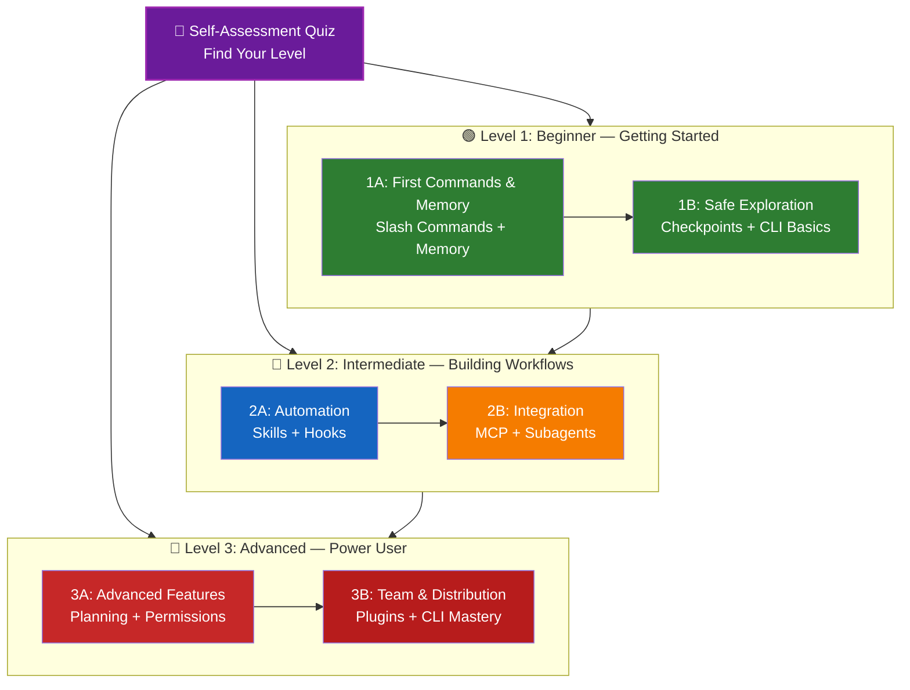

<!-- i18n-source: LEARNING-ROADMAP.md -->
<!-- i18n-source-sha: 2deba3a -->
<!-- i18n-date: 2026-04-16 -->

<picture>
  <source media="(prefers-color-scheme: dark)" srcset="../resources/logos/claude-howto-logo-dark.svg">
  
</picture>

# 📚 Roteiro de Aprendizado do Claude Code

**Novo no Claude Code?** Este guia ajuda você a dominar as funcionalidades do Claude Code no seu ritmo. Seja você iniciante ou um desenvolvedor experiente, comece pelo autoteste abaixo para encontrar o caminho certo.

---

## 🧭 Descubra o seu nível

Nem todo mundo parte do mesmo ponto. Faça este autoteste rápido para encontrar o melhor ponto de entrada.

**Responda com sinceridade:**

- [ ] Consigo iniciar o Claude Code e manter uma conversa (`claude`)
- [ ] Criei ou editei um arquivo CLAUDE.md
- [ ] Já usei ao menos 3 Slash Commands nativos (ex.: /help, /compact, /model)
- [ ] Criei um Slash Command personalizado ou uma skill (SKILL.md)
- [ ] Configurei um servidor MCP (ex.: GitHub, banco de dados)
- [ ] Configurei hooks em ~/.claude/settings.json
- [ ] Criei ou usei Subagents personalizados (.claude/agents/)
- [ ] Usei o modo print (`claude -p`) para scripts ou CI/CD

**Seu nível:**

| Marcações | Nível | Começar em | Tempo estimado |
|-----------|-------|------------|----------------|
| 0-2 | **Nível 1: Iniciante** — Primeiros passos | [Marco 1A](#marco-1a-primeiros-comandos--memory) | ~3 horas |
| 3-5 | **Nível 2: Intermediário** — Construindo fluxos | [Marco 2A](#marco-2a-automação-skills--hooks) | ~5 horas |
| 6-8 | **Nível 3: Avançado** — Power User e Líder de equipe | [Marco 3A](#marco-3a-recursos-avançados) | ~5 horas |

> **Dica**: na dúvida, comece um nível abaixo. É melhor revisar rapidamente material conhecido do que perder conceitos fundamentais.

> **Versão interativa**: rode `/self-assessment` no Claude Code para um quiz guiado e interativo que mede sua proficiência em todas as 10 áreas de funcionalidade e gera um caminho personalizado.

---

## 🎯 Filosofia do aprendizado

As pastas deste repositório estão numeradas em **ordem recomendada de aprendizado** com base em três princípios:

1. **Dependências** — conceitos fundamentais primeiro
2. **Complexidade** — recursos mais fáceis antes dos avançados
3. **Frequência de uso** — recursos mais usados ensinados cedo

Essa abordagem garante uma base sólida enquanto entrega ganhos imediatos de produtividade.

---

## 🗺️ Seu caminho de aprendizado



**Legenda de cores:**
- 💜 Roxo: Autoteste
- 🟢 Verde: Nível 1 — iniciante
- 🔵 Azul / 🟡 Dourado: Nível 2 — intermediário
- 🔴 Vermelho: Nível 3 — avançado

---

## 📊 Tabela completa do roteiro

| Passo | Recurso | Complexidade | Tempo | Nível | Dependências | Por que aprender | Benefícios-chave |
|-------|---------|--------------|-------|-------|--------------|------------------|------------------|
| **1** | [Slash Commands](../01-slash-commands/) | ⭐ Iniciante | 30 min | Nível 1 | Nenhuma | Ganhos rápidos de produtividade (55+ nativos + 5 skills embutidas) | Automação instantânea, padrões de equipe |
| **2** | [Memory](../02-memory/) | ⭐⭐ Iniciante+ | 45 min | Nível 1 | Nenhuma | Essencial para todos os recursos | Contexto persistente, preferências |
| **3** | [Checkpoints](../08-checkpoints/) | ⭐⭐ Intermediário | 45 min | Nível 1 | Gestão de sessão | Exploração segura | Experimentação, recuperação |
| **4** | [CLI básica](../10-cli/) | ⭐⭐ Iniciante+ | 30 min | Nível 1 | Nenhuma | Uso básico da CLI | Modos interativo e print |
| **5** | [Skills](../03-skills/) | ⭐⭐ Intermediário | 1 hora | Nível 2 | Slash Commands | Expertise automática | Capacidades reutilizáveis, consistência |
| **6** | [Hooks](../06-hooks/) | ⭐⭐ Intermediário | 1 hora | Nível 2 | Ferramentas, comandos | Automação de fluxo (25 eventos, 4 tipos) | Validação, quality gates |
| **7** | [MCP](../05-mcp/) | ⭐⭐⭐ Intermediário+ | 1 hora | Nível 2 | Configuração | Acesso a dados ao vivo | Integração em tempo real, APIs |
| **8** | [Subagents](../04-subagents/) | ⭐⭐⭐ Intermediário+ | 1,5 hora | Nível 2 | Memory, comandos | Lidar com tarefas complexas (6 nativos incluindo Bash) | Delegação, expertise especializada |
| **9** | [Funcionalidades avançadas](../09-advanced-features/) | ⭐⭐⭐⭐⭐ Avançado | 2-3 horas | Nível 3 | Todos os anteriores | Ferramentas de power user | Planejamento, Auto Mode, canais, ditado de voz, permissões |
| **10** | [Plugins](../07-plugins/) | ⭐⭐⭐⭐ Avançado | 2 horas | Nível 3 | Todos os anteriores | Soluções completas | Onboarding de equipe, distribuição |
| **11** | [Domínio da CLI](../10-cli/) | ⭐⭐⭐ Avançado | 1 hora | Nível 3 | Recomendado: todos | Dominar a linha de comando | Scripts, CI/CD, automação |

**Tempo total de aprendizado**: ~11-13 horas (ou pule para seu nível e economize tempo)

---

## 🟢 Nível 1: Iniciante — Primeiros passos

**Para**: usuários com 0-2 marcações no teste
**Tempo**: ~3 horas
**Foco**: produtividade imediata, entender fundamentos
**Resultado**: usuário confortável no dia a dia, pronto para o Nível 2

### Marco 1A: Primeiros Comandos & Memory

**Tópicos**: Slash Commands + Memory
**Tempo**: 1-2 horas
**Complexidade**: ⭐ Iniciante
**Objetivo**: ganho imediato de produtividade com comandos personalizados e contexto persistente

#### O que você vai conquistar
✅ Criar Slash Commands personalizados para tarefas repetitivas
✅ Configurar Memory de projeto para padrões da equipe
✅ Configurar preferências pessoais
✅ Entender como o Claude carrega contexto automaticamente

#### Exercícios práticos

```bash
# Exercício 1: Instale seu primeiro Slash Command
mkdir -p .claude/commands
cp 01-slash-commands/optimize.md .claude/commands/

# Exercício 2: Crie a Memory do projeto
cp 02-memory/project-CLAUDE.md ./CLAUDE.md

# Exercício 3: Experimente
# No Claude Code, digite: /optimize
```

#### Critérios de sucesso
- [ ] Conseguiu invocar o comando `/optimize`
- [ ] O Claude lembra dos padrões do seu projeto a partir do CLAUDE.md
- [ ] Você entende quando usar Slash Commands vs. Memory

#### Próximos passos
Quando estiver confortável, leia:
- [01-slash-commands/README.md](../01-slash-commands/README.md)
- [02-memory/README.md](../02-memory/README.md)

> **Teste o que aprendeu**: rode `/lesson-quiz slash-commands` ou `/lesson-quiz memory` no Claude Code para verificar seu entendimento.

---

### Marco 1B: Exploração segura

**Tópicos**: checkpoints + CLI básica
**Tempo**: 1 hora
**Complexidade**: ⭐⭐ Iniciante+
**Objetivo**: aprender a experimentar com segurança e usar os comandos básicos da CLI

#### O que você vai conquistar
✅ Criar e restaurar checkpoints para experimentação segura
✅ Entender modo interativo vs. modo print
✅ Usar flags e opções básicas da CLI
✅ Processar arquivos via piping

#### Exercícios práticos

```bash
# Exercício 1: Experimente o fluxo de checkpoint
# No Claude Code:
# Faça mudanças experimentais, depois pressione Esc+Esc ou use /rewind
# Selecione o checkpoint antes do experimento
# Escolha "Restaurar código e conversa" para voltar

# Exercício 2: Modo interativo vs. modo print
claude "explain this project"           # Modo interativo
claude -p "explain this function"       # Modo print (não interativo)

# Exercício 3: Processe conteúdo de arquivo via piping
cat error.log | claude -p "explain this error"
```

#### Critérios de sucesso
- [ ] Criou e voltou a um checkpoint
- [ ] Usou os modos interativo e print
- [ ] Pipou um arquivo para análise pelo Claude
- [ ] Entende quando usar checkpoints para experimentação segura

#### Próximos passos
- Leia: [08-checkpoints/README.md](../08-checkpoints/README.md)
- Leia: [10-cli/README.md](../10-cli/README.md)
- **Pronto para o Nível 2!** Siga para o [Marco 2A](#marco-2a-automação-skills--hooks)

> **Teste o que aprendeu**: rode `/lesson-quiz checkpoints` ou `/lesson-quiz cli` para verificar se está pronto para o Nível 2.

---

## 🔵 Nível 2: Intermediário — Construindo fluxos

**Para**: usuários com 3-5 marcações no teste
**Tempo**: ~5 horas
**Foco**: automação, integração, delegação de tarefas
**Resultado**: fluxos automatizados, integrações externas, pronto para o Nível 3

### Verificação de pré-requisitos

Antes de começar o Nível 2, verifique se está confortável com estes conceitos do Nível 1:

- [ ] Consegue criar e usar Slash Commands ([01-slash-commands/](../01-slash-commands/))
- [ ] Configurou Memory de projeto via CLAUDE.md ([02-memory/](../02-memory/))
- [ ] Sabe criar e restaurar checkpoints ([08-checkpoints/](../08-checkpoints/))
- [ ] Consegue usar `claude` e `claude -p` na linha de comando ([10-cli/](../10-cli/))

> **Lacunas?** Revise os tutoriais acima antes de continuar.

---

### Marco 2A: Automação (Skills + Hooks)

**Tópicos**: skills + hooks
**Tempo**: 2-3 horas
**Complexidade**: ⭐⭐ Intermediário
**Objetivo**: automatizar fluxos comuns e checagens de qualidade

#### O que você vai conquistar
✅ Autoinvocar capacidades especializadas com frontmatter YAML (incluindo os campos `effort` e `shell`)
✅ Configurar automação orientada a eventos usando os 25 eventos de hook
✅ Usar os 4 tipos de hook (command, http, prompt, agent)
✅ Aplicar padrões de qualidade de código
✅ Criar hooks personalizados para seu fluxo

#### Exercícios práticos

```bash
# Exercício 1: Instale uma skill
cp -r 03-skills/code-review ~/.claude/skills/

# Exercício 2: Configure hooks
mkdir -p ~/.claude/hooks
cp 06-hooks/pre-tool-check.sh ~/.claude/hooks/
chmod +x ~/.claude/hooks/pre-tool-check.sh

# Exercício 3: Configure hooks nos settings
# Adicione em ~/.claude/settings.json:
{
  "hooks": {
    "PreToolUse": [
      {
        "matcher": "Bash",
        "hooks": [
          {
            "type": "command",
            "command": "~/.claude/hooks/pre-tool-check.sh"
          }
        ]
      }
    ]
  }
}
```

#### Critérios de sucesso
- [ ] Skill de code review autoinvocada quando relevante
- [ ] Hook PreToolUse roda antes da execução da ferramenta
- [ ] Você entende autoinvocação de skill vs. disparo por evento de hook

#### Próximos passos
- Crie sua própria skill personalizada
- Configure hooks adicionais para seu fluxo
- Leia: [03-skills/README.md](../03-skills/README.md)
- Leia: [06-hooks/README.md](../06-hooks/README.md)

> **Teste o que aprendeu**: rode `/lesson-quiz skills` ou `/lesson-quiz hooks` para testar seu conhecimento antes de avançar.

---

### Marco 2B: Integração (MCP + Subagents)

**Tópicos**: MCP + Subagents
**Tempo**: 2-3 horas
**Complexidade**: ⭐⭐⭐ Intermediário+
**Objetivo**: integrar serviços externos e delegar tarefas complexas

#### O que você vai conquistar
✅ Acessar dados ao vivo de GitHub, bancos, etc.
✅ Delegar trabalho a agentes de IA especializados
✅ Entender quando usar MCP vs. Subagents
✅ Construir fluxos integrados

#### Exercícios práticos

```bash
# Exercício 1: Configure o MCP do GitHub
export GITHUB_TOKEN="your_github_token"
claude mcp add github -- npx -y @modelcontextprotocol/server-github

# Exercício 2: Teste a integração MCP
# No Claude Code: /mcp__github__list_prs

# Exercício 3: Instale Subagents
mkdir -p .claude/agents
cp 04-subagents/*.md .claude/agents/
```

#### Exercício de integração
Experimente este fluxo completo:
1. Use MCP para buscar um PR do GitHub
2. Deixe o Claude delegar a revisão ao Subagent code-reviewer
3. Use hooks para rodar testes automaticamente

#### Critérios de sucesso
- [ ] Consultou dados do GitHub via MCP com sucesso
- [ ] O Claude delega tarefas complexas a Subagents
- [ ] Você entende a diferença entre MCP e Subagents
- [ ] Combinou MCP + Subagents + hooks num fluxo

#### Próximos passos
- Configure servidores MCP adicionais (banco, Slack, etc.)
- Crie Subagents personalizados para seu domínio
- Leia: [05-mcp/README.md](../05-mcp/README.md)
- Leia: [04-subagents/README.md](../04-subagents/README.md)
- **Pronto para o Nível 3!** Siga para o [Marco 3A](#marco-3a-recursos-avançados)

> **Teste o que aprendeu**: rode `/lesson-quiz mcp` ou `/lesson-quiz subagents` para verificar se está pronto para o Nível 3.

---

## 🔴 Nível 3: Avançado — Power User e Líder de equipe

**Para**: usuários com 6-8 marcações no teste
**Tempo**: ~5 horas
**Foco**: ferramentas para equipe, CI/CD, recursos enterprise, desenvolvimento de plugins
**Resultado**: power user, capaz de estruturar fluxos de equipe e CI/CD

### Verificação de pré-requisitos

Antes de começar o Nível 3, verifique se está confortável com estes conceitos do Nível 2:

- [ ] Consegue criar e usar skills com autoinvocação ([03-skills/](../03-skills/))
- [ ] Configurou hooks para automação orientada a eventos ([06-hooks/](../06-hooks/))
- [ ] Sabe configurar servidores MCP para dados externos ([05-mcp/](../05-mcp/))
- [ ] Sabe usar Subagents para delegação de tarefas ([04-subagents/](../04-subagents/))

> **Lacunas?** Revise os tutoriais acima antes de continuar.

---

### Marco 3A: Recursos avançados

**Tópicos**: recursos avançados (planejamento, permissões, pensamento estendido, Auto Mode, canais, ditado de voz, controle remoto/desktop/web)
**Tempo**: 2-3 horas
**Complexidade**: ⭐⭐⭐⭐⭐ Avançado
**Objetivo**: dominar fluxos avançados e ferramentas de power user

#### O que você vai conquistar
✅ Modo de planejamento para features complexas
✅ Controle granular de permissões com 6 modos (default, acceptEdits, plan, auto, dontAsk, bypassPermissions)
✅ Pensamento estendido via toggle Alt+T / Option+T
✅ Gerenciamento de tarefas em background
✅ Auto Memory para preferências aprendidas
✅ Auto Mode com classificador de segurança em background
✅ Canais para fluxos estruturados em múltiplas sessões
✅ Ditado de voz para interação sem uso das mãos
✅ Controle remoto, app desktop e sessões web
✅ Agent Teams para colaboração multi-agente

#### Exercícios práticos

```bash
# Exercício 1: Use o modo de planejamento
/plan Implement user authentication system

# Exercício 2: Experimente os modos de permissão (6 disponíveis: default, acceptEdits, plan, auto, dontAsk, bypassPermissions)
claude --permission-mode plan "analyze this codebase"
claude --permission-mode acceptEdits "refactor the auth module"
claude --permission-mode auto "implement the feature"

# Exercício 3: Habilite o pensamento estendido
# Pressione Alt+T (Option+T no macOS) durante a sessão para alternar

# Exercício 4: Fluxo avançado com checkpoints
# 1. Crie o checkpoint "Clean state"
# 2. Use o modo de planejamento para projetar uma feature
# 3. Implemente com delegação a Subagent
# 4. Rode os testes em background
# 5. Se os testes falharem, retroceda ao checkpoint
# 6. Tente uma abordagem alternativa

# Exercício 5: Experimente o auto mode (classificador de segurança em background)
claude --permission-mode auto "implement user settings page"

# Exercício 6: Habilite agent teams
export CLAUDE_AGENT_TEAMS=1
# Peça ao Claude: "Implement feature X using a team approach"

# Exercício 7: Tarefas agendadas
/loop 5m /check-status
# Ou use CronCreate para tarefas agendadas persistentes

# Exercício 8: Canais para fluxos multi-sessão
# Use canais para organizar o trabalho entre sessões

# Exercício 9: Ditado de voz
# Use entrada por voz para interação sem mãos com o Claude Code
```

#### Critérios de sucesso
- [ ] Usou o modo de planejamento para uma feature complexa
- [ ] Configurou modos de permissão (plan, acceptEdits, auto, dontAsk)
- [ ] Alternou o pensamento estendido com Alt+T / Option+T
- [ ] Usou o auto mode com o classificador de segurança em background
- [ ] Usou tarefas em background para operações longas
- [ ] Explorou canais para fluxos multi-sessão
- [ ] Experimentou ditado de voz para entrada sem mãos
- [ ] Entende controle remoto, app desktop e sessões web
- [ ] Habilitou e usou agent teams para tarefas colaborativas
- [ ] Usou `/loop` para tarefas recorrentes ou monitoramento agendado

#### Próximos passos
- Leia: [09-advanced-features/README.md](../09-advanced-features/README.md)

> **Teste o que aprendeu**: rode `/lesson-quiz advanced` para testar seu domínio dos recursos de power user.

---

### Marco 3B: Equipe e Distribuição (Plugins + Domínio da CLI)

**Tópicos**: plugins + domínio da CLI + CI/CD
**Tempo**: 2-3 horas
**Complexidade**: ⭐⭐⭐⭐ Avançado
**Objetivo**: construir ferramentas para equipe, criar plugins, dominar integração com CI/CD

#### O que você vai conquistar
✅ Instalar e criar plugins completos agrupados
✅ Dominar a CLI para scripts e automação
✅ Configurar integração CI/CD com `claude -p`
✅ Saída JSON para pipelines automatizados
✅ Gerenciamento de sessões e processamento em lote

#### Exercícios práticos

```bash
# Exercício 1: Instale um plugin completo
# No Claude Code: /plugin install pr-review

# Exercício 2: Modo print para CI/CD
claude -p "Run all tests and generate report"

# Exercício 3: Saída JSON para scripts
claude -p --output-format json "list all functions"

# Exercício 4: Gestão e retomada de sessão
claude -r "feature-auth" "continue implementation"

# Exercício 5: Integração CI/CD com restrições
claude -p --max-turns 3 --output-format json "review code"

# Exercício 6: Processamento em lote
for file in *.md; do
  claude -p --output-format json "summarize this: $(cat $file)" > ${file%.md}.summary.json
done
```

#### Exercício de integração CI/CD
Crie um script simples de CI/CD:
1. Use `claude -p` para revisar arquivos alterados
2. Gere resultados em JSON
3. Processe com `jq` para encontrar issues específicas
4. Integre num workflow do GitHub Actions

#### Critérios de sucesso
- [ ] Instalou e usou um plugin
- [ ] Construiu ou modificou um plugin para sua equipe
- [ ] Usou o modo print (`claude -p`) em CI/CD
- [ ] Gerou saída JSON para scripting
- [ ] Retomou uma sessão anterior com sucesso
- [ ] Criou um script de processamento em lote
- [ ] Integrou o Claude num workflow de CI/CD

#### Casos de uso reais para a CLI
- **Automação de code review**: rode code reviews em pipelines CI/CD
- **Análise de logs**: analise logs de erro e saídas do sistema
- **Geração de documentação**: gere docs em lote
- **Insights de testes**: analise falhas de testes
- **Análise de performance**: revise métricas de performance
- **Processamento de dados**: transforme e analise arquivos de dados

#### Próximos passos
- Leia: [07-plugins/README.md](../07-plugins/README.md)
- Leia: [10-cli/README.md](../10-cli/README.md)
- Crie atalhos e plugins CLI para o time
- Configure scripts de processamento em lote

> **Teste o que aprendeu**: rode `/lesson-quiz plugins` ou `/lesson-quiz cli` para confirmar seu domínio.

---

## 🧪 Teste seu conhecimento

Este repositório inclui duas skills interativas que você pode usar a qualquer momento no Claude Code para avaliar seu entendimento:

| Skill | Comando | Objetivo |
|-------|---------|----------|
| **Self-Assessment** | `/self-assessment` | Avalia sua proficiência geral nas 10 funcionalidades. Escolha os modos Quick (2 min) ou Deep (5 min) para obter um perfil de skills personalizado e uma trilha. |
| **Lesson Quiz** | `/lesson-quiz [lesson]` | Testa seu entendimento de uma lição específica com 10 perguntas. Use antes da lição (pré-teste), durante (acompanhamento) ou depois (verificação de domínio). |

**Exemplos:**
```
/self-assessment                  # Descubra seu nível geral
/lesson-quiz hooks                # Quiz da Lição 06: Hooks
/lesson-quiz 03                   # Quiz da Lição 03: Skills
/lesson-quiz advanced-features    # Quiz da Lição 09
```

---

## ⚡ Caminhos rápidos

### Se você só tem 15 minutos
**Objetivo**: conseguir a primeira vitória

1. Copie um Slash Command: `cp 01-slash-commands/optimize.md .claude/commands/`
2. Experimente no Claude Code: `/optimize`
3. Leia: [01-slash-commands/README.md](../01-slash-commands/README.md)

**Resultado**: você terá um Slash Command funcionando e entenderá o básico

---

### Se você tem 1 hora
**Objetivo**: configurar as ferramentas essenciais de produtividade

1. **Slash Commands** (15 min): copie e teste `/optimize` e `/pr`
2. **Memory do projeto** (15 min): crie CLAUDE.md com os padrões do seu projeto
3. **Instale uma skill** (15 min): configure a skill code-review
4. **Experimente juntos** (15 min): veja como funcionam em harmonia

**Resultado**: ganho básico de produtividade com comandos, Memory e autoskills

---

### Se você tem um fim de semana
**Objetivo**: ficar proficiente na maioria dos recursos

**Sábado de manhã** (3 horas):
- Complete o Marco 1A: Slash Commands + Memory
- Complete o Marco 1B: checkpoints + CLI básica

**Sábado à tarde** (3 horas):
- Complete o Marco 2A: skills + hooks
- Complete o Marco 2B: MCP + Subagents

**Domingo** (4 horas):
- Complete o Marco 3A: recursos avançados
- Complete o Marco 3B: plugins + domínio da CLI + CI/CD
- Construa um plugin personalizado para sua equipe

**Resultado**: você será um power user do Claude Code, pronto para treinar outras pessoas e automatizar fluxos complexos

---

## 💡 Dicas de aprendizado

### ✅ Faça

- **Comece pelo autoteste** para descobrir seu ponto de partida
- **Complete os exercícios práticos** de cada marco
- **Comece simples** e aumente a complexidade aos poucos
- **Teste cada recurso** antes de passar ao próximo
- **Anote** o que funciona para o seu fluxo
- **Revisite** conceitos anteriores ao aprender tópicos avançados
- **Experimente com segurança** usando checkpoints
- **Compartilhe conhecimento** com sua equipe

### ❌ Evite

- **Pular a verificação de pré-requisitos** ao subir de nível
- **Tentar aprender tudo de uma vez** — é exaustivo
- **Copiar configurações sem entender** — você não saberá depurar
- **Esquecer de testar** — sempre valide os recursos
- **Apressar os marcos** — leve tempo para entender
- **Ignorar a documentação** — cada README traz detalhes valiosos
- **Trabalhar isoladamente** — discuta com colegas

---

## 🎓 Estilos de aprendizado

### Aprendizes visuais
- Estude os diagramas Mermaid em cada README
- Observe o fluxo de execução dos comandos
- Desenhe seus próprios diagramas de fluxo
- Use o caminho visual acima

### Aprendizes práticos
- Complete todos os exercícios práticos
- Experimente variações
- Quebre coisas e conserte (use checkpoints!)
- Crie seus próprios exemplos

### Aprendizes leitores
- Leia cada README com atenção
- Estude os exemplos de código
- Revise as tabelas comparativas
- Leia os posts linkados em resources

### Aprendizes sociais
- Monte sessões de pair programming
- Ensine conceitos a colegas
- Participe de discussões na comunidade Claude Code
- Compartilhe suas configurações personalizadas

---

## 📈 Acompanhamento de progresso

Use estas checklists para acompanhar seu progresso por nível. Rode `/self-assessment` a qualquer momento para obter um perfil atualizado, ou `/lesson-quiz [lesson]` após cada tutorial para verificar o entendimento.

### 🟢 Nível 1: Iniciante
- [ ] Concluiu [01-slash-commands](../01-slash-commands/)
- [ ] Concluiu [02-memory](../02-memory/)
- [ ] Criou o primeiro Slash Command personalizado
- [ ] Configurou a Memory do projeto
- [ ] **Marco 1A concluído**
- [ ] Concluiu [08-checkpoints](../08-checkpoints/)
- [ ] Concluiu a parte básica de [10-cli](../10-cli/)
- [ ] Criou e voltou a um checkpoint
- [ ] Usou os modos interativo e print
- [ ] **Marco 1B concluído**

### 🔵 Nível 2: Intermediário
- [ ] Concluiu [03-skills](../03-skills/)
- [ ] Concluiu [06-hooks](../06-hooks/)
- [ ] Instalou a primeira skill
- [ ] Configurou hook PreToolUse
- [ ] **Marco 2A concluído**
- [ ] Concluiu [05-mcp](../05-mcp/)
- [ ] Concluiu [04-subagents](../04-subagents/)
- [ ] Conectou o MCP do GitHub
- [ ] Criou Subagent personalizado
- [ ] Combinou integrações em um fluxo
- [ ] **Marco 2B concluído**

### 🔴 Nível 3: Avançado
- [ ] Concluiu [09-advanced-features](../09-advanced-features/)
- [ ] Usou o modo de planejamento com sucesso
- [ ] Configurou modos de permissão (6 modos, incluindo auto)
- [ ] Usou o auto mode com classificador de segurança
- [ ] Usou o toggle de pensamento estendido
- [ ] Explorou canais e ditado de voz
- [ ] **Marco 3A concluído**
- [ ] Concluiu [07-plugins](../07-plugins/)
- [ ] Concluiu o uso avançado de [10-cli](../10-cli/)
- [ ] Configurou o modo print (`claude -p`) para CI/CD
- [ ] Criou saída JSON para automação
- [ ] Integrou o Claude em um pipeline CI/CD
- [ ] Criou um plugin para a equipe
- [ ] **Marco 3B concluído**

---

## 🆘 Desafios comuns no aprendizado

### Desafio 1: "Conceitos demais de uma vez"
**Solução**: foque em um marco de cada vez. Complete todos os exercícios antes de seguir em frente.

### Desafio 2: "Não sei qual recurso usar quando"
**Solução**: consulte a seção [O Que Você Pode Construir Com Isso?](README.md#o-que-você-pode-construir-com-isso) no README principal.

### Desafio 3: "A configuração não está funcionando"
**Solução**: verifique a seção [Solução de Problemas](README.md#solução-de-problemas) e confirme os locais dos arquivos.

### Desafio 4: "Os conceitos parecem se sobrepor"
**Solução**: revise a tabela de [Comparação de Recursos](README.md#comparação-de-recursos) para entender as diferenças.

### Desafio 5: "Difícil lembrar de tudo"
**Solução**: crie seu próprio cheat sheet. Use checkpoints para experimentar com segurança.

### Desafio 6: "Sou experiente, mas não sei por onde começar"
**Solução**: faça o [Autoteste](#-descubra-o-seu-nível). Pule para o seu nível e use a verificação de pré-requisitos para identificar lacunas.

---

## 🎯 O que fazer depois de concluir?

Quando você completar todos os marcos:

1. **Crie documentação da equipe** — documente o setup do Claude Code da sua equipe
2. **Construa plugins personalizados** — empacote os fluxos da sua equipe
3. **Explore o controle remoto** — controle sessões do Claude Code programaticamente via ferramentas externas
4. **Experimente sessões web** — use o Claude Code em interfaces baseadas em navegador para desenvolvimento remoto
5. **Use o app desktop** — acesse os recursos do Claude Code pelo aplicativo desktop nativo
6. **Use o Auto Mode** — deixe o Claude trabalhar autonomamente com um classificador de segurança em background
7. **Aproveite o Auto Memory** — deixe o Claude aprender suas preferências automaticamente ao longo do tempo
8. **Configure agent teams** — coordene múltiplos agentes em tarefas complexas e multifacetadas
9. **Use canais** — organize o trabalho em fluxos estruturados multi-sessão
10. **Experimente ditado de voz** — use entrada por voz para interagir com o Claude Code sem as mãos
11. **Use tarefas agendadas** — automatize verificações recorrentes com `/loop` e ferramentas cron
12. **Contribua com exemplos** — compartilhe com a comunidade
13. **Mentore outras pessoas** — ajude colegas a aprenderem
14. **Otimize fluxos** — melhore continuamente com base no uso
15. **Fique por dentro** — acompanhe releases e novidades do Claude Code

---

## 📚 Recursos adicionais

### Documentação oficial
- [Documentação do Claude Code](https://code.claude.com/docs/en/overview)
- [Documentação da Anthropic](https://docs.anthropic.com)
- [Especificação do protocolo MCP](https://modelcontextprotocol.io)

### Posts de blog
- [Discovering Claude Code Slash Commands](https://medium.com/@luongnv89/discovering-claude-code-slash-commands-cdc17f0dfb29)

### Comunidade
- [Anthropic Cookbook](https://github.com/anthropics/anthropic-cookbook)
- [Repositório de servidores MCP](https://github.com/modelcontextprotocol/servers)

---

## 💬 Feedback e suporte

- **Encontrou um problema?** Abra uma issue no repositório
- **Tem uma sugestão?** Envie um pull request
- **Precisa de ajuda?** Consulte a documentação ou pergunte à comunidade

---

**Última atualização**: 16 de abril de 2026
**Versão do Claude Code**: 2.1.112
**Fontes**:
- https://docs.anthropic.com/en/docs/claude-code
- https://www.anthropic.com/news/claude-opus-4-7
- https://support.claude.com/en/articles/12138966-release-notes
**Modelos Compatíveis**: Claude Sonnet 4.6, Claude Opus 4.7, Claude Haiku 4.5
**Mantido por**: contribuidores do Claude How-To
**Licença**: fins educacionais, livre para usar e adaptar

---

[← Voltar ao README principal](README.md)
