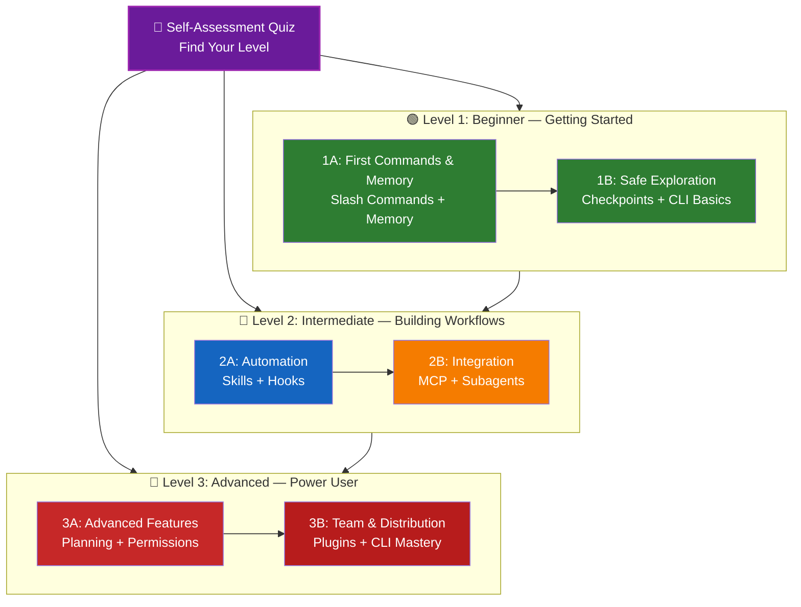

<!-- i18n-source: LEARNING-ROADMAP.md -->
<!-- i18n-source-sha: 9c224ff -->
<!-- i18n-date: 2026-04-14 -->

<picture>
  <source media="(prefers-color-scheme: dark)" srcset="../resources/logos/claude-howto-logo-dark.svg">
  
</picture>

# 📚 Roteiro de Aprendizado do Claude Code

**Novo no Claude Code?** Este guia ajuda você a dominar os recursos do Claude Code no seu próprio ritmo. Não importa se você está começando do zero ou já tem experiência com desenvolvimento, comece pelo questionário de autoavaliação abaixo para encontrar o caminho certo.

---

## 🧭 Encontre Seu Nível

Nem todo mundo começa do mesmo ponto. Faça esta autoavaliação rápida para descobrir a melhor porta de entrada.

**Responda com honestidade:**

- [ ] Consigo iniciar o Claude Code e conversar (`claude`)
- [ ] Já criei ou editei um arquivo `CLAUDE.md`
- [ ] Já usei pelo menos 3 slash commands nativos (por exemplo, `/help`, `/compact`, `/model`)
- [ ] Já criei um slash command ou skill personalizada (`SKILL.md`)
- [ ] Já configurei um servidor MCP (por exemplo, GitHub, banco de dados)
- [ ] Já configurei hooks em `~/.claude/settings.json`
- [ ] Já criei ou usei subagentes personalizados (`.claude/agents/`)
- [ ] Já usei o modo print (`claude -p`) para scripts ou CI/CD

**Seu nível:**

| Checkups | Nível | Comece em | Tempo para concluir |
|--------|-------|----------|------------------|
| 0-2 | **Nível 1: Iniciante** — Começando | [Marco 1A](#marco-1a-primeiros-comandos-e-memória) | ~3 horas |
| 3-5 | **Nível 2: Intermediário** — Construindo fluxos | [Marco 2A](#marco-2a-automação-skills--hooks) | ~5 horas |
| 6-8 | **Nível 3: Avançado** — Power user e líder de equipe | [Marco 3A](#marco-3a-funcionalidades-avançadas) | ~5 horas |

> **Dica**: Se estiver em dúvida, comece um nível abaixo. É melhor revisar material familiar rapidamente do que perder conceitos fundamentais.

> **Versão interativa**: Execute `/self-assessment` no Claude Code para um questionário guiado e interativo que avalia sua proficiência em todas as 10 áreas de funcionalidade e gera um caminho de aprendizado personalizado.

---

## 🎯 Filosofia de Aprendizado

As pastas neste repositório são numeradas na **ordem recomendada de aprendizado** com base em três princípios:

1. **Dependências** - Conceitos fundamentais vêm primeiro
2. **Complexidade** - Funcionalidades mais fáceis antes das avançadas
3. **Frequência de uso** - Os recursos mais usados são ensinados primeiro

Essa abordagem garante uma base sólida e ganhos de produtividade imediatos.

---

## 🗺️ Seu Caminho de Aprendizado



**Legenda de cores:**

- 💜 Roxo: Questionário de autoavaliação
- 🟢 Verde: Caminho do Nível 1
- 🔵 Azul / 🟡 Dourado: Caminho do Nível 2
- 🔴 Vermelho: Caminho do Nível 3

---

## 📊 Tabela Completa do Roteiro

| Etapa | Funcionalidade | Complexidade | Tempo | Nível | Dependências | Por que aprender | Benefícios principais |
|------|---------|-----------|------|-------|--------------|----------------|--------------|
| **1** | [Slash Commands](01-slash-commands/) | ⭐ Iniciante | 30 min | Nível 1 | Nenhuma | Ganhos rápidos de produtividade (55+ nativos + 5 skills integradas) | Automação imediata, padrões da equipe |
| **2** | [Memory](02-memory/) | ⭐⭐ Iniciante+ | 45 min | Nível 1 | Nenhuma | Essencial para todas as funcionalidades | Contexto persistente, preferências |
| **3** | [Checkpoints](08-checkpoints/) | ⭐⭐ Intermediário | 45 min | Nível 1 | Gerenciamento de sessão | Exploração segura | Experimentação, recuperação |
| **4** | [CLI Basics](10-cli/) | ⭐⭐ Iniciante+ | 30 min | Nível 1 | Nenhuma | Uso central do CLI | Modo interativo e print |
| **5** | [Skills](03-skills/) | ⭐⭐ Intermediário | 1 hora | Nível 2 | Slash Commands | Especialização automática | Capacidades reutilizáveis, consistência |
| **6** | [Hooks](06-hooks/) | ⭐⭐ Intermediário | 1 hora | Nível 2 | Ferramentas, Commands | Automação de fluxo de trabalho (25 eventos, 4 tipos) | Validação, gates de qualidade |
| **7** | [MCP](05-mcp/) | ⭐⭐⭐ Intermediário+ | 1 hora | Nível 2 | Configuração | Acesso a dados em tempo real | Integração ao vivo, APIs |
| **8** | [Subagents](04-subagents/) | ⭐⭐⭐ Intermediário+ | 1.5 horas | Nível 2 | Memory, Commands | Tratamento de tarefas complexas (6 nativos incluindo Bash) | Delegação, expertise especializada |
| **9** | [Advanced Features](09-advanced-features/) | ⭐⭐⭐⭐⭐ Avançado | 2-3 horas | Nível 3 | Todos os anteriores | Ferramentas de power user | Planejamento, Auto Mode, Channels, Voice Dictation, permissões |
| **10** | [Plugins](07-plugins/) | ⭐⭐⭐⭐ Avançado | 2 horas | Nível 3 | Todos os anteriores | Soluções completas | Onboarding da equipe, distribuição |
| **11** | [CLI Mastery](10-cli/) | ⭐⭐⭐ Avançado | 1 hora | Nível 3 | Recomendado: Todos | Domínio da linha de comando | Scripts, CI/CD, automação |

**Tempo total de aprendizado**: ~11-13 horas (ou pule para o seu nível e economize tempo)

---

## 🟢 Nível 1: Iniciante — Começando

**Para**: Usuários com 0-2 marcações no questionário
**Tempo**: ~3 horas
**Foco**: Produtividade imediata, compreensão dos fundamentos
**Resultado**: Usuário diário confortável, pronto para o Nível 2

<a id="marco-1a"></a>
### Marco 1A: Primeiros Comandos e Memória

**Tópicos**: Slash Commands + Memory
**Tempo**: 1-2 horas
**Complexidade**: ⭐ Iniciante
**Objetivo**: Ganho imediato de produtividade com comandos personalizados e contexto persistente

#### O que você vai conquistar

✅ Criar slash commands personalizados para tarefas repetitivas
✅ Configurar memória do projeto para padrões da equipe
✅ Definir preferências pessoais
✅ Entender como o Claude carrega contexto automaticamente

#### Exercícios práticos

```bash
# Exercício 1: Instale seu primeiro slash command
mkdir -p .claude/commands
cp 01-slash-commands/optimize.md .claude/commands/

# Exercício 2: Crie a memória do projeto
cp 02-memory/project-CLAUDE.md ./CLAUDE.md

# Exercício 3: Teste
# No Claude Code, digite: /optimize
```

#### Critérios de sucesso

- [ ] Invocar com sucesso o comando `/optimize`
- [ ] O Claude lembra dos padrões do projeto via CLAUDE.md
- [ ] Você entende quando usar slash commands versus memória

#### Próximos passos

Quando estiver confortável, leia:

- [01-slash-commands/README.md](01-slash-commands/README.md)
- [02-memory/README.md](../02-memory/README.md)

> **Teste seu entendimento**: Execute `/lesson-quiz slash-commands` ou `/lesson-quiz memory` no Claude Code para validar o que aprendeu.

---

### Marco 1B: Exploração Segura

**Tópicos**: Checkpoints + CLI Basics
**Tempo**: 1 hora
**Complexidade**: ⭐⭐ Iniciante+
**Objetivo**: Aprender a experimentar com segurança e usar comandos básicos de CLI

#### O que você vai conquistar

✅ Criar e restaurar checkpoints para experimentação segura
✅ Entender modo interativo versus print mode
✅ Usar flags e opções básicas de CLI
✅ Processar arquivos via pipe

#### Exercícios práticos

```bash
# Exercício 1: Teste o fluxo de checkpoints
# No Claude Code:
# Faça mudanças experimentais, depois pressione Esc+Esc ou use /rewind
# Selecione o checkpoint anterior ao experimento
# Escolha "Restore code and conversation" para voltar

# Exercício 2: Modo interativo versus print mode
claude "explain this project"           # Modo interativo
claude -p "explain this function"       # Print mode (não interativo)

# Exercício 3: Processar conteúdo de arquivo via pipe
cat error.log | claude -p "explain this error"
```

#### Critérios de sucesso

- [ ] Criou e restaurou um checkpoint
- [ ] Usou modo interativo e print mode
- [ ] Enviou um arquivo para o Claude via pipe para análise
- [ ] Entende quando usar checkpoints para experimentar com segurança

#### Próximos passos

- Leia: [08-checkpoints/README.md](08-checkpoints/README.md)
- Leia: [10-cli/README.md](../10-cli/README.md)
- **Pronto para o Nível 2!** Siga para [Marco 2A](#marco-2a-automação-skills--hooks)

> **Teste seu entendimento**: Execute `/lesson-quiz checkpoints` ou `/lesson-quiz cli` para verificar se está pronto para o Nível 2.

---

## 🔵 Nível 2: Intermediário — Construindo Fluxos

**Para**: Usuários com 3-5 marcações no questionário
**Tempo**: ~5 horas
**Foco**: Automação, integração, delegação de tarefas
**Resultado**: Fluxos automatizados, integrações externas, pronto para o Nível 3

### Verificação de Pré-requisitos

Antes de começar o Nível 2, certifique-se de estar confortável com estes conceitos do Nível 1:

- [ ] Consegue criar e usar slash commands ([01-slash-commands/](01-slash-commands/))
- [ ] Já configurou memória do projeto via CLAUDE.md ([02-memory/](02-memory/))
- [ ] Sabe criar e restaurar checkpoints ([08-checkpoints/](08-checkpoints/))
- [ ] Consegue usar `claude` e `claude -p` pela linha de comando ([10-cli/](10-cli/))

> **Lacunas?** Revise os tutoriais vinculados acima antes de continuar.

---

<a id="marco-2a"></a>
### Marco 2A: Automação (Skills + Hooks)

**Tópicos**: Skills + Hooks
**Tempo**: 2-3 horas
**Complexidade**: ⭐⭐ Intermediário
**Objetivo**: Automatizar fluxos de trabalho comuns e verificações de qualidade

#### O que você vai conquistar

✅ Auto-invocar capacidades especializadas com frontmatter YAML (incluindo campos `effort` e `shell`)
✅ Configurar automação orientada a eventos em 25 eventos de hook
✅ Usar todos os 4 tipos de hook (command, http, prompt, agent)
✅ Aplicar padrões de qualidade de código
✅ Criar hooks personalizados para seu fluxo

#### Exercícios práticos

```bash
# Exercício 1: Instalar uma skill
cp -r 03-skills/code-review ~/.claude/skills/

# Exercício 2: Configurar hooks
mkdir -p ~/.claude/hooks
cp 06-hooks/pre-tool-check.sh ~/.claude/hooks/
chmod +x ~/.claude/hooks/pre-tool-check.sh

# Exercício 3: Configurar hooks em settings
# Adicione em ~/.claude/settings.json:
{
  "hooks": {
    "PreToolUse": [
      {
        "matcher": "Bash",
        "hooks": [
          {
            "type": "command",
            "command": "~/.claude/hooks/pre-tool-check.sh"
          }
        ]
      }
    ]
  }
}
```

#### Critérios de sucesso
- [ ] A skill de code review é invocada automaticamente quando relevante
- [ ] O hook PreToolUse roda antes da execução de ferramentas
- [ ] Você entende auto-invocação de skills versus gatilhos de eventos de hook

#### Próximos passos
- Crie sua própria skill personalizada
- Configure hooks adicionais para o seu fluxo
- Leia: [03-skills/README.md](../03-skills/README.md)
- Leia: [06-hooks/README.md](../06-hooks/README.md)

> **Teste seu entendimento**: Execute `/lesson-quiz skills` ou `/lesson-quiz hooks` para testar seu conhecimento antes de avançar.

---

### Marco 2B: Integração (MCP + Subagentes)

**Tópicos**: MCP + Subagentes
**Tempo**: 2-3 horas
**Complexidade**: ⭐⭐⭐ Intermediário+
**Objetivo**: Integrar serviços externos e delegar tarefas complexas

#### O que você vai conquistar

✅ Acessar dados ao vivo do GitHub, bancos de dados etc.
✅ Delegar trabalho para agentes de IA especializados
✅ Entender quando usar MCP versus subagentes
✅ Montar fluxos integrados

#### Exercícios práticos

```bash
# Exercício 1: Configurar o GitHub MCP
export GITHUB_TOKEN="your_github_token"
claude mcp add github -- npx -y @modelcontextprotocol/server-github

# Exercício 2: Testar a integração MCP
# No Claude Code: /mcp__github__list_prs

# Exercício 3: Instalar subagentes
mkdir -p .claude/agents
cp 04-subagents/*.md .claude/agents/
```

#### Exercício de integração
Tente este fluxo completo:
1. Use MCP para buscar um PR do GitHub
2. Deixe o Claude delegar a revisão ao subagente `code-reviewer`
3. Use hooks para executar testes automaticamente

#### Critérios de sucesso
- [ ] Consultou dados do GitHub via MCP com sucesso
- [ ] O Claude delega tarefas complexas para subagentes
- [ ] Você entende a diferença entre MCP e subagentes
- [ ] Conseguiu combinar MCP + subagentes + hooks em um fluxo

#### Próximos passos
- Configure MCP servers adicionais (banco de dados, Slack etc.)
- Crie subagentes personalizados para o seu domínio
- Leia: [05-mcp/README.md](../05-mcp/README.md)
- Leia: [04-subagents/README.md](../04-subagents/README.md)
- **Pronto para o Nível 3!** Avance para [Marco 3A](#marco-3a-funcionalidades-avançadas)

> **Teste seu entendimento**: Execute `/lesson-quiz mcp` ou `/lesson-quiz subagents` para verificar se está pronto para o Nível 3.

---

<a id="marco-3a"></a>
### Marco 3A: Funcionalidades Avançadas

**Cobertura pendente**: esta seção e as próximas partes do roteiro ainda serão traduzidas na próxima passada.

---

<!-- Cobertura inicial traduzida; as seções seguintes serão traduzidas na próxima passada. -->
