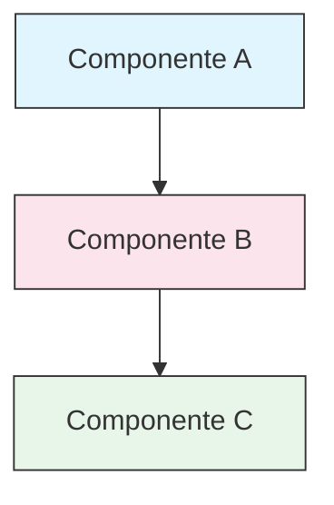

<!-- i18n-source: STYLE_GUIDE.md -->
<!-- i18n-source-sha: d4369ce -->
<!-- i18n-date: 2026-04-16 -->
<picture>
  <source media="(prefers-color-scheme: dark)" srcset="resources/logos/claude-howto-logo-dark.svg">
  
</picture>

# Guia de Estilo

> Convenções e regras de formatação para contribuir com o Claude How To. Siga este guia para manter o conteúdo consistente, profissional e fácil de manter.

---

## Índice

- [Nomenclatura de Arquivos e Pastas](#nomenclatura-de-arquivos-e-pastas)
- [Estrutura do Documento](#estrutura-do-documento)
- [Cabeçalhos](#cabeçalhos)
- [Formatação de Texto](#formatação-de-texto)
- [Listas](#listas)
- [Tabelas](#tabelas)
- [Blocos de Código](#blocos-de-código)
- [Links e Referências Cruzadas](#links-e-referências-cruzadas)
- [Diagramas](#diagramas)
- [Uso de Emoji](#uso-de-emoji)
- [Frontmatter YAML](#frontmatter-yaml)
- [Imagens e Mídia](#imagens-e-mídia)
- [Tom e Voz](#tom-e-voz)
- [Mensagens de Commit](#mensagens-de-commit)
- [Checklist para Autores](#checklist-para-autores)

---

## Nomenclatura de Arquivos e Pastas

### Pastas de Lições

As pastas de lições usam um **prefixo de dois dígitos** seguido de um descritor em **kebab-case**:

```
01-slash-commands/
02-memory/
03-skills/
04-subagents/
05-mcp/
```

O número reflete a ordem do caminho de aprendizado, do iniciante ao avançado.

### Nomes de Arquivos

| Tipo | Convenção | Exemplos |
|------|-----------|----------|
| **README da Lição** | `README.md` | `01-slash-commands/README.md` |
| **Arquivo de recurso** | Kebab-case `.md` | `code-reviewer.md`, `generate-api-docs.md` |
| **Script shell** | Kebab-case `.sh` | `format-code.sh`, `validate-input.sh` |
| **Arquivo de config** | Nomes padrão | `.mcp.json`, `settings.json` |
| **Arquivo de Memory** | Prefixado por escopo | `project-CLAUDE.md`, `personal-CLAUDE.md` |
| **Docs de nível superior** | MAIÚSCULAS `.md` | `CATALOG.md`, `QUICK_REFERENCE.md`, `CONTRIBUTING.md` |
| **Assets de imagem** | Kebab-case | `pr-slash-command.png`, `claude-howto-logo.svg` |

### Regras

- Use **minúsculas** para todos os nomes de arquivos e pastas (exceto docs de nível superior como `README.md`, `CATALOG.md`)
- Use **hifens** (`-`) como separadores de palavras, nunca underscores ou espaços
- Mantenha os nomes descritivos mas concisos

---

## Estrutura do Documento

### README Raiz

O `README.md` raiz segue esta ordem:

1. Logo (elemento `<picture>` com variantes escuro/claro)
2. Título H1
3. Blockquote introdutório (proposta de valor em uma linha)
4. Seção "Por que Este Guia?" com tabela comparativa
5. Regra horizontal (`---`)
6. Índice
7. Catálogo de Recursos
8. Navegação Rápida
9. Caminho de Aprendizado
10. Seções de recursos
11. Primeiros Passos
12. Melhores Práticas / Solução de Problemas
13. Contribuição / Licença

### README de Lição

Cada `README.md` de lição segue esta ordem:

1. Título H1 (ex.: `# Slash Commands`)
2. Parágrafo de visão geral resumida
3. Tabela de referência rápida (opcional)
4. Diagrama de arquitetura (Mermaid)
5. Seções detalhadas (H2)
6. Exemplos práticos (numerados, 4-6 exemplos)
7. Melhores práticas (tabelas de Faça e Não Faça)
8. Solução de problemas
9. Guias relacionados / Documentação oficial
10. Rodapé de metadados do documento

### Arquivo de Recurso/Exemplo

Arquivos de recursos individuais (ex.: `optimize.md`, `pr.md`):

1. Frontmatter YAML (se aplicável)
2. Título H1
3. Propósito / descrição
4. Instruções de uso
5. Exemplos de código
6. Dicas de personalização

### Separadores de Seção

Use regras horizontais (`---`) para separar regiões principais do documento:

```markdown
---

## Nova Seção Principal
```

Coloque-os após o blockquote introdutório e entre partes logicamente distintas do documento.

---

## Cabeçalhos

### Hierarquia

| Nível | Uso | Exemplo |
|-------|-----|---------|
| `#` H1 | Título da página (um por documento) | `# Slash Commands` |
| `##` H2 | Seções principais | `## Melhores Práticas` |
| `###` H3 | Subseções | `### Adicionando uma Skill` |
| `####` H4 | Sub-subseções (raramente) | `#### Opções de Configuração` |

### Regras

- **Um H1 por documento** — somente o título da página
- **Nunca pule níveis** — não salte de H2 para H4
- **Mantenha cabeçalhos concisos** — almeje 2-5 palavras
- **Use capitalização de sentença** — capitalize apenas a primeira palavra e substantivos próprios (exceção: nomes de recursos permanecem como estão)
- **Adicione prefixos de emoji apenas nos cabeçalhos de seção do README raiz** (veja [Uso de Emoji](#uso-de-emoji))

---

## Formatação de Texto

### Ênfase

| Estilo | Quando Usar | Exemplo |
|--------|------------|---------|
| **Negrito** (`**texto**`) | Termos-chave, rótulos em tabelas, conceitos importantes | `**Instalação**:` |
| *Itálico* (`*texto*`) | Primeiro uso de um termo técnico, títulos de livros/docs | `*frontmatter*` |
| `Código` (`` `texto` ``) | Nomes de arquivos, comandos, valores de config, referências de código | `` `CLAUDE.md` `` |

### Blockquotes para Chamadas

Use blockquotes com prefixos em negrito para notas importantes:

```markdown
> **Nota**: Slash commands personalizados foram integrados às skills desde a v2.0.

> **Importante**: Nunca faça commit de chaves de API ou credenciais.

> **Dica**: Combine Memory com skills para máxima eficácia.
```

Tipos de chamadas suportados: **Nota**, **Importante**, **Dica**, **Aviso**.

### Parágrafos

- Mantenha parágrafos curtos (2-4 frases)
- Adicione uma linha em branco entre parágrafos
- Comece com o ponto principal, depois forneça contexto
- Explique o "porquê" não apenas o "o quê"

---

## Listas

### Listas Não Ordenadas

Use hifens (`-`) com indentação de 2 espaços para aninhamento:

```markdown
- Primeiro item
- Segundo item
  - Item aninhado
  - Outro item aninhado
    - Profundamente aninhado (evite ir mais fundo que 3 níveis)
- Terceiro item
```

### Listas Ordenadas

Use listas numeradas para passos sequenciais, instruções e itens classificados:

```markdown
1. Primeiro passo
2. Segundo passo
   - Detalhe do subponto
   - Outro subponto
3. Terceiro passo
```

### Listas Descritivas

Use rótulos em negrito para listas no estilo chave-valor:

```markdown
- **Gargalos de desempenho** - identifique operações O(n^2), loops ineficientes
- **Vazamentos de Memory** - encontre recursos não liberados, referências circulares
- **Melhorias de algoritmos** - sugira melhores algoritmos ou estruturas de dados
```

### Regras

- Mantenha indentação consistente (2 espaços por nível)
- Adicione uma linha em branco antes e depois de uma lista
- Mantenha itens de lista paralelos em estrutura (todos começam com verbo, ou todos são substantivos, etc.)
- Evite aninhamento mais profundo que 3 níveis

---

## Tabelas

### Formato Padrão

```markdown
| Coluna 1 | Coluna 2 | Coluna 3 |
|----------|----------|----------|
| Dado     | Dado     | Dado     |
```

### Padrões Comuns de Tabela

**Comparação de recursos (3-4 colunas):**

```markdown
| Recurso | Invocação | Persistência | Melhor Para |
|---------|-----------|--------------|-------------|
| **Slash Commands** | Manual (`/cmd`) | Somente sessão | Atalhos rápidos |
| **Memory** | Carregado auto. | Entre sessões | Aprendizado longo prazo |
```

**Faça e Não Faça:**

```markdown
| Faça | Não Faça |
|------|----------|
| Use nomes descritivos | Use nomes vagos |
| Mantenha arquivos focados | Sobrecarregue um único arquivo |
```

**Referência rápida:**

```markdown
| Aspecto | Detalhes |
|---------|----------|
| **Propósito** | Gerar documentação de API |
| **Escopo** | Nível de projeto |
| **Complexidade** | Intermediário |
```

### Regras

- **Cabeçalhos de tabela em negrito** quando são rótulos de linha (primeira coluna)
- Alinhe pipes para legibilidade no fonte (opcional mas preferido)
- Mantenha o conteúdo das células conciso; use links para detalhes
- Use `formatação de código` para comandos e caminhos de arquivo dentro das células

---

## Blocos de Código

### Tags de Linguagem

Sempre especifique uma tag de linguagem para destaque de sintaxe:

| Linguagem | Tag | Use Para |
|-----------|-----|---------|
| Shell | `bash` | Comandos CLI, scripts |
| Python | `python` | Código Python |
| JavaScript | `javascript` | Código JS |
| TypeScript | `typescript` | Código TS |
| JSON | `json` | Arquivos de configuração |
| YAML | `yaml` | Frontmatter, config |
| Markdown | `markdown` | Exemplos Markdown |
| SQL | `sql` | Queries de banco de dados |
| Texto simples | (sem tag) | Saída esperada, árvores de diretório |

### Convenções

```bash
# Comentário explicando o que o comando faz
claude mcp add notion --transport http https://mcp.notion.com/mcp
```

- Adicione uma **linha de comentário** antes de comandos não óbvios
- Torne todos os exemplos **prontos para copiar e colar**
- Mostre versões **simples e avançadas** quando relevante
- Inclua **saída esperada** quando ajudar no entendimento (use bloco de código sem tag)

### Blocos de Instalação

Use este padrão para instruções de instalação:

```bash
# Copiar arquivos para o seu projeto
cp 01-slash-commands/*.md .claude/commands/
```

### Fluxos de Trabalho em Múltiplos Passos

```bash
# Passo 1: Criar o diretório
mkdir -p .claude/commands

# Passo 2: Copiar os templates
cp 01-slash-commands/*.md .claude/commands/

# Passo 3: Verificar a instalação
ls .claude/commands/
```

---

## Links e Referências Cruzadas

### Links Internos (Relativos)

Use caminhos relativos para todos os links internos:

```markdown
[Slash Commands](01-slash-commands/)
[Guia de Skills](03-skills/)
[Arquitetura de Memory](02-memory/#memory-architecture)
```

De uma pasta de lição de volta para raiz ou irmã:

```markdown
[Voltar ao guia principal](../README.md)
[Relacionado: Skills](03-skills/)
```

### Links Externos (Absolutos)

Use URLs completas com texto âncora descritivo:

```markdown
[Documentação oficial da Anthropic](https://code.claude.com/docs/en/overview)
```

- Nunca use "clique aqui" ou "este link" como texto âncora
- Use texto descritivo que faça sentido fora do contexto

### Âncoras de Seção

Faça link para seções dentro do mesmo documento usando âncoras no estilo GitHub:

```markdown
[Catálogo de Recursos](#-feature-catalog)
[Melhores Práticas](#best-practices)
```

### Padrão de Guias Relacionados

Termine as lições com uma seção de guias relacionados:

```markdown
## Guias Relacionados

- [Slash Commands](01-slash-commands/) - Atalhos rápidos
- [Memory](02-memory/) - Contexto persistente
- [Skills](03-skills/) - Capacidades reutilizáveis
```

---

## Diagramas

### Mermaid

Use Mermaid para todos os diagramas. Tipos suportados:

- `graph TB` / `graph LR` — arquitetura, hierarquia, fluxo
- `sequenceDiagram` — fluxos de interação
- `timeline` — sequências cronológicas

### Convenções de Estilo

Aplique cores consistentes usando blocos de estilo:



**Paleta de cores:**

| Cor | Hex | Use Para |
|-----|-----|---------|
| Azul claro | `#e1f5fe` | Componentes principais, entradas |
| Rosa claro | `#fce4ec` | Processamento, middleware |
| Verde claro | `#e8f5e9` | Saídas, resultados |
| Amarelo claro | `#fff9c4` | Configuração, opcional |
| Roxo claro | `#f3e5f5` | Voltado ao usuário, UI |

### Regras

- Use `["Texto do rótulo"]` para rótulos de nó (permite caracteres especiais)
- Use `<br/>` para quebras de linha dentro dos rótulos
- Mantenha os diagramas simples (máximo 10-12 nós)
- Adicione uma breve descrição em texto abaixo do diagrama para acessibilidade
- Use de cima para baixo (`TB`) para hierarquias, da esquerda para direita (`LR`) para fluxos de trabalho

---

## Uso de Emoji

### Onde Emojis São Usados

Emojis são usados **com moderação e propósito** — apenas em contextos específicos:

| Contexto | Emojis | Exemplo |
|----------|--------|---------|
| Cabeçalhos de seção do README raiz | Ícones de categoria | `## 📚 Caminho de Aprendizado` |
| Indicadores de nível de skill | Círculos coloridos | 🟢 Iniciante, 🔵 Intermediário, 🔴 Avançado |
| Faça e Não Faça | Marcas de verificação/cruz | ✅ Faça isso, ❌ Não faça isso |
| Avaliações de complexidade | Estrelas | ⭐⭐⭐ |

### Conjunto Padrão de Emoji

| Emoji | Significado |
|-------|------------|
| 📚 | Aprendizado, guias, documentação |
| ⚡ | Primeiros passos, referência rápida |
| 🎯 | Recursos, referência rápida |
| 🎓 | Caminhos de aprendizado |
| 📊 | Estatísticas, comparações |
| 🚀 | Instalação, comandos rápidos |
| 🟢 | Nível iniciante |
| 🔵 | Nível intermediário |
| 🔴 | Nível avançado |
| ✅ | Prática recomendada |
| ❌ | Evite / anti-padrão |
| ⭐ | Unidade de avaliação de complexidade |

### Regras

- **Nunca use emojis no corpo do texto** ou em parágrafos
- **Use emojis apenas em cabeçalhos** no README raiz (não nos READMEs das lições)
- **Não adicione emojis decorativos** — cada emoji deve transmitir significado
- Mantenha o uso de emoji consistente com a tabela acima

---

## Frontmatter YAML

### Arquivos de Recursos (Skills, Commands, Agents)

```yaml
---
name: identificador-único
description: O que este recurso faz e quando usá-lo
allowed-tools: Bash, Read, Grep
---
```

### Campos Opcionais

```yaml
---
name: meu-recurso
description: Descrição breve
argument-hint: "[caminho-do-arquivo] [opções]"
allowed-tools: Bash, Read, Grep, Write, Edit
model: opus                        # opus, sonnet, ou haiku
disable-model-invocation: true     # Somente invocação pelo usuário
user-invocable: false              # Oculto do menu do usuário
context: fork                      # Executar em Subagent isolado
agent: Explore                     # Tipo de agente para context: fork
---
```

### Regras

- Coloque o frontmatter no topo do arquivo
- Use **kebab-case** para o campo `name`
- Mantenha `description` em uma frase
- Inclua apenas os campos necessários

---

## Imagens e Mídia

### Padrão de Logo

Todos os documentos que começam com um logo usam o elemento `<picture>` para suporte a modo escuro/claro:

```html
<picture>
  <source media="(prefers-color-scheme: dark)" srcset="resources/logos/claude-howto-logo-dark.svg">
  
</picture>
```

### Screenshots

- Armazene na pasta de lição relevante (ex.: `01-slash-commands/pr-slash-command.png`)
- Use nomes de arquivo em kebab-case
- Inclua texto alt descritivo
- Prefira SVG para diagramas, PNG para screenshots

### Regras

- Sempre forneça texto alt para imagens
- Mantenha tamanhos de arquivo de imagem razoáveis (< 500KB para PNGs)
- Use caminhos relativos para referências de imagens
- Armazene imagens no mesmo diretório do documento que as referencia, ou em `assets/` para imagens compartilhadas

---

## Tom e Voz

### Estilo de Escrita

- **Profissional mas acessível** — precisão técnica sem sobrecarga de jargões
- **Voz ativa** — "Crie um arquivo" não "Um arquivo deve ser criado"
- **Instruções diretas** — "Execute este comando" não "Você pode querer executar este comando"
- **Amigável para iniciantes** — assuma que o leitor é novo no Claude Code, não novo em programação

### Princípios de Conteúdo

| Princípio | Exemplo |
|-----------|---------|
| **Mostre, não apenas diga** | Forneça exemplos funcionais, não descrições abstratas |
| **Complexidade progressiva** | Comece simples, adicione profundidade nas seções posteriores |
| **Explique o "porquê"** | "Use Memory para... porque..." não apenas "Use Memory para..." |
| **Pronto para copiar e colar** | Todo bloco de código deve funcionar quando colado diretamente |
| **Contexto do mundo real** | Use cenários práticos, não exemplos artificiais |

### Vocabulário

- Use "Claude Code" (não "Claude CLI" ou "a ferramenta")
- Use "skill" (não "custom command" — termo legado)
- Use "lição" ou "guia" para as seções numeradas
- Use "exemplo" para arquivos de recursos individuais

---

## Mensagens de Commit

Siga os [Conventional Commits](https://www.conventionalcommits.org/):

```
type(scope): description
```

### Tipos

| Tipo | Use Para |
|------|---------|
| `feat` | Novo recurso, exemplo ou guia |
| `fix` | Correção de bug, correção, link quebrado |
| `docs` | Melhorias de documentação |
| `refactor` | Reestruturação sem mudar comportamento |
| `style` | Somente mudanças de formatação |
| `test` | Adições ou mudanças de testes |
| `chore` | Build, dependências, CI |

### Escopos

Use o nome da lição ou área de arquivo como escopo:

```
feat(slash-commands): Add API documentation generator
docs(memory): Improve personal preferences example
fix(README): Correct table of contents link
docs(skills): Add comprehensive code review skill
```

---

## Rodapé de Metadados do Documento

Os READMEs de lição terminam com um bloco de metadados:

```markdown
---
**Última Atualização**: Março de 2026
**Versão do Claude Code**: 2.1.97
**Modelos Compatíveis**: Claude Sonnet 4.6, Claude Opus 4.7, Claude Haiku 4.5
```

- Use formato mês + ano (ex.: "Março de 2026")
- Atualize a versão quando os recursos mudarem
- Liste todos os modelos compatíveis

---

## Checklist para Autores

Antes de enviar conteúdo, verifique:

- [ ] Nomes de arquivo/pasta usam kebab-case
- [ ] Documento começa com título H1 (um por arquivo)
- [ ] A hierarquia de cabeçalhos está correta (sem níveis pulados)
- [ ] Todos os blocos de código têm tags de linguagem
- [ ] Exemplos de código estão prontos para copiar e colar
- [ ] Links internos usam caminhos relativos
- [ ] Links externos têm texto âncora descritivo
- [ ] Tabelas estão formatadas corretamente
- [ ] Emojis seguem o conjunto padrão (se usados)
- [ ] Diagramas Mermaid usam a paleta de cores padrão
- [ ] Sem informações sensíveis (chaves de API, credenciais)
- [ ] Frontmatter YAML é válido (se aplicável)
- [ ] Imagens têm texto alt
- [ ] Parágrafos são curtos e focados
- [ ] Seção de guias relacionados faz link para lições relevantes
- [ ] Mensagem de commit segue o formato conventional commits

---
**Última atualização**: 16 de abril de 2026
**Versão do Claude Code**: 2.1.112
**Fontes**:
- https://docs.anthropic.com/en/docs/claude-code
- https://www.anthropic.com/news/claude-opus-4-7
- https://support.claude.com/en/articles/12138966-release-notes
**Modelos Compatíveis**: Claude Sonnet 4.6, Claude Opus 4.7, Claude Haiku 4.5
