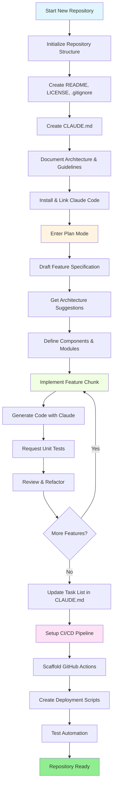
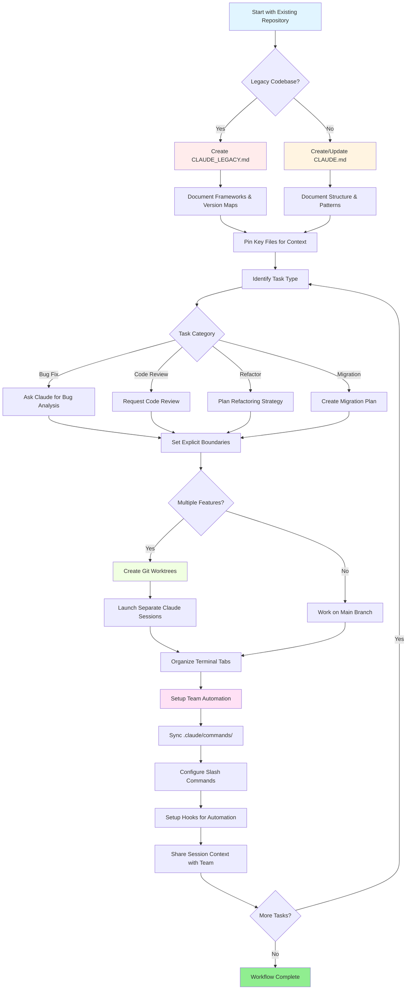

<!-- i18n-source: resources.md -->
<!-- i18n-source-sha: d4369ce -->
<!-- i18n-date: 2026-04-16 -->
<picture>
  <source media="(prefers-color-scheme: dark)" srcset="resources/logos/claude-howto-logo-dark.svg">
  
</picture>

# Lista de bons recursos

## Documentação Oficial

| Recurso | Descrição | Link |
|---------|-----------|------|
| Claude Code Docs | Documentação oficial do Claude Code | [code.claude.com/docs/en/overview](https://code.claude.com/docs/en/overview) |
| Anthropic Docs | Documentação completa da Anthropic | [docs.anthropic.com](https://docs.anthropic.com) |
| MCP Protocol | Especificação do Model Context Protocol | [modelcontextprotocol.io](https://modelcontextprotocol.io) |
| MCP Servers | Implementações oficiais de servidores MCP | [github.com/modelcontextprotocol/servers](https://github.com/modelcontextprotocol/servers) |
| Anthropic Cookbook | Exemplos de código e tutoriais | [github.com/anthropics/anthropic-cookbook](https://github.com/anthropics/anthropic-cookbook) |
| Claude Code Skills | Repositório comunitário de skills | [github.com/anthropics/skills](https://github.com/anthropics/skills) |
| Agent Teams | Coordenação e colaboração de múltiplos agentes | [code.claude.com/docs/en/agent-teams](https://code.claude.com/docs/en/agent-teams) |
| Scheduled Tasks | Tarefas recorrentes com /loop e cron | [code.claude.com/docs/en/scheduled-tasks](https://code.claude.com/docs/en/scheduled-tasks) |
| Chrome Integration | Automação de navegador | [code.claude.com/docs/en/chrome](https://code.claude.com/docs/en/chrome) |
| Keybindings | Personalização de atalhos de teclado | [code.claude.com/docs/en/keybindings](https://code.claude.com/docs/en/keybindings) |
| Desktop App | Aplicação desktop nativa | [code.claude.com/docs/en/desktop](https://code.claude.com/docs/en/desktop) |
| Remote Control | Controle remoto de sessão | [code.claude.com/docs/en/remote-control](https://code.claude.com/docs/en/remote-control) |
| Auto Mode | Gerenciamento automático de permissões | [code.claude.com/docs/en/permissions](https://code.claude.com/docs/en/permissions) |
| Channels | Comunicação por múltiplos canais | [code.claude.com/docs/en/channels](https://code.claude.com/docs/en/channels) |
| Voice Dictation | Entrada de voz para o Claude Code | [code.claude.com/docs/en/voice-dictation](https://code.claude.com/docs/en/voice-dictation) |

## Blog de Engenharia da Anthropic

| Artigo | Descrição | Link |
|--------|-----------|------|
| Code Execution with MCP | Como resolver o inchaço de contexto do MCP usando execução de código — redução de 98,7% nos tokens | [anthropic.com/engineering/code-execution-with-mcp](https://www.anthropic.com/engineering/code-execution-with-mcp) |

---

## Dominando o Claude Code em 30 Minutos

_Vídeo_: https://www.youtube.com/watch?v=6eBSHbLKuN0

_**Todas as Dicas**_
- **Explore Recursos Avançados e Atalhos**
  - Verifique regularmente as notas de lançamento do Claude para novos recursos de edição de código e contexto.
  - Aprenda atalhos de teclado para alternar rapidamente entre as visões de chat, arquivo e editor.

- **Configuração Eficiente**
  - Crie sessões específicas para projetos com nomes/descrições claros para fácil recuperação.
  - Fixe os arquivos ou pastas mais utilizados para que o Claude possa acessá-los a qualquer momento.
  - Configure as integrações do Claude (ex.: GitHub, IDEs populares) para agilizar seu processo de codificação.

- **Perguntas Eficazes sobre a Base de Código**
  - Faça perguntas detalhadas ao Claude sobre arquitetura, padrões de design e módulos específicos.
  - Use referências de arquivo e linha nas suas perguntas (ex.: "O que a lógica em `app/models/user.py` realiza?").
  - Para bases de código grandes, forneça um resumo ou manifesto para ajudar o Claude a focar.
  - **Exemplo de prompt**: _"Você pode explicar o fluxo de autenticação implementado em src/auth/AuthService.ts:45-120? Como ele se integra com o middleware em src/middleware/auth.ts?"_

- **Edição de Código e Refatoração**
  - Use comentários inline ou requisições em blocos de código para obter edições focadas ("Refatore esta função para maior clareza").
  - Peça comparações lado a lado antes/depois.
  - Deixe o Claude gerar testes ou documentação após grandes edições para garantia de qualidade.
  - **Exemplo de prompt**: _"Refatore a função getUserData em api/users.js para usar async/await em vez de promises. Me mostre uma comparação antes/depois e gere testes unitários para a versão refatorada."_

- **Gerenciamento de Contexto**
  - Limite o código/contexto colado apenas ao que é relevante para a tarefa atual.
  - Use prompts estruturados ("Aqui está o arquivo A, aqui está a função B, minha pergunta é X") para melhor desempenho.
  - Remova ou recolha arquivos grandes na janela de prompt para evitar exceder os limites de contexto.
  - **Exemplo de prompt**: _"Aqui está o modelo User de models/User.js e a função validateUser de utils/validation.js. Minha pergunta é: como posso adicionar validação de e-mail mantendo compatibilidade retroativa?"_

- **Integre Ferramentas da Equipe**
  - Conecte sessões do Claude aos repositórios e documentação da sua equipe.
  - Use templates integrados ou crie os seus próprios para tarefas de engenharia recorrentes.
  - Colabore compartilhando transcrições de sessão e prompts com colegas de equipe.

- **Aumentando o Desempenho**
  - Dê ao Claude instruções claras e orientadas a objetivos (ex.: "Resuma esta classe em cinco bullet points").
  - Remova comentários desnecessários e código boilerplate das janelas de contexto.
  - Se a saída do Claude estiver fora do caminho, redefina o contexto ou reformule as perguntas para melhor alinhamento.
  - **Exemplo de prompt**: _"Resuma a classe DatabaseManager em src/db/Manager.ts em cinco bullet points, focando em suas principais responsabilidades e métodos-chave."_

- **Exemplos Práticos de Uso**
  - Debugging: Cole erros e stack traces, depois pergunte sobre possíveis causas e correções.
  - Geração de Testes: Solicite testes baseados em propriedades, unitários ou de integração para lógica complexa.
  - Revisões de Código: Peça ao Claude para identificar mudanças arriscadas, casos extremos ou code smells.
  - **Exemplos de prompts**:
    - _"Estou recebendo este erro: 'TypeError: Cannot read property 'map' of undefined at line 42 in components/UserList.jsx'. Aqui está o stack trace e o código relevante. O que está causando isso e como posso corrigir?"_
    - _"Gere testes unitários abrangentes para a classe PaymentProcessor, incluindo casos extremos para transações falhas, timeouts e entradas inválidas."_
    - _"Revise este diff de pull request e identifique possíveis problemas de segurança, gargalos de desempenho e code smells."_

- **Automação de Workflow**
  - Automatize tarefas repetitivas (como formatação, limpezas e renomeações repetitivas) usando prompts do Claude.
  - Use o Claude para redigir descrições de PR, notas de lançamento ou documentação baseada em diffs de código.
  - **Exemplo de prompt**: _"Com base no git diff, crie uma descrição detalhada de PR com um resumo das mudanças, lista de arquivos modificados, passos de teste e impactos potenciais. Também gere notas de lançamento para a versão 2.3.0."_

**Dica**: Para melhores resultados, combine várias dessas práticas — comece fixando arquivos críticos e resumindo seus objetivos, depois use prompts focados e as ferramentas de refatoração do Claude para melhorar incrementalmente sua base de código e automação.

**Workflow recomendado com o Claude Code**

### Workflow Recomendado com o Claude Code

#### Para um Novo Repositório

1. **Inicialize o Repositório e a Integração com o Claude**
   - Configure seu novo repositório com a estrutura essencial: README, LICENSE, .gitignore, configs raiz.
   - Crie um arquivo `CLAUDE.md` descrevendo a arquitetura, objetivos de alto nível e diretrizes de codificação.
   - Instale o Claude Code e vincule-o ao seu repositório para sugestões de código, scaffolding de testes e automação de workflow.

2. **Use o Modo de Planejamento e Specs**
   - Use o modo de planejamento (`shift-tab` ou `/plan`) para rascunhar uma especificação detalhada antes de implementar recursos.
   - Peça ao Claude sugestões de arquitetura e layout inicial do projeto.
   - Mantenha uma sequência de prompts clara e orientada a objetivos — peça esboços de componentes, módulos principais e responsabilidades.

3. **Desenvolvimento e Revisão Iterativos**
   - Implemente recursos principais em pequenos pedaços, pedindo ao Claude geração de código, refatoração e documentação.
   - Solicite testes unitários e exemplos após cada incremento.
   - Mantenha uma lista de tarefas em execução no CLAUDE.md.

4. **Automatize CI/CD e Deploy**
   - Use o Claude para criar scaffolding de GitHub Actions, scripts npm/yarn ou workflows de deploy.
   - Adapte os pipelines facilmente atualizando seu CLAUDE.md e solicitando os comandos/scripts correspondentes.

#### Para um Repositório Existente

1. **Configuração do Repositório e Contexto**
   - Adicione ou atualize o `CLAUDE.md` para documentar a estrutura do repositório, padrões de codificação e arquivos-chave. Para repositórios legados, use `CLAUDE_LEGACY.md` cobrindo frameworks, mapas de versão, instruções, bugs e notas de atualização.
   - Fixe ou destaque os arquivos principais que o Claude deve usar para contexto.

2. **Perguntas Contextuais sobre o Código**
   - Peça ao Claude revisões de código, explicações de bugs, refatorações ou planos de migração referenciando arquivos/funções específicos.
   - Dê ao Claude limites explícitos (ex.: "modifique apenas estes arquivos" ou "sem novas dependências").

3. **Gerenciamento de Branch, Worktree e Multi-Sessão**
   - Use múltiplos git worktrees para recursos ou correções de bugs isolados e lance sessões separadas do Claude por worktree.
   - Mantenha abas/janelas do terminal organizadas por branch ou recurso para workflows paralelos.

4. **Ferramentas da Equipe e Automação**
   - Sincronize comandos personalizados via `.claude/commands/` para consistência entre equipes.
   - Automatize tarefas repetitivas, criação de PRs e formatação de código via slash commands ou hooks do Claude.
   - Compartilhe sessões e contexto com membros da equipe para troubleshooting e revisão colaborativos.

**Dicas**:
- Comece cada novo recurso ou correção com uma spec e um prompt em modo de planejamento.
- Para repositórios legados e complexos, armazene orientações detalhadas em CLAUDE.md/CLAUDE_LEGACY.md.
- Dê instruções claras e focadas e divida trabalhos complexos em planos de múltiplas fases.
- Limpe regularmente as sessões, podando o contexto e removendo worktrees concluídos para evitar desordem.

Esses passos capturam as principais recomendações para workflows tranquilos com o Claude Code em bases de código novas e existentes.

---

## Novos Recursos e Capacidades (Março de 2026)

### Recursos Principais

| Recurso | Descrição | Saiba Mais |
|---------|-----------|------------|
| **Auto Memory** | O Claude aprende e lembra automaticamente suas preferências entre sessões | [Guia de Memory](02-memory/) |
| **Remote Control** | Controle sessões do Claude Code programaticamente a partir de ferramentas e scripts externos | [Recursos Avançados](09-advanced-features/) |
| **Web Sessions** | Acesse o Claude Code através de interfaces baseadas em navegador para desenvolvimento remoto | [Referência CLI](10-cli/) |
| **Desktop App** | Aplicação desktop nativa para o Claude Code com interface aprimorada | [Claude Code Docs](https://code.claude.com/docs/en/desktop) |
| **Extended Thinking** | Toggle de raciocínio profundo via `Alt+T`/`Option+T` ou variável de ambiente `MAX_THINKING_TOKENS` | [Recursos Avançados](09-advanced-features/) |
| **Permission Modes** | Controle granular: default, acceptEdits, plan, auto, dontAsk, bypassPermissions | [Recursos Avançados](09-advanced-features/) |
| **7-Tier Memory** | Managed Policy, Project, Project Rules, User, User Rules, Local, Auto Memory | [Guia de Memory](02-memory/) |
| **Hook Events** | 25 eventos: PreToolUse, PostToolUse, PostToolUseFailure, Stop, StopFailure, SubagentStart, SubagentStop, Notification, Elicitation e mais | [Guia de Hooks](06-hooks/) |
| **Agent Teams** | Coordene múltiplos agentes trabalhando juntos em tarefas complexas | [Guia de Subagents](04-subagents/) |
| **Scheduled Tasks** | Configure tarefas recorrentes com `/loop` e ferramentas cron | [Recursos Avançados](09-advanced-features/) |
| **Chrome Integration** | Automação de navegador com Chromium headless | [Recursos Avançados](09-advanced-features/) |
| **Keyboard Customization** | Personalize keybindings incluindo sequências de acordes | [Recursos Avançados](09-advanced-features/) |
| **Monitor Tool** | Observe o fluxo stdout de um comando em background e reaja a eventos em vez de fazer polling (v2.1.98+) | [Recursos Avançados](09-advanced-features/) |

---
**Última Atualização**: 16 de abril de 2026
**Versão do Claude Code**: 2.1.112
**Fontes**:
- https://docs.anthropic.com/en/docs/claude-code
- https://www.anthropic.com/news/claude-opus-4-7
- https://support.claude.com/en/articles/12138966-release-notes
**Modelos Compatíveis**: Claude Sonnet 4.6, Claude Opus 4.7, Claude Haiku 4.5
